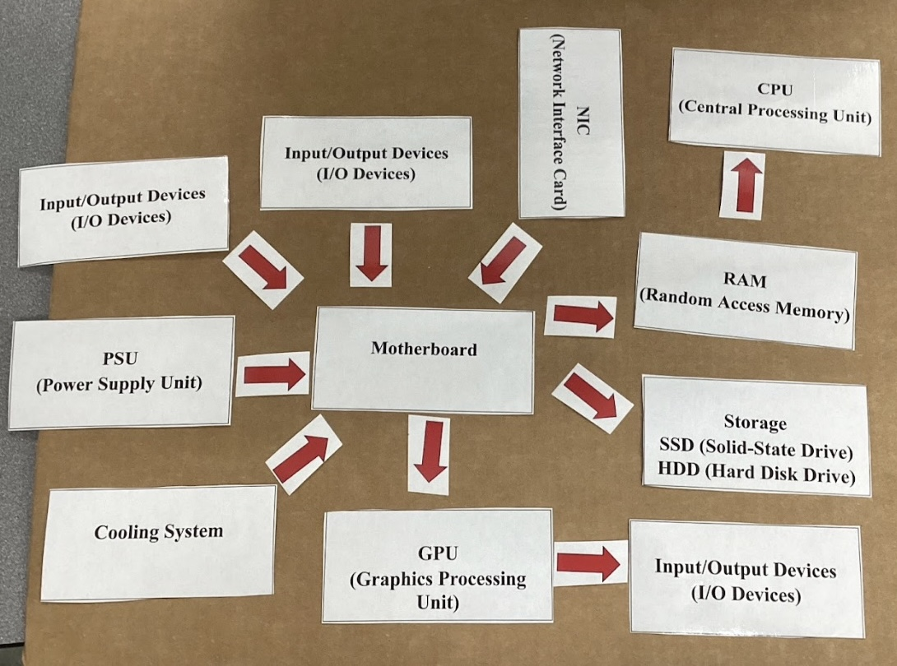
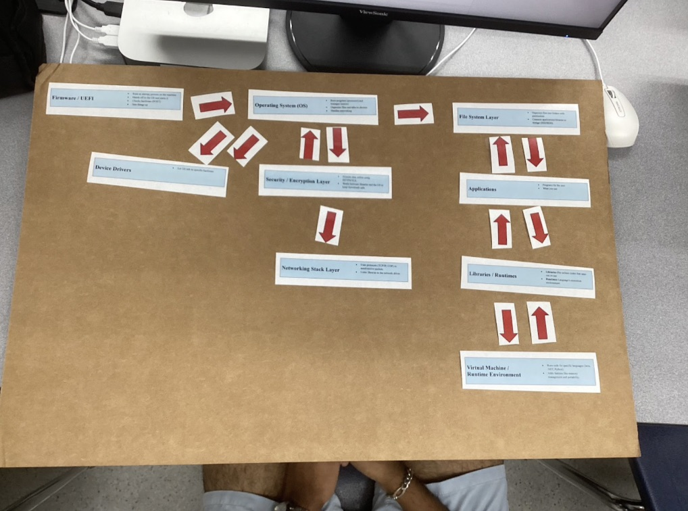
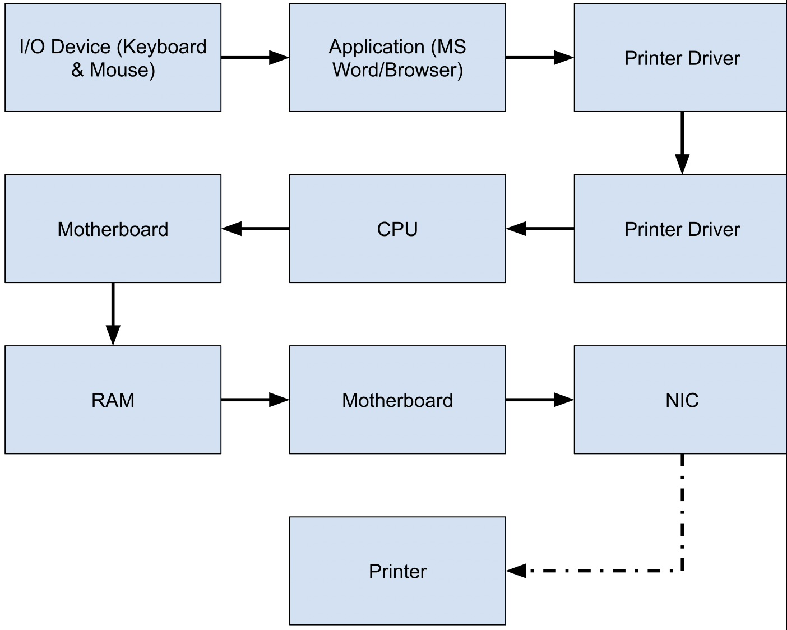

# Component Cards & Software Slips

## Project introduction

Component Cards and Software Slips was the first project of the year, and was designed to teach us about the various hardware and software components of a PC, and to teach us about how they all worked together. 

The project included various small activities to help us learn, including:

- Silent Signals
- Metal to Magic
- A Component Song

## Silent Signals

Silent Signals was the first part of the project. In this activity, my partner and I each received a 3D printed card with a white side and a blue side, and our goal was to communicate various messages with each other solely with the cards, and without any kind of gesturing or speaking. From the start, we knew that we needed to establish some kind of standardized method of communication with each other. We mutually decided that to communicate numbers, we should use the card to tap the desk to represent the quantity of the number, and for boolean questions (yes/no, A/B, etc.) that we needed to assign one color to option 1 and the other color to option 2. Unfortunately, we couldn't talk, so we ended up picking different colors than each other.

After trying out my system with partners, our new goal was to design a communication system to communicate the following information without gestures or speaking:

- The number 3
- The month October
- “Yes” to a yes/no question

My plan for this was to:

- Start by tapping the table thrice to communicate the integer value of 3
- Waiting a bit, then tapping the table 10 times to communicate October, since it's the 10th month
- Lastly, to communicate "yes" to a yes/no question, I would show the white side of the card. Although there's no way to guarantee that my partner would know white means yes, if you think about the card as an on/off switch, white would likely be "on" since it's light, and blue would be "off" since it's darker. Therefore, white would signify "yes." This method required a bit of luck that my partner would understand what I was trying to communicate, since there was no way to actually talk with him to tell him what each color meant.

**Silent Signals Reflection**

The purpose of "Silent Signals" was to highlight the importance of a shared communication protocol. Similarly to how my partner and I were able to communicate more easily when we had a mutual understanding of what each others' signals meant, in order for machines to communicate effectively, they need to understand each others' protocols. 

## Component Song

The next part of Component Cards and Software Slips was the Component Song. Using ChatGPT, I generated song lyrics that described the multiple hardware and software components of a computer, and I then used Suno in order to have AI-generated vocals and instrumentals for the song. 

[Song lyrics and link to song](https://docs.google.com/document/d/15bHGkJZctrTETz_DqEujU8uApcVKDoWbXd6w4TiK3Ho/edit?tab=t.0)

**Component Song Reflection**

Creating the Component Song was a fun way to learn about the different parts of a computer, and helped me learn about what exactly each part does. 

## Metal to Magic

Metal to Magic was the main component of this project. In Metal to Magic, we formally learned about the many different hardware and software components of a PC, such as:

**Hardware Components**

| Hardware  | Purpose   |
|-----------|-----------|
|   CPU     | Executes instructions from programs    |
| RAM       |Temporarily stores data and instructions the CPU is currently using|
| SSD/HDD   |Computer's long term data storage sytem|
| GPU       |Processor specialized for parallel processing; useful for graphics processing and matrix multiplication|
|Motherboard|Main circuit board inside the computer; connects all hardware components and allows them to communicate via buses|
|  PSU      |Device that powers the system|
|NIC        | Translates data between computer and network; enables WiFi capabilities|
|Cooling System|Keeps components cool in order to prevent overheating and thermal throttling|
| I/O Devices  |Tools the user utilizes to interact with the computer (keyboard, microphone, mouse, camera, display, etc)|

   

**Software Components**

| Software  | Purpose   |
|-----------|-----------|
|Firmware/UEFI|Starts the PC and hands off to OS; motherboard firmware|
|Drivers    |Lets the OS talk to hardware|
|OS         |Manages files, hardware, programs, UI, and much more|
|Libraries/Runtimes|Pre-written code for apps shared building blocks for apps|
|Applications|Programs for the user to interact with to complete tasks|

   

### Hardware and Software Flowcharts

After learning about what each component of a PC did, we needed to learn about how they all worked together. So, with a partner, I took cards with hardware and software components and arranged them to represent how individual components all interact with each other to get tasks done. We started off with keeping the hardware and software flowcharts separate, then at the end, trying to combine both hardware and software cards to visualize what exactly a computer does when printing out an essay.

#### Hardware Flowchart

Here, I tried to emphasize how virtually everything communicates through the motherboard, which is why I had the motherboard at the center and all of the components connected individually to the board. 

#### Software Flowchart

Making the software component flowchart was a bit easier, since with software, there is a clearer hierarchy of the different layers, with the UEFI being at the lowest level and the runtimes and apps being at the highest level.

#### Printing an Essay Flowchart (Hardware + Software)

Before designing this flowchart, I thought through what exactly happened on my computer when I hit print, and did my best to represent that in my flowchart.

### Build a PC Activity

With this knowledge about what the hardware and software components of a PC do and how they work together, a partner and I were given the task to upgrade a PC with a given budget to be most optimized for a task, such as gaming, video editing in 4K, AI training, etc. We chose to build a PC that was specialized for 4K video editing, and were given a budget of $1000 to upgrade along with a list of parts for purchase.

**Current Parts List**

- CPU: mid-range 4-core processor 
- RAM: 8 GB 
- Storage: 256 GB SSD 
- GPU: basic integrated graphics 
- PSU: 500W basic model 
- Standard cooling 
- Basic NIC (network card) 
- Motherboard that supports most modern upgrades 

**Parts for Purchase**

| Component      | Upgrade Option                                    | Cost  |
|----------------|---------------------------------------------------|-------|
| CPU            | Mid-range 6-core processor                        | $150  |
|                | High-end 8-core processor                         | $300  |
| RAM            | 16 GB total RAM                                   | $150  |
|                | 32 GB total RAM                                   | $300  |
| Storage        | 512 GB SSD                                        | $150  |
|                | 1 TB SSD                                          | $250  |
|                | 2 TB HDD (extra, for bulk storage)                | $100  |
| GPU            | Mid-range graphics card (good for gaming, video)  | $250  |
|                | High-end graphics card (best for gaming, ML)      | $400  |
| Cooling System | Enhanced air cooling                              | $100  |
|                | Liquid cooling system                             | $200  |
| NIC            | 2.5 Gbps network card                             | $100  |
| Other          | Extra case fans, RGB lighting, style upgrades     | $50   |
 
   
**What we Decided to Do**

Before deciding anything immediately, my partner an I reflected on what exactly a video editing workflow demanded the most. We decided that the biggest limiting factor in our current PC build was the 8GB of RAM, since video editing consumes a lot of RAM. Although 32GB RAM would have been nice, we only had the budget to increase to 16GB, which is still enough for 4K editing (total spent: $150). Next, we upgraded the cooling system, since video editing often requires long exports, which often take multiple hours. This would inevitably generate a lot of heat, so maximum cooling was necessary to ensure that the sustained performance of the system was good. We went with the enhanced air cooling system along with extra case fans (total spent: $300). Next, we upgraded the GPU, since our current build only had a very weak integrated graphics chip. Video editing leans a lot on the GPU, and the current integrated graphics would make 4K video editing a nightmare. We went with the mid-range graphics card, since we didn't have the budget for a high-end graphics card (total: $550). After that, we upgraded the CPU to the high-end 8 core processor, because along with using the GPU a lot, video editing requires a CPU with strong multithreaded performance, so we went with the highest core-count CPU available (total: $850). Finally, with the remaining $150, we upograded to the 512GB SSD, since video files take up a lot of storage. More storage would have been nice, but we didn't have the budget for anything else, and we figured that the editor could always use a NAS or cloud storage for storing older files (total: $1000).

### Metal to Magic Reflection**

Overall, Metal to Magic was very helpful in understanding not only what the individual components of a computer do, but also in explaining how the components work together. I learned about how standardized protocols are essential for machines to communicate with each other, and even for parts a machine to communicate with other parts. 