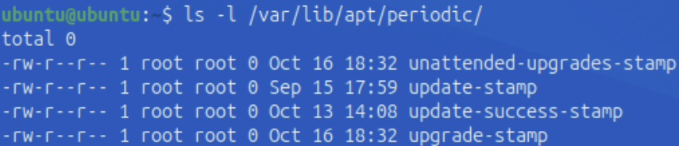

# Implementing Security in Devices

## Table of Contents

- ##### [Project Introduction](#project-introduction)
- ##### [NIST and OWASP Guidelines](#nist-and-owasp-guidelines)
- ##### [Designing a Secure Password and Implementing it in Ubuntu](#designing-a-secure-password-and-implementing-it-in-ubuntu)
- ##### [Incorporating MFA in Ubuntu with Google Authenticator](#incorporating-mfa-in-ubuntu-with-google-authenticator)
- ##### [Patching Outdated Software in Ubuntu](#patching-outdated-software-in-ubuntu)
- ##### [Reflection](#reflection)

## Project Introduction 

This project was focused on implementing different methods to secure devices such as creating/using password algorithms to create secure passwords, installing MFA tools in Ubuntu, patching outdated software, and incorporating NIST/OWASP guidelines. 

## NIST and OWASP Guidelines {.collapsible}

[NIST](https://www.nist.gov) (National Institute of Standards and Technology) and [OWASP](https://owasp.org) (Open Worldwide Application Security Project) are both organizations that help develop standards and guidelines to help improve security, among other things. 

Both of these organizations release on creating strong passwords and securing devices. Common themes between the two organizations include:

- Use passwords that are both complex enough to be strong yet memorable enough to remember, as well as being lengthy
- Incorporate some sort of multi factor authentication (MFA) for services and devices, such as biometric authentication, verification with a one time password (OTP), or security questions

## Designing a Secure Password and Implementing it in Ubuntu {.collapsible}

### Creating a Password Algorithm to Make a New Password

Before this activity, the password for the Ubuntu VM is just "ubuntu". As one can imagine, "ubuntu" is not a very secure password! 

To generate a new password, I came up with the following algorithm, ensuring that a complex, long, yet memorable password could be used:

- Write out as many digits of π as you can. The most you can easily write down is the base of the new password

- Then, split your name in half and add the first half to the front of the digits of π and the second half to the end.
    - If your name has an odd amount of characters, put the greater half at the start and the smaller half at the end. For example, if your name is Max and you know 10 digits of π, your password so far would be Ma3.141592653x.
- Then, replace all instances of lowercase a with @, lowercase i with !, lowercase e with 3, lowercase o with 0, lowercase s with 5, and lowercase l with 1. 
- The final password for the example would be M@3.141592653x

### Implementing the New Password in Ubuntu

To secure Ubuntu, the newly-generated password needed to be implemented. In order to change the password, the `passwd` command was run, which prompted for the current password ("ubuntu") then the new password (which was generated using the algorithm listed above). After entering the new password under the `passwd` command, the password should have changed (note: in the screenshot below, new password was mistyped a few times, which is why the computer printed "sorry, passwords do not match" a few times. The password did end up changing).

{ width=400 }

In order to test to see if the new password works, `sudo ls /root` was run. The expected output is all of the contents of the /root directory. Since this command requires admin (sudo) privileges, it asked for the password. The newly-changed password was entered, and it worked, meaning that the `passwd` command successfully changed the password in Ubuntu, and that it works when running tasks requiring root access. 

{ width=400 }

Running the command returned snap, since that was the only item present in the /root directory. This indicates that the command worked, therefore the password is valid. Now, Ubuntu is more secure than before due to a much more complex password.

## Incorporating MFA in Ubuntu with Google Authenticator {.collapsible}

After the secure password was implemented, the next step in securing the Ubuntu VM was to implement some sort of MFA. Due to its widespread usage and relative simplicity, Google Authenticator was chosen as the method for implementing MFA. 

Google Authenticator works by generating a new TOTP (Temporary One Time Password) every 30 seconds with an algorithm. The Authenticator application and Google's server have the same algorithm, so when the code generated on the phone is used to authenticate, the account/service connects to Google's server to verify that the code is correct. If Google's server has the same code as the one that was inputted by the user, then the user is granted access to the account/service.

To install Google Authenticator in Ubuntu, the following commands needed to be run:

- `sudo apt update`: Updates system packages to make sure the system is up to date, which helps prevent installation errors and ensures that the system is secure before setting up anything new.
- `sudo apt install libpam-google-authenticator -y`: Installs the Google Authenticator package for Ubuntu via the apt package manager and agrees to install the package with the `-y` flag.

After installing the Google Authenticator package, the command `google-authenticator` was run to start the configuration process. To set it up, the following questions were answered:

|                         Prompt                         |   Answer  |
|--------------------------------------------------------|-----------|
|Do you want authentication tokens to be time-based (y/n)|     y     |
|Update your .google_authenticator file?                 |     y     |
|Disallow multiple uses of the same token?               |     y     |
|(Token valid for 30 seconds)                            |Press Enter|
|Enable rate-limiting?                                   |     y     |

 

After answering the questions, the terminal displayed a QR code which can be used to link Ubuntu to a Google Account for use with Google Authenticator. It also displayed recovery codes, which can be used in place of the TOTP generated in the app in case there is an issue with the app or the device is not connected to the internet. Those codes can only be used once. Additionally, it provided a secret key, which can also be used to link Ubuntu to the Google Authenticator app (in fact, the QR code displayed is just the secret key represented as a scannable code). 

{ width=400 }

Unfortunately, since the school iPads don't have the Google Authenticator, a [TOTP website](https://totp.danhersam.com/) had to be used as a workaround (**the website should never be used as an actual method of security; it was used solely to verify that Google Authenticator is working. Never enter a secret key into any website**). To verify that Google Authenticator was working, the secret key was copied and pasted into the website, which enabled the website to generate a 6 digit verification code every 30 seconds. In Ubuntu, the `google-authenticator` command was re-run, and when it prompted to enter a code from the app, the code from the website was entered. It accepted the code, which means that the Google Authenticator installation works. 

The last step was to configure Ubuntu to require both a password and a code from Google Authenticator when logging in. The steps to do so were:

1. Ensure PAM + keyboard-interactive are enabled in sshd.
To do so, edit the SSH server configuration file with `sudo nano /etc/ssh/sshd_config`, find the line `KbdInteractiveAuthentication no`, and change it to `KbdInteractiveAuthentication yes`. Then, make sure `UsePAM yes` exists, and that it is set to "yes". Additionally, change `#PasswordAuthentication no` to `#PasswordAuthentication yes` if it isn't already set to "yes". Once these changes are made, save and exit the file, then restart the SSH server with `sudo systemctl restart ssh`.

2. Add Google Authenticator to the SSH PAM stack.
To do so, open the SSH PAM configuration file with `sudo nano /etc/pam.d/sshd`, then right below the header comment, add `auth required pam_google_authenticator.so`. Save and exit the file, then restart SSH again with `sudo systemctl restart ssh`.

3. Test the login.
To do so, SSH to the VM with `ssh [username]@localhost` (note: replace [username] with your actual Ubuntu username). It should prompt for botha password and verification code, indicating that Google Authenticator is set up for SSH.

{ width=400 }

## Patching Outdated Software in Ubuntu {.collapsible}

The last step in increasing the security of Ubuntu was to patch outdated software. Every computer needs regular patches to stay secure, since they fix bugs, security holes, and performance issues. This was done with the following steps:

1. Check for available updates:
To list out the packages that can be updated, `sudo apt list --upgradable` was run. On my specific VM, 1158 packages were outdated and had an upgrade available.

{ width=400 }

2. Apply the updates (patches):
To install the updates, `sudo apt upgrade` was run. This installs all the updates for the packages that were listed as "upgradable".

3. Check the update history to verify that the update was installed:
To verify that the update was installed, open the log file for apt with `cat /var/log/apt/history.log`. It returns the date, time, and list of packages that were updated. However, it is difficult to see a specific update due to the quantity of information in this log.

4. Searching the log for a specific update to ensure a specific package has been updated:
To search for updates on a specific date, the command `grep "yyyy-mm" /var/log/apt/history.log` can be used (replace yyyy-mm with a specific year and month) to show updates in a specific month. 
{ width=400 } { width=400 }
 

To show every package, software, and dependency that is installed on the system, `grep "Install:" /var/log/apt/history.log` was run. An example output is: 

Install: python3:amd64 (3.10.12-0ubuntu0.22.04.1, automatic)

|Part                      |Meaning                                                                    |
|--------------------------|---------------------------------------------------------------------------|
|Install:                  |This line lists newly installed software packages                          |
|python3:amd64             |The name of the package (Python 3 for 64-bit architecture                  |
|(3.10.12-Oubuntu0.22.04.1)|The version number of the package                                          |
|automatic                 |Means the package was installed as a dependency (another program needed it)|

Example output from `grep "Install:" /var/log/apt/history.log`:
{ width=400 }

The output is very long and unreadable. To search for a specific package, "Install" can be replaced with the package name (nano, firefox, etc.), meaning the command would like like this: `grep "firefox" /var/lig/apt/history.log`. 

To show recent updates, the last lines of history.log can be shown with `tail -n 20 /var/log/apt/history.log` (note: 20 can be replaced with the desired amount of lines (10, 20, 32, 67, 102, etc.)).

{ width=670 }
 

5. Ensuring that automatic updates have been applied:
Ubuntu schedules automatic updates. The command `ls -l /var/lib/apt/periodic` can be run to see when Ubuntu last ran an automatic update.

{ width=400 }

## Reflection {.collapsible}

In modern times, securing devices is more important than ever. As our lives become more reliant on digital tools, keeping our digital lives safe from hackers is of the utmost importance. Having secure passwords for devices and online accounts is one of the easiest ways to be protected from hackers, and everybody should consider making secure passwords. However, just having a secure password often is not enough to be safe. This is why MFA is vital, since in combination with a secure password, it makes it exceptionally difficult for a hacker to break into a system or account. Since most enterprise servers and systems are Ubuntu-based, learning how to implement these changes in Ubuntu is very helpful in many careers.
