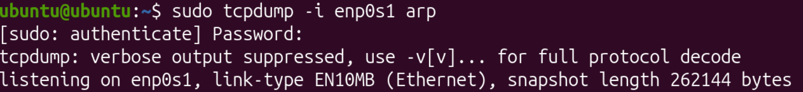
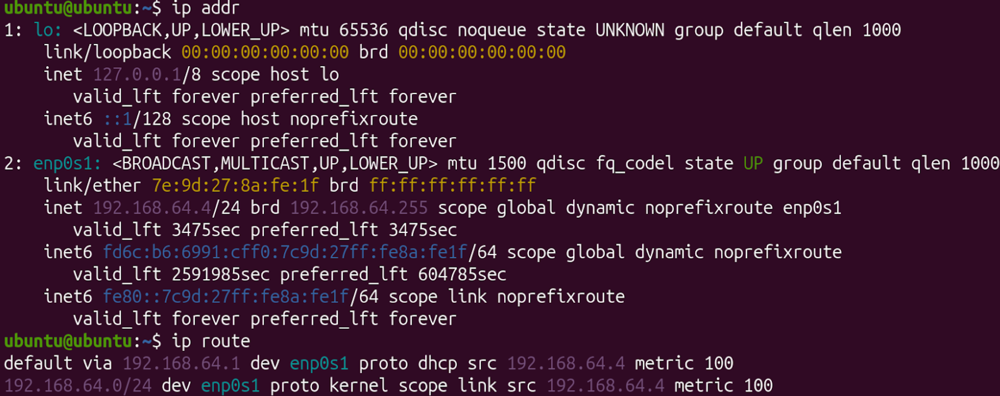

# Determining Security Controls in a LAN

In this activity, physical security vulnerabilities in a pharmaceutical company were explored and patched.

## Table of Contents

- [**Common LAN Threats & Why Switches Are Vulnerable**](#common-lan-threats-and-why-switches-are-vulnerable)
- [**Appropriate Security Controls and Common Vulnerabilities Within a Simple LAN**](#appropriate-security-controls-and-common-vulnerabilities-within-a-simple-lan)
- [**Security Controls to Mitigate Vulnerabilities Within a Simple LAN**](#appropriate-security-controls-and-common-vulnerabilities-within-a-simple-lan)
- [**Enterprise Physical Security Threat Analysis**](#enterprise-physical-security-threat-analysis)

## Common LAN Threats and Why Switches Are Vulnerable {.collapsible}

## Appropriate Security Controls and Common Vulnerabilities Within a Simple LAN {.collapsible}

In this activity, a LAN was simulated to observe how easy it is to collect and manipulate ARP information when no internal security controls exist. Two Linux VMs were used: one that simulates a desktop computer running Ubuntu that sends ARP requests and one that simulates an Ubuntu-based server which listens to ARP requests. Both VMs were set to Bridged network mode to appear as separate devices from the host machine on the LAN.

Steps:

1. On VM2, run `ip addr` and `ip route`, and note down the interface name, VM2's IPv4 address, and the default gateway.
    - Interface: enp0s1
    - IPv4 address: 192.168.64.4
    - Default gateway: 192.168.64.1

{ width=500 }

2. On VM2, start listening for ARP traffic with `sudo tcpdump -i "interface" arp` (replace "interface" with the interface of the computer that was found with `ip addr`). Leave this running in the terminal while running step 3.

{ width=500 }

3. On VM1, run `sudo arping -c 5 -I "interface" "VM2's IPv4 Address"` (replace "interface" and "VM2's IPv4 Address" with the values previously found on VM2 with `ip addr`). This command broadcasts ARP requests from VM1 asking "who has VM2's IP?", and VM2 responds with its MAC address.

{ width=500 }

Analysis:

ARP reveals the MAC address associated with an IP address on a LAN. When VM1 sent an ARP request asking for VM2's IP, VM2 responded with its MAC address. ARP assumes all devices on the same network segment are trustworthy and will respond honestly without verification, making it vulnerable to spoofing because any device can claim to own a random IP address and intercept traffic meant for another host. Bridged mode was required for this lab because it allowed both VMs to operate on the same network so they could see and respond to each other's ARP broadcasts. Without it, the VMs would be isolated and unable to communicate.

A common vulnerability in an unsecured LAN is ARP spoofing, which is demonstrated in the diagram below:

{ width=600 }

ARP spoofing succeeds in unprotected LANs because ARP has no authentication mechanism, meaning that any device can claim ownership of any IP address and broadcast that claim, and all devices trust ARP responses without verification. Dynamic ARP Inspection (DAI) is the security control specifically designed to stop this attack. DAI works by intercepting all ARP packets on a switch and validating IP-to-MAC bindings using a trusted database. When a malicious device attempts to send a spoofed ARP packet claiming to own the gateway's IP address, DAI detects the invalid binding and drops the packet before it can propagate, preventing the attacker from poisoning the ARP tables of legitimate hosts and intercepting their traffic.

## Security Controls to Mitigate Vulnerabilities in a Switched LAN {.collapsible}

The next activity was to simulate and analyze a school's LAN with two virtual machines. Once the simulation was complete, an [**assessment report**](https://docs.google.com/document/d/1yPeEwW0Fa0ttF9qG2FwPMp9Pwbd_9-Difbsc1UxgZxY/edit?tab=t.0) was created to provide a summary of the experiment and its findings.

**Evidence gathering process:**

Key: VM1 = Desktop Computer | VM2 = Linux Server

1. On VM 2, run `ip addr` and `ip route` to establish the active network interface, IP address, and default gateway.

{ width=500 }

2. On VM 2, run `sudo tcpdump -i "interface" "arp"` (replace "interface" with your machine's actual network interface found with `ip addr`) to observe ARP broadcast behavior, as well as identifying flat-network visibility and IP-to-MAC discovery

{ width=500 }

3. On VM 1, run `sudo arping -c 5 -I "interface" "VM2's IP"` (replace "interface" and "VM2's IP" with the values found with `ip addr`) to demonstrate how easily hosts can discover one another and show low-effort internal reconnaissance in a flat LAN.

{ width=500 }

The results from this experiment showcase how the user desktop can easily discover and communicate with a server, which in a real school's LAN, would contain sensitive information that shouldn't be accessible to most users. To fix this issue, VLAN segmentation can be used to separate different classes of devices into virtual LANs (VLANs), and communication between VLANs can be limited. This would allow for teachers and students to be unable to access the admin and server devices. This is demonstrated in the diagram below:

{ width=500 }

### ACL Intent Statements

- Students and teachers cannot access the admin and server VLAN
- The server and admins **can** access the students and teachers
- The admins and server can access each other

## Enterprise Physical Security Threat Analysis {.collapsible}

The last activity in this unit was to plan out a physical security plan for a pharmaceutical company.

### Physical Vulnerabilities Relevant to a Pharmaceutical Research Company 

In a facility with highly confidential information such as a pharmaceutical research company, physical security is of the upmost importance. Common vulnerabilties that companies may overlook include:

- Unrestricted access to spaces with sensitive information (such as research or financial information)
    - This vulnerability would exist in confidential facilities within the campus such as research labs and the admin wing with financial documents, and presents severe risk since it allows unauthorized people to access highly confidential and valuable information even though they shouldn't be able to
- Lack of security cameras in secure areas or in hallways leading to secure areas
    - This vulnerability, similarly to the previous one, would exist near confidential facilities. This vulnerability presents a risk since it does not allow the security team to know when people entered or exited the secure area or where in the building they are coming from.
- Unsecured network closets that leave network infrastructure exposed
    - This vulnerability would exist in network server rooms and closets throughout the campus. This vulnerability presents a risk since it allows unauthorized people to access critical network infrastructure, potentially disrupting operations, stealing sensitive data, or installing malicious devices without detection.
- Lack of night vision cameras to help monitor areas even when it is dark
    - This vulnerability would exist in exterior areas, parking lots, and loading docks around the facility. This vulnerability presents a risk since it does not allow the security team to monitor activities during nighttime hours, making it easier for intruders to conduct surveillance or attempt unauthorized access when visibility is limited.
- Short fence that can easily be climbed
    - This vulnerability would exist at the perimeter of the campus. This vulnerability presents a risk since it allows unauthorized people to bypass the outer security boundary and gain physical access to the facility grounds and building entrances.
- Lack of biometric authentication to enter the campus
    - This vulnerability would exist at main entrances and gateways to secure areas. This vulnerability presents a risk since traditional access methods like keycards and passwords can be stolen, duplicated, or shared with unauthorized individuals, whereas biometric authentication provides a more secure verification method that cannot be easily compromised.

### Physical Security Plan

In order to secure the facility, the following controls would be implemented.

### Environmental Controls#

The environment of such a facility is very important. Factors such as temperature, air quality, humidity, and fire suppression systems must all be carefully implemented.

**Temperature:**
- Due to the precise nature of pharmaceutical research, technicians and researchers must have precise control over temperature of individual rooms in order to optimize for whatever compound they are testing.
- This would be regulated by having individual AC compressors, heaters, and thermostats for every room and connecting the thermostats to the network in order to have precise control and monitoring of the temperature in every single room of the facility.

**Humidity:**
- Similarly to temperature, even slight variations in ambient humidity can throw off a reaction or experiment. Therefore, technicians and researchers must have precise control over the individual rooms in order to optimize for whatever compound they are testing.
- This would be regulated by having individual humidifiers and dehumidifiers for every room and connecting them to the network in order to have precise control and monitoring of the humidity in every single room of the facility.

**Air Quality:**
- Conducing experiments in a pharmaceutical environment can release toxic fumes into the air. Therefore, high quality, industrial-grade air filtration systems are extremely important in a pharmaceutical environment. 
- To ensure high air quality, air filtration systems would be installed in every single research lab, and would also be spread throughout hallways and conference rooms to maintain pristine air quality. They would be connected to the LAN in order to facilitate precise control and monitoring.

**Fire Suppression Systems:**
- Safety is of the upmost importance, and experiments can possibly lead to fires. Therefore, fire suppression systems should be installed in every single research lab and should be connected to smoke detectors, as well as the LAN in case the smoke detectors don't trigger the suppression system. Along with smoke detectors and fire suppression systems, the temperature sensors in each research lab would be able to detect a surge of heat and automatically set off the suppression system.

#### Access Controls

**Badges:**
- Electronic access badges are essential for controlling who can enter restricted areas within the facility. Each employee would be issued a unique badge that grants access only to areas relevant to their job role.
- Badges would be integrated with a centralized access control system connected to the LAN, allowing administrators to monitor entry and exit times, revoke access immediately if needed, and generate audit logs of all access attempts to sensitive areas.

**Biometrics:**
- Biometric authentication such as fingerprint or iris scanning provides a more secure layer of access control than badges alone, as it cannot be stolen or shared.
- Biometric readers would be installed at the entrances to the most sensitive areas such as research labs, data centers, and executive offices. All biometric data would be encrypted and stored securely on isolated systems to prevent unauthorized access.

**Mantraps:**
- Mantraps, also known as access vestibules or airlocks, are small controlled spaces between two doors that prevent unauthorized people from following legitimate employees into restricted areas.
- Mantraps would be installed at the main entrances to research labs, server rooms, and the executive wing. Only one person at a time would be allowed through based on badge and biometric verification, preventing tailgating.

**Zoning:**
- Zoning divides the facility into different security levels based on the sensitivity of the information and equipment in each area. This ensures that unauthorized individuals can only access areas relevant to their role.
- The facility would be divided into zones such as public areas (lobbies and conference rooms), employee areas (offices and break rooms), restricted areas (research labs), and highly restricted areas (executive offices and data centers). Access controls would be progressively stricter as you move to higher security zones. 

#### Surveillance and Detection

**Cameras:**
- Security cameras are critical for monitoring facility access, detecting unauthorized entry, and providing evidence in case of a security incident or theft.
- High-resolution cameras with night vision capability would be installed throughout the facility, including hallways, research labs, server rooms, loading docks, parking lots, and exterior perimeter areas. All camera feeds would be recorded continuously and stored on a secure network server for at least 90 days.

**Monitoring Rooms:**
- A dedicated security monitoring room staffed by trained security personnel allows real-time surveillance and rapid response to security incidents.
- A central monitoring station would be established where security staff can observe live feeds from all cameras, receive alerts from alarm systems, and communicate with facility personnel. This room would be secured with its own access controls and would have redundant communication systems.

**Alarms:**
- Alarm systems provide immediate alerts when unauthorized access is detected or when doors to restricted areas are opened improperly.
- Motion sensors would be installed in high-value areas such as research labs and server rooms. Door and window sensors would be placed on all exterior exits and restricted area entrances. All alarms would be connected to the central monitoring station and would trigger automatic notifications to security personnel and management.

**Logging:**
- Comprehensive logging of all access attempts, alarms, and camera footage provides an audit trail for investigating incidents and identifying security vulnerabilities.
- All badge swipes, biometric scans, alarm triggers, and camera recordings would be logged to a centralized, tamper-proof system. Access logs would be regularly reviewed for suspicious patterns, and reports would be generated for compliance and security audits. 

#### Hardware Security

**Locked Racks:**
- Locked server racks prevent unauthorized people from physically tampering with, stealing, or disconnecting critical networking and computing hardware.
- All servers and networking equipment would be stored in locked, climate-controlled racks within restricted server rooms. Only authorized IT personnel with proper credentials would be allowed to access these racks, and all physical access would be logged.

**Secured Network Closets:**
- Network closets contain critical infrastructure such as switches, routers, and patch panels. Securing these spaces prevents intruders from installing rogue devices or disrupting network operations.
- All network closets throughout the facility would be locked and accessible only to authorized IT and network personnel. These closets would have biometric access controls and surveillance cameras to monitor who enters and what modifications are made to the network infrastructure.

**Port Protection:**
- Exposed network ports can be used to connect unauthorized devices to the network, allowing attackers to access sensitive data or inject malware.
- All unused network ports on switches and patch panels would be disabled and physically secured. Occupied ports would be documented and monitored. Additionally, physical port locks would be used to prevent unauthorized devices from being plugged into critical network infrastructure. 

#### Personnel and Procedures

**Visitor Handling:**
- Visitors can pose a significant security risk if not properly controlled, as they may be unauthorized individuals attempting to gain access to sensitive areas or gather intelligence about facility operations.
- All visitors would be required to sign in at a main security desk and receive a temporary, time-limited badge. Visitors would be restricted to designated public areas only and would not be allowed to access research labs, server rooms, or executive offices without explicit authorization from a department head.

**Escort Policies:**
- Escort policies ensure that visitors and contractors with legitimate access to sensitive areas are always supervised by an authorized employee.
- Any visitor or contractor requiring access to restricted areas would be required to be accompanied by an employee with appropriate clearance for that area at all times. The escorting employee would be responsible for ensuring the visitor does not access unauthorized equipment or information and would document the visit in the access log.

**Access Reviews:**
- Regular reviews of who has access to what areas ensure that access controls are up-to-date and that former employees or personnel whose roles have changed no longer have unnecessary access.
- Access reviews would be conducted quarterly, with managers reviewing which employees have access to their department's restricted areas. Employees who have changed roles or left the company would have their access immediately revoked. These reviews would be documented and maintained for compliance purposes.

**Training:**
- All employees must understand security policies and procedures to ensure they follow them consistently and recognize potential security threats.
- All employees would receive annual security awareness training covering topics such as badge security, escort policies, recognizing suspicious individuals, reporting security concerns, and consequences of violating security policies. New employees would receive security training as part of their onboarding process. 

### Diagram of New Security Plan

In order to visually represent the security plan listed above, a diagram was created that incorporates the following security protocols, among others:

- Armed guards to protect the entrance and secured areas
- Biometrically authenticated entry point for secured areas
- ID verification for general access
- Security cameras on roads leading up to various areas
- Precise thermostats and fire suppressant systems in research facility
- Trees to block onlookers 

**Diagram:**
{ width=999 }

### Risk-Based Justification

The highest-priority physical security controls for the pharmaceutical facility are biometric access authentication, secured network infrastructure, and comprehensive surveillance systems that work together as a perimeter defense. Biometric authentication at research labs, data centers, and executive offices prevents the theft of proprietary compounds, formulas, and financial records by ensuring that only authorized personnel can physically reach sensitive areas, which is irreplaceable since badges and keycards can be stolen, copied, or shared. Equally critical are secured network closets and locked server racks with biometric controls and logging, which prevent both internal and external actors from installing malicious devices, disrupting operations, or directly accessing sensitive data. These controls directly reduce theft risk by making it logistically impossible to remove equipment; they prevent sabotage by alerting security personnel in real-time when unauthorized access is attempted; and they eliminate the most direct pathway to data compromise—physical access to network infrastructure.

These physical controls form the foundation upon which technical security architecture depends. Network segmentation and access control lists (ACLs) can restrict what users can access, but only physical security ensures that only legitimate users can reach the devices in the first place. Physical security prevents malicious actors from bypassing segmentation entirely through hardware tampering or installing rogue devices. The surveillance and access logging systems gather ample data to know who accessed what and when, helping the company narrow down root causes of issues. By securing the perimeter, monitoring entry and exit, and maintaining detailed logs through biometric authentication, the company has a very thorough defense strategy where technical and physical controls reinforce each other, reducing chances of theft, sabotage, and data compromise. This integrated approach transforms the facility from a potential liability into an ultra-secure facility that protects extremely valuable intellectual property and patient data.