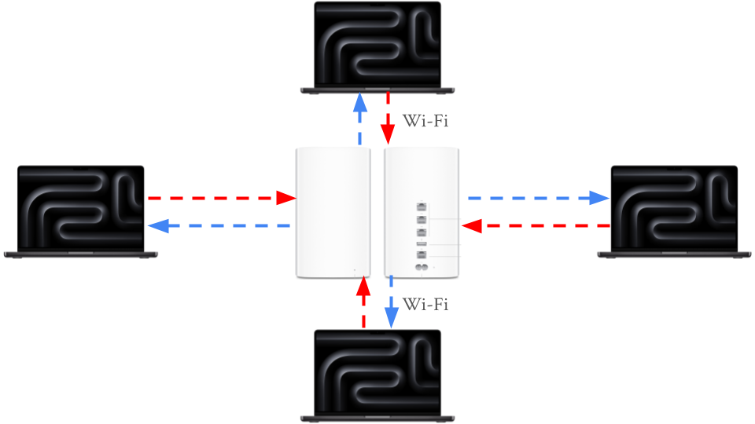
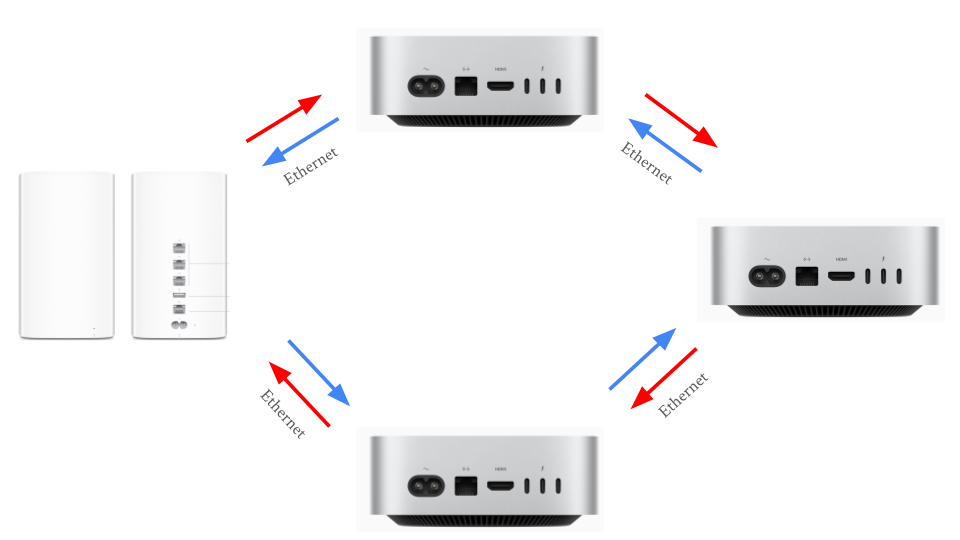
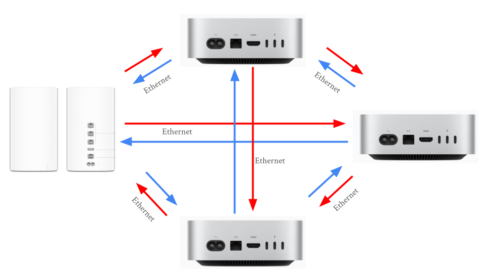

# Networking Foundations: Layers, Cables, and Connectivity

This project was focused on exploring aspects of a network that make up layers 1 and 2 of the OSI model, such as Ethernet cables, IP addresses, physical layout, and more. These aspects were investigated through various activities. 

## Table of Contents

- [**Exploring IP Addresses in Shared and Bridged Modes in UTM**](#exploring-ip-addresses-in-shared-and-bridged-modes-in-utm)
- [**Network Topology Activity**](#network-topology-activity)
- [**Cable Constructing and Testing**](#cable-constructing-and-testing)
- [**Exploring Layers 1 and 2 of the OSI Model (Network Access Layer of TCP/IP Model)**](#exploring-layers-1-and-2-of-the-osi-model-network-access-layer-of-tcpip-model)
- [**Building and Testing a Small Office / Home Office (SOHO) Network**](#building-and-testing-a-small-office--home-office-network-collapsible)
- [**Reflection**](#reflection)

## Exploring IP Addresses in Shared and Bridged Modes in UTM {.collapsible}

This activity explored how Shared (NAT) and Bridged network modes in UTM affect a VM's IP address and how it connects to the internet.

### Part 1: Exploring Shared (NAT) Mode

Before doing anything, the VM had to be set to Shared (NAT) mode. To do so, the VM's settings were edited in UTM by right clicking the VM, selecting network settings in the left sidebar, and changing the network mode to "Shared". 

Once the VM was set to Shared Network mode, the internal IP address was found with `ip a`, resulting in the following output:

{ width=400 }

|Term|Explanation|
|----|-----------|
|inet|IPv4 address (192.168.64.2)|
|/24|Represents the **subnet mask** (255.255.255.0), which signifies that the first 24 bits (192.168.64) of the IP address designate the network and the remaining 8 bits designate the device on the network|
|brd 192.168.64.255|The **broadcast address** for the subnet|
|scope global dynamic enp0s1|“Global” means this IP can reach outside the VM (through NAT), and “dynamic” means it was assigned automatically (DHCP).|

Private IP addresses reveal how the device interacts with the LAN, not the internet. To see a device's IP on the internet, otherwise known as a **public IP address**, a website such as [https://whatismyipaddress.com](https://whatismyipaddress.com) can be used to find it. The VM's public IP was 173.95.44.210.

{ width=400 }

In Shared mode, the public and private IPs were different. 192.168.64.2 belonged to the LAN whereas 173.95.44.210 belonged to the internet. Shared mode might be used by a VM when connecting to the internet because it appears as the same device as the host machine on the LAN and is subject to the same firewall and device restrictions as the host. Shared mode also makes it easier to connect multiple VMs on a single computer since they all share an IP address, making it easier to work with than dealing with individual IPs for each VM.

### Part 2: Exploring Bridged Mode

After exploring Shared (NAT) Mode in UTM, bridged mode was explored. To switch the VM from Shared to Bridged mode, the VM was shut down, then its network settings were changed. Once this change was made, the VM was started again. Once Ubuntu was loaded, a similar procedure was followed. The IP address was again found with `ip a`. However, the results were different:

{ width=400 }

Then, the public IP was checked with [the same website](https://whatismyipaddress.com). While the private IP was completely different, the public IP was exactly the same (173.95.44.210). 

{ width=400 }

While the private IP address changed from 192.168.64.2 to 10.1235.30, the public IP address did not change at all. This is because the IP address of the device has no impact on the router's IP address, which is what determines the public IP. In Bridged Mode, the VM appears as an entirely different computer on the LAN, which is very different to Shared Mode. This quality would lead to an organization often choosing Bridged over Shared mode in a corporate environment because corporations may use a VM to test out new software, and while testing, they would want to make sure that the software is in an environment as similar to as a real computer as possible. Shared mode simply does not provide such an environment, whereas Bridged mode is ideal for such an application. However, the fact that Bridged mode behaves like a separate computer poses a security risk, as it could provide an opportunity to bypass network or device restrictions imposed on the host machine.

### Comparison Table

|Mode|Private IP|Public IP|
|----|----------|---------|
|Shared (NAT)|192.168.64.2|173.95.44.210|
|Bridged|10.12.25.30|173.95.44.210|

When comparing the two modes, Shared mode appears as the same device as the host on the network, whereas Bridged mode appears as a separate device. Due to this quality, Shared mode provides a safer, more controlled environment whereas Bridged mode provides an environment akin to a physical computer. 

### Reflection

1. **How did your IP addresses change between Shared and Bridged mode?**
    - My private IP address changed between Shared and Bridged mode, since it switched from being the same as the Mac’s IP address to being a completely different address on the LAN. The public IP address did not change, since that is controlled by the router, not the individual devices connected to it.

2. **What did this experiment teach you about how local and public networks communicate?**
    - This experiment taught me about how Public IP addresses are based off of the router, and the IP addresses of endpoint devices on the LAN do not affect the Public IP address. It also showed me how Bridged and Shared mode in UTM are different, since a Bridged VM has an IP separate from the host, whereas a Shared VM has the same IP as the host.

3. **Why might IT professionals use different network configurations for home, business, or lab environments?**
    - IT professionals might use different network configurations for home, business, or lab environments. In business environments, IT professionals would likely want to keep the amount of IP addresses available to a minimum, so they would use Shared mode. On the other hand, lab environments and home users may use Bridged mode since it would allow them to simulate how a full computer with the virtualized OS would work, since Bridged mode behaves like a separate computer on the network (it has its own MAC and IP address).

4. **Which mode do you think is best for classroom use, and why?**
    - Shared mode is better for classroom use since it is easier for IT to manage, and it ensures that students can’t bypass the school’s firewall or network restrictions.

## Network Topology Activity {.collapsible}

The next activity was the Network Topology Activity. Network topology is the way that computers, devices, and other pieces of technology are arranged and connected within a network. It’s like a map or blueprint that shows how data travels from one device to another.

Every network includes devices that either send, receive, or direct data. The connect and communicate in the following way:
- End Devices: These are the computers, smartphones, printers, and other tools people use.
They send and receive data.
- Networking Devices: These control or manage traffic between devices.
    - Switch: Connects multiple devices on the same local network (like in a classroom or office).
    - Router: Connects different networks (like your home network to the internet).
    - Access Point: Allows wireless devices to connect using Wi-Fi.
- Cables or Wireless Connections: The “roads” that data travels along.
    - Examples include Ethernet cables, fiber optic cables, or radio waves (for Wi-Fi).

When data travels, it moves in packets — small chunks of information that include details about where they’re coming from and where they’re going. The topology determines which path those packets take and how efficiently they reach their destination.

Example of a network with 3 computers, 1 networking device (router in this case) and 1 printer:

{ width=600 }

Common network topologies include:

- Star Topography
    - Once central switch or hub in the middle
    - All computers connect to that central point
    - Common in office network and home Wi-Fi routers

{ width=600 }

- Bus Topography
    - A single straight line ("backbone cable") with all computers branching off.
    - Common in early Ethernet networks (now outdated).

{ width=600 }

- Ring Topography
    - Devices form a circle with connections between neighbors
    - Data travels one way (or both in dual-ring)
    - Common in some legacy fiber networks and token ring systems

{ width=600 }

- Mesh Topography
    - Every device connects to multiple others
    - If one path breaks, another cna still carry data
    - Common in data centers and wireless mesh networks with many IoT devices

{ width=600 }

- Hybrid Topography
    - Combine two or more (for example, multiple Star networks connected in a Bus layout)
    - Common in large organizations with multiple departments or floors

{ width=600 }

### Reflection:

For a small business, the star topology is the easiest to set up because it only requires connecting each device to a central router, making installation and troubleshooting simple. The mesh topology is the most reliable when a connection fails since it provides multiple paths for data to travel, allowing the network to keep functioning even if one link goes down. However, that same redundancy makes mesh the most expensive to implement due to the large number of cables and connections required. A school would most likely use a star or hybrid topology—star within classrooms and a hybrid structure between floors or buildings—because it offers a balance of scalability, cost-efficiency, and control. Overall, the physical layout of a network topology directly affects speed and reliability: topologies with shared paths (like bus or ring) can create bottlenecks or single points of failure, while layouts with dedicated or redundant paths (like star and mesh) provide faster performance and greater resilience due to the multiple pathways for data to travel across.

## Cable Constructing and Testing {.collapsible}

After learning about network topography, the next activity was building and testing cables. Every network, from a classroom computer lab to a corporate data center - relies on Ethernet cables to carry data between devices. Professional technicians and network engineers often make and test their own cables instead of buying them pre-made, allowing them to create cables at precise lengths, verify quality, and save on cost.

## Exploring Layers 1 and 2 of the OSI Model (Network Access Layer of TCP/IP Model) {.collapsible}

## Building and Testing a Small Office / Home Office Network {.collapsible}

## Reflection {.collapsible}