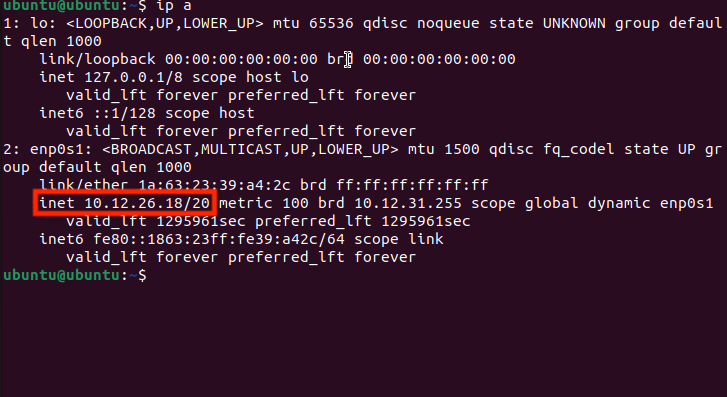
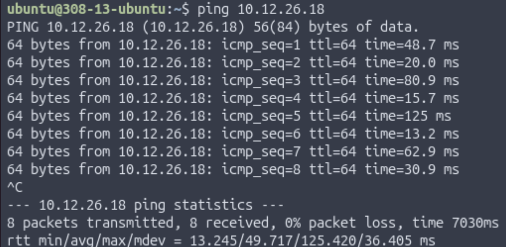
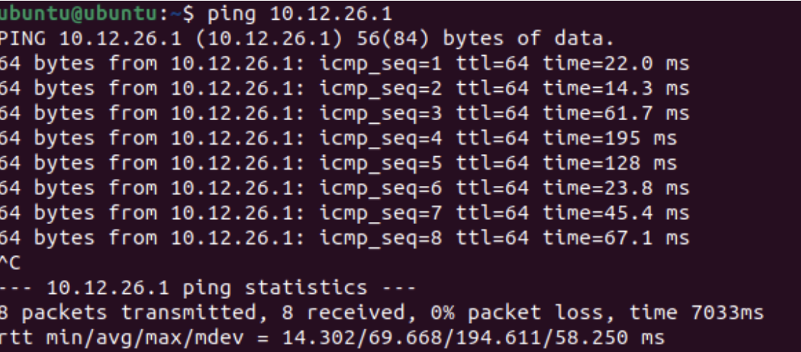
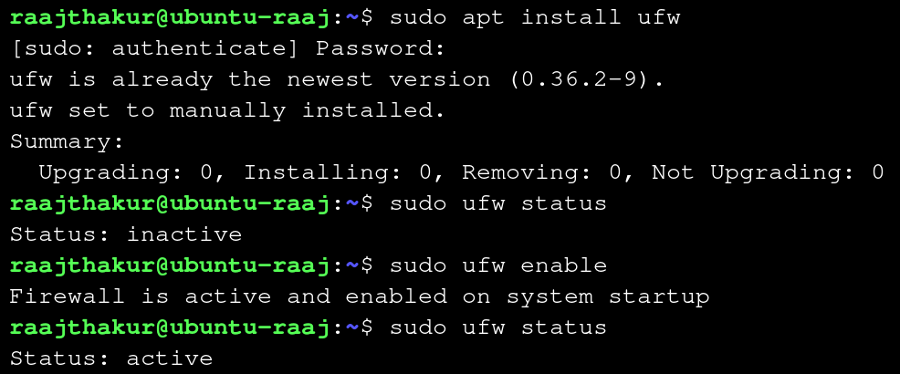

# Networking Foundations: Layers, Cables, and Connectivity

This project was focused on exploring aspects of a network that make up layers 1 and 2 of the OSI model, such as Ethernet cables, IP addresses, physical layout, and more. These aspects were investigated through various activities. 

## Table of Contents

- [**Exploring IP Addresses in Shared and Bridged Modes in UTM**](#exploring-ip-addresses-in-shared-and-bridged-modes-in-utm)
- [**Network Topology Activity**](#network-topology-activity)
- [**Cable Constructing and Testing**](#cable-constructing-and-testing)
- [**Exploring Layers 1 and 2 of the OSI Model (Network Access Layer of TCP/IP Model)**](#exploring-layers-1-and-2-of-the-osi-model-network-access-layer-of-tcpip-model)
- [**Building and Testing a SOHO Network**](#building-and-testing-a-soho-network)
- [**Reflection**](#overall-reflection)

## Exploring IP Addresses in Shared and Bridged Modes in UTM {.collapsible}

This activity explored how Shared (NAT) and Bridged network modes in UTM affect a VM's IP address and how it connects to the internet.

### Part 1: Exploring Shared (NAT) Mode

Before doing anything, the VM had to be set to Shared (NAT) mode. To do so, the VM's settings were edited in UTM by right clicking the VM, selecting network settings in the left sidebar, and changing the network mode to "Shared". 

Once the VM was set to Shared Network mode, the internal IP address was found with `ip a`, resulting in the following output:

{ width=400 }

|Term|Explanation|
|----|-----------|
|inet|IPv4 address (192.168.64.2)|
|/24|Represents the **subnet mask** (255.255.255.0), which signifies that the first 24 bits (192.168.64) of the IP address designate the network and the remaining 8 bits designate the device on the network|
|brd 192.168.64.255|The **broadcast address** for the subnet|
|scope global dynamic enp0s1|“Global” means this IP can reach outside the VM (through NAT), and “dynamic” means it was assigned automatically (DHCP).|

Private IP addresses reveal how the device interacts with the LAN, not the internet. To see a device's IP on the internet, otherwise known as a **public IP address**, a website such as [https://whatismyipaddress.com](https://whatismyipaddress.com) can be used to find it. The VM's public IP was 173.95.44.210.

{ width=400 }

In Shared mode, the public and private IPs were different. 192.168.64.2 belonged to the LAN whereas 173.95.44.210 belonged to the internet. Shared mode might be used by a VM when connecting to the internet because it appears as the same device as the host machine on the LAN and is subject to the same firewall and device restrictions as the host. Shared mode also makes it easier to connect multiple VMs on a single computer since they all share an IP address, making it easier to work with than dealing with individual IPs for each VM.

### Part 2: Exploring Bridged Mode

After exploring Shared (NAT) Mode in UTM, bridged mode was explored. To switch the VM from Shared to Bridged mode, the VM was shut down, then its network settings were changed. Once this change was made, the VM was started again. Once Ubuntu was loaded, a similar procedure was followed. The IP address was again found with `ip a`. However, the results were different:

{ width=400 }

Then, the public IP was checked with [the same website](https://whatismyipaddress.com). While the private IP was completely different, the public IP was exactly the same (173.95.44.210). 

{ width=400 }

While the private IP address changed from 192.168.64.2 to 10.1235.30, the public IP address did not change at all. This is because the IP address of the device has no impact on the router's IP address, which is what determines the public IP. In Bridged Mode, the VM appears as an entirely different computer on the LAN, which is very different to Shared Mode. This quality would lead to an organization often choosing Bridged over Shared mode in a corporate environment because corporations may use a VM to test out new software, and while testing, they would want to make sure that the software is in an environment as similar to as a real computer as possible. Shared mode simply does not provide such an environment, whereas Bridged mode is ideal for such an application. However, the fact that Bridged mode behaves like a separate computer poses a security risk, as it could provide an opportunity to bypass network or device restrictions imposed on the host machine.

### Comparison Table

|Mode|Private IP|Public IP|
|----|----------|---------|
|Shared (NAT)|192.168.64.2|173.95.44.210|
|Bridged|10.12.25.30|173.95.44.210|

When comparing the two modes, Shared mode appears as the same device as the host on the network, whereas Bridged mode appears as a separate device. Due to this quality, Shared mode provides a safer, more controlled environment whereas Bridged mode provides an environment akin to a physical computer. 

### Reflection

1. **How did your IP addresses change between Shared and Bridged mode?**
    - My private IP address changed between Shared and Bridged mode, since it switched from being the same as the Mac’s IP address to being a completely different address on the LAN. The public IP address did not change, since that is controlled by the router, not the individual devices connected to it.

2. **What did this experiment teach you about how local and public networks communicate?**
    - This experiment taught me about how Public IP addresses are based off of the router, and the IP addresses of endpoint devices on the LAN do not affect the Public IP address. It also showed me how Bridged and Shared mode in UTM are different, since a Bridged VM has an IP separate from the host, whereas a Shared VM has the same IP as the host.

3. **Why might IT professionals use different network configurations for home, business, or lab environments?**
    - IT professionals might use different network configurations for home, business, or lab environments. In business environments, IT professionals would likely want to keep the amount of IP addresses available to a minimum, so they would use Shared mode. On the other hand, lab environments and home users may use Bridged mode since it would allow them to simulate how a full computer with the virtualized OS would work, since Bridged mode behaves like a separate computer on the network (it has its own MAC and IP address).

4. **Which mode do you think is best for classroom use, and why?**
    - Shared mode is better for classroom use since it is easier for IT to manage, and it ensures that students can’t bypass the school’s firewall or network restrictions.

## Network Topology Activity {.collapsible}

The next activity was the Network Topology Activity. Network topology is the way that computers, devices, and other pieces of technology are arranged and connected within a network. It’s like a map or blueprint that shows how data travels from one device to another.

Every network includes devices that either send, receive, or direct data. The connect and communicate in the following way:
- End Devices: These are the computers, smartphones, printers, and other tools people use.
They send and receive data.
- Networking Devices: These control or manage traffic between devices.
    - Switch: Connects multiple devices on the same local network (like in a classroom or office).
    - Router: Connects different networks (like your home network to the internet).
    - Access Point: Allows wireless devices to connect using Wi-Fi.
- Cables or Wireless Connections: The “roads” that data travels along.
    - Examples include Ethernet cables, fiber optic cables, or radio waves (for Wi-Fi).

When data travels, it moves in packets — small chunks of information that include details about where they’re coming from and where they’re going. The topology determines which path those packets take and how efficiently they reach their destination.

Example of a network with 3 computers, 1 networking device (router in this case) and 1 printer:

{ width=600 }

Common network topologies include:

- Star Topography
    - Once central switch or hub in the middle
    - All computers connect to that central point
    - Common in office network and home Wi-Fi routers

{ width=600 }

- Bus Topography
    - A single straight line ("backbone cable") with all computers branching off.
    - Common in early Ethernet networks (now outdated).

{ width=600 }

- Ring Topography
    - Devices form a circle with connections between neighbors
    - Data travels one way (or both in dual-ring)
    - Common in some legacy fiber networks and token ring systems

{ width=600 }

- Mesh Topography
    - Every device connects to multiple others
    - If one path breaks, another cna still carry data
    - Common in data centers and wireless mesh networks with many IoT devices

{ width=600 }

- Hybrid Topography
    - Combine two or more (for example, multiple Star networks connected in a Bus layout)
    - Common in large organizations with multiple departments or floors

{ width=600 }

### Reflection:

For a small business, the star topology is the easiest to set up because it only requires connecting each device to a central router, making installation and troubleshooting simple. The mesh topology is the most reliable when a connection fails since it provides multiple paths for data to travel, allowing the network to keep functioning even if one link goes down. However, that same redundancy makes mesh the most expensive to implement due to the large number of cables and connections required. A school would most likely use a star or hybrid topology—star within classrooms and a hybrid structure between floors or buildings—because it offers a balance of scalability, cost-efficiency, and control. Overall, the physical layout of a network topology directly affects speed and reliability: topologies with shared paths (like bus or ring) can create bottlenecks or single points of failure, while layouts with dedicated or redundant paths (like star and mesh) provide faster performance and greater resilience due to the multiple pathways for data to travel across.

## Cable Constructing and Testing {.collapsible}

After learning about network topography, the next activity was building and testing cables. Every network, from a classroom computer lab to a corporate data center - relies on Ethernet cables to carry data between devices. Professional technicians and network engineers often make and test their own cables instead of buying them pre-made, allowing them to create cables at precise lengths, verify quality, and save on cost.

Building and testing cables works at the Physical Layer (Layer 1) of the OSI Model. This is where data is converted to electrical signals that travel through wires.

At this layer:

- Cable quality determines **speed** and **signal reliability**
- Misplaced wires or bad crimps can cause communication failures
- Proper testing ensures that the cable works before being installed in a network

When constructing and testing the Ethernet cables, the following equipment was used:

|Tool|Purpose|When It's Used|
|----|-------|--------------|
|Cable Stripper|Removes the outer jacket from the Ethernet cable without damaging the internal wires.|Used to expose the eight colored wires within the cable|
|Cable Cutter|Cuts the cable cleanly and evenly before and after stripping|Used at the start and end for making precise cuts|
|RJ45 Crimp Tool|Presses the metal pins inside the RJ45 connector into each wire, securing them and creating an electrical connection|Used after the wires are arranged an inserted|
|Pass-Through RJ45 Connectors|Plastic connectors that attach to each cable end. The wires pass through the front for visibility before crimping|Used on both ends of the cable|
|Cable Tester|Verifies that all eight wires are connected from one end to the other. Lights indicate pass or fail|Used after crimping both ends|
|Cat5e/Cat6 Ethernet Cable|The actual networking cable containing eight copper wires twisted into pairs|Used throughout the entire process|

The most common wiring standard for Ethernet cable is T568B, which is the most common in U.S. networks.

e most common wiring standard for Ethernet cable is T568B, which is the most common in U.S. networks.

|Pin|Wire Color|Function (T568B Standard)|
|---|----------|--------------------------|
|1|White/Orange|Transmit + (TX+)|
|2|Orange|Transmit – (TX–)|
|3|White/Green|Receive + (RX+)|
|4|Blue|Not used in 10/100 Mbps; part of Pair 3 in Gigabit Ethernet|
|5|White/Blue|Not used in 10/100 Mbps; part of Pair 3 in Gigabit Ethernet|
|6|Green|Receive – (RX–)|
|7|White/Brown|Not used in 10/100 Mbps; part of Pair 4 in Gigabit Ethernet|
|8|Brown|Not used in 10/100 Mbps; part of Pair 4 in Gigabit Ethernet|

### Steps for Constructing the Cable

Step 1: Prepare the cable

- Measure approximately 12 inches of cable
- Use the cutter section of the crimp tool to make a clean, straight cut
- Use the stripper to remove about 3 inches of the outer plastic jacket

{ width=500 }

Step 2: Untwist and arrange the wires

- Untwist the four pairs without damaging the wire
- Arrange them in the T568B order:
    - White/Orange, Orange, White/Green, Blue, WHite/Blue, Green, White/Brown, Brown
- Straighten the wires until they are flat and parallel
- Trim them evenly to about 0.5 inches in length using the wire cutter

{ width=500 }

Step 3: Insert the wires into the RJ45 connector

- Hold the RJ45 connector with the clip facing down and gold pins facing up
- Slide all eight wires carefully into the connector while maintaining the correct color order
- Double check that the color order is correct before proceeding

{ width=500 }

Step 4: Crimp the connector

- Insert the RJ45 connector into the RJ45 crimp tool
- Squeeze the handles firmly until a click is heard
- The crimp tool will press the metal contacts into the wires and cut off the excess ends
- Lightly tug on the connector to confirm that it's secure

{ width=500 }

Step 5: Add 2 cable sleeves to the cable, then repeat steps 1-4 on the other end of the cable

**Wire Stripping Demonstration Video**

{ width=700 }

### Testing the Cable

Once the cable was constructed, it had to be tested to ensure that it can establish a reliable physical link within a network. To do so, an Ethernet cable testing tool was used. Both ends of the cable were plugged into the device, and each wire (1-8) was tested. Successful connections were indicated by an LED. 

{ width=700 }

### Reflection

The most challenging step in creating my Ethernet cable was feeding the small individual wires into the RJ45 connector, since keeping all eight conductors perfectly straight, aligned in the T568B order, and pushed fully into the connector without any of them slipping out was very difficult and required lots of precision. Maintaining the correct wire order is critical because Ethernet relies on twisted pairs arranged in a specific pattern to reduce interference and ensure signals travel along the proper transmit and receive paths; even a single pair swapped or misaligned can cause slow speeds, failed connections, or complete link loss. Building and testing the cable directly connects to the Physical Layer (Layer 1) of the OSI model, since that layer is responsible for transmitting electrical signals between devices. If a cable were built incorrectly but never tested, a real network could experience intermittent failures, dropped packets, or devices that appear “broken,” leading to difficult troubleshooting and wasted time. Labeling the cable and using professional tools—like crimpers, strippers, and testers—mirrors real-world industry practices because technicians need to identify cables quickly, ensure reliable terminations, and verify functionality before installation, all of which maintain network organization and uptime in professional environments.

## Exploring Layers 1 and 2 of the OSI Model (Network Access Layer of TCP/IP Model) {.collapsible}

In this activity, OSI Layers 1 and 2 were investigated (equivalent to Network Access Layer of the TCP/IP model). OSI Layer 1 moves bits across cables, Wi-Fi, and hardware connections, and Layer 2 uses **MAC Addresses** and **frames** to send data across a network. The Ubuntu VM was used to find the MAC address, explore the network interface, and see live network traffic.

### Layer 1

To reveal important information about the network interface, a core component of Layer 1, the `ethtool` command was used in Ubuntu. To install it, run `sudo apt install ethtool -y`. Once `ethtool` was installed, the network interfaces were listed with `ip link show`. In the Ubuntu VM, interface enp0s1 was in use, so to reveal its information, `sudo ethtool enp0s1` was run. It reports details such as speed, duplex mode, link detected (yes/no), and the driver version. However, in the VM, many data points were listed as "unknown" since the NIC is virtualized and don't actually communicate with the network. The virtual NICs relay data to and from the hosts's physical NIC and acts as a bridge that lets the VM send and receive network traffic through the host's real hardware. For this reason, data such as speed and duplex were listed as "unknown."

{ width=500 }

Ethtool reports the Transceiver as "Internal" since the VM's NIC is virtual and doesn't actually have a physical transceiver. 

### Layer 2

OSI Layer 2 is responsible for making sure that data travels safely and accurately devices on the same local network. In this layer, data is packaged into frames, smaller packets of data. Frames include the data, the source and destination MAC addresses, and error checking information to detect damage during transmission.

When one device wants to communicate with another on the same network, it uses **ARP** (**A**ddress **R**esolution **P**rotocol) to match an IP address with the correct MAC address. This information can be found in Ubuntu with the following commands:

- `arp -n` &Rightarrow; lists devices and their MAC addresses known by Ubuntu
- `ip -s link` &Rightarrow; shows how many packets have been sent or received by each interface

When a message is sent from one device to another on the same network, the **physical layer** turns the data into signals and sends them through Ethernet or Wi-Fi, and the **data link layer** packages the data into **frames** and tags the frames with MAC addresses so they reach the correct device.

To explore Layer 2, `ip link show` was run, which returned the following information:

- Interface name: enp0s1
- MAC address: 92:9f:78:7c:ae:77o
- Broadcast Address: ff:ff:ff:ff:ff:ff

{ width=500 }

After obtaining this information, `arp -n` was run to see IP and MAC addresses of devices that the VM has communicated with on the local network. ARP connects IP Addresses (OSI Layer 3) with MAC Addresses (OSI Layer 2) so that the computer knows where to physically send data.

{ width=500 }

Next, network traffic statistics were revealed with `ip -s link`, which returned the following information:

- RX packets (received): 16605
- TX packets (transmitted): 2519
- Errors:0

{ width=500 }

Lastly, `tcpdump` was used to observe data packets as they move across the VM's NIC. Using the command `sudo tcpdump -c 5` captures the first five live packets travelling through the VM's NIC, and reports the source and destination MAC addresses as well as the protocols being used. 

{ width=500 }

In the `tcpdump` capture, both the source and destination MAC addresses were revealed, since they identify the physical NICs involved in the data transfer. In the capture, Firefox was opened, and the packets captured are the data that Firefox fetched and received from its servers. This information is important for network monitoring and troubleshooting since it reveals how devices are communicating at OSI Layer 2, making it possible to detect misconfigurations, unexpected traffic, and connectivity failures. 

### Reflection

Through the investigation of Layers 1 and 2 of the OSI Model, I learned that the Ubuntu VM uses the network interface enp0s1, and that it reveals itself on the local network using its MAC address. The MAC address can be obtained through using `ip link show`, and can be monitored using `tcpdump`. A MAC address is different from an IP address, since a MAC address is permanent and unique to each NIC, whereas an IP address is assigned by a router in Layer 3. ARP links these two addresses together, since it maps each IP address to the correct MAC address, allowing for devices to communicate with each other using IP addresses. When viewing live packets in `tcpdump`, the capture revealed information about the MAC addresses that send and receive packets. Layer 1 and 2 work together by having Layer 1 convert data into electrical (Ethernet) or radio (Wi-Fi) signals for transmission, while Layer 2 packages that data into frames, assigns MAC addresses, and ensures that the signals traveling across the medium reach the correct device on the local network. 

## Building and Testing a SOHO Network {.collapsible}

In this activity, a small office / home office (SOHO) networks was designed and simulated with Ubuntu VMs. A SOHO network is the most common network, as it is the kind of network setup most people use at home or in a small business. It connects multiple devices like computers, printers, and IoT devices so they can share internet access, files, and other resources. A typical SOHO network contains the following components:

- Modem: Connects network to the Internet Service Provider (ISP)
- Router: Directs (routes) traffic between local devices and the internet; assigns IP addresses
- Switch: Expands the number of wired ports available for computers, printers, and desktop phones
- Access Point (AP): Provides Wi-Fi to laptops, tablets, and cell phones
- Devices: Endpoints like computers, printers, and smart TVs that use the network

### Designing a SOHO Network

A SOHO network was designed with the following devices:

- 2 Ubuntu computers
- 1 printer
- 1 smartphone or tablet
- 1 router
- 1 switch
- 1 access point
- 1 cloud-connected device (NAS, smart TV, or other IoT device)

Additionally, the diagram includes an IP addressing plan using 192.168.50.0/24. This means that each device has an IP of 192.168.50.x, where 0 < x < 99 and the first 24 bits represent the network (meaning the last 8 bits represent the device).

{ width=999 }

### Simulating the SOHO and Testing in Ubuntu

To test the SOHO, 2 computers running Ubuntu VMs in Bridged Network mode were used (labelled Computer A and Computer B). To start, once the VMs were set to Bridged Mode, `ip a` was run on both computers. Computer A's IP was 10.12.26.1 and Computer B's IP was 10.12.26.18. 

{ width=400 }
*Computer A's IP*

{ width=400 }
*Computer B's IP*

Once the IP addresses were found, the two computers pinged each other with `ping [Other Computer's IP Address]`.

{ width=400 }
*Pinging Computer B from Computer A*

{ width=400 }
*Pinging Computer A from Computer B*

Once the computers could connect to each other, the following commands were run on each computer to explore what's happening inside the network:

|Command|Purpose|
|-------|-------|
|`arp -a`|Lists devices and the unique MAC address of nearby devices that the computer recognizes on the local network|
|`netstat -r`|Displays how data is being send through the network|
|`ifconfig`|Shows the active network interfaces and IP configuration|
|`sudo traceroute google.com`|Displays every "hop" packets take to reach Google's DNS server and helps visualize how data travels through routers across the internet|

{ width=999 }

These commands reveal how the SOHO network handles communication over the local network, device identification, routing, and internet connectivity. The `arp -a` results show that the VM learned the MAC address of the default gateway (192.168.4.1), which reveals that all non-local communication is handled by the router. The `netstat -r` output shows that the VM's network uses a 192.168.64.0/24 networking plan, where the first 24 bits of the IP (192.168.64) designate the network, and the last 8 bits (0-99) designate the device on the network. The `ifconfig` output reveals that the VM uses the network adapter enp0s1 with an IP of 192.168.64.7 and has a MAC address of 92:9f:78:7c:ae:77. And, since the flags include "UP" and "RUNNING", it is known that there is an active network connection on enp0s1. The output from `sudo traceroute 8.8.8.8` demonstrates the path data takes from the VM to Google's public DNS server, 8.8.8.8. The first "hop" is to the local router, followed by the ISP's internal network, and then national network infrastructure before reaching Google. This demonstrates how the SOHO hands off traffic from the devices to the router, then to the ISP, and eventually national and global internet infrastructure. Overall, these tools showcase how the SOHO network resolves local devices with ARP, directs outbound traffic with a routing table (revealed with `netstat -r`), identifies interfaces and addresses (MAC and IP) with `ifconfig`, and routes packets to the internet through `traceroute`. 

Once the information about the SOHO was revealed, the next step in simulating and testing the SOHO was to enable a firewall in Ubuntu. A firewall acts like a security gate at the entrance of the network, as it blocks unwanted connections and allows safe traffic. Firewalls operate at OSI Layers 3 and 4, filtering packets based on rules. To enable ufw, a common firewall used in Ubuntu, the following steps were used:

1. Install ufw with `sudo apt install ufw`
2. Check ufw's status with `sudo ufw status`
3. If it says "inactive," turn it on with `sudo ufw enable` and re-check it with `sudo ufw status`

{ width=500 }

Next, internet reachability was tested with `traceroute`. Earlier, basic reachability was tested with `traceroute 8.8.8.8`, however, testing `traceroute` with google.com instead of 8.8.8.8 tests both basic reachability and the DNS. Running `traceroute google.com` yielded the following result:

{ width=500 }

When compared to `traceroute 8.8.8.8` (**pictured below**), running `traceroute google.com` takes a lot more steps since google.com actually encompasses many different DNS servers, and there is a lot of internal routing within google's many servers once the packets reach google's public server. On the other hand, 8.8.8.8 is one specific server, which yields a relatively simple path for the data to take. 

{ width=500 }

Lastly, to demonstrate OSI Layer 7 (Application Layer), a simple web server was created with python on each computer. This demonstrates the Application Layer by showing how one device can serve files to another over HTTP. The following commands were used to create the server:

- `hostname -I`: Not necessary to start the server, but useful to run since it prints the hostname of the computer through which the server will be accessible
- `cd ~`: Navigates to the home folder
- `python3 -m http.server 8080`: Starts a simple HTTP server on port 8080 with Python 3

These commands were run on Computer B. On Computer A, 10.12.24.243:8080 was entered in a web browser to access the server, where the contents of Computer B's home folder were accessible over the local network. 

{ width=500 }

### Reflection

The SOHO network investigation demonstrated how the VM’s network interface identifies itself on the local network through its assigned IP address and its unique MAC address, both of which were visible in `ifconfig` and `ip a`. A MAC address, which permanently identifies the physical or virtual network interface, differs from an IP address because an IP is assigned by the router and can change based on the network, while the MAC remains constant and operates at Layer 2. ARP plays a crucial role in linking these two addressing systems by mapping each known IP address to the correct MAC address, allowing data to be delivered to the correct device on the local network even when only an IP address is used. The `tcpdump` capture revealed the source and destination MAC addresses for each packet, along with the protocols in use, showing real-time communication between applications—such as a browser—and remote servers. These observations highlighted how Layers 1 and 2 work together: Layer 1 converts data into electrical or radio signals for transmission across cables or Wi-Fi, while Layer 2 wraps that data into frames, assigns MAC addresses, performs error detection, and ensures the signals reach the correct local device. Together, these layers form the foundation of a functioning SOHO network by enabling reliable physical transmission and accurate local delivery of data.

## Overall Reflection {.collapsible}

This project tied together OSI concepts with practical skills by demonstrating how Layer 1 physical media and Layer 2 data-link framing enable Layer 3 IP addressing and higher-layer services in a SOHO network. Building and testing Ethernet cables reinforced the importance of correct pair order (T568B), solid crimps, and cable verification at Layer 1 because physical faults immediately affect link reliability and throughput. Observations with `ip`, `arp`, and `tcpdump` showed how MAC addresses and ARP operate at Layer 2 to map IP addresses at Layer 3, and how NAT/bridged modes alter private addressing while leaving the router's public IP unchanged. Topology choices—such as star for small offices or hybrid layouts for larger deployments—were linked to resilience and troubleshooting complexity, with mesh designs offering redundancy at higher cost. Simulating a SOHO network using virtual machines highlighted real-world trade-offs: bridged VMs behave like distinct hosts on the LAN and expose distinct security considerations, whereas NAT/Shared mode simplifies management but hides device-level behavior. Key challenges included precise cable termination and ensuring virtualized NICs report meaningful Layer 1 metrics, both of which complicate fault isolation during lab exercises and field deployments. Professionally relevant skills gained include systematic testing and documentation of cables and addresses, interpreting interface and routing tables to locate faults, and designing simple IP plans and firewall rules suitable for small networks. Together, these lessons emphasize that reliable networking depends on correct physical construction, consistent addressing and topology choices, and disciplined monitoring—skills that directly transfer to network administration, troubleshooting, and infrastructure planning.