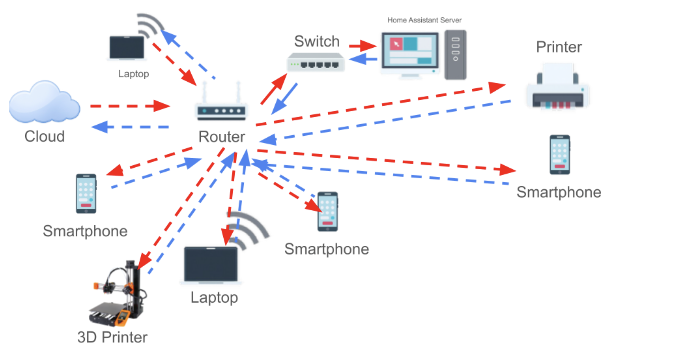
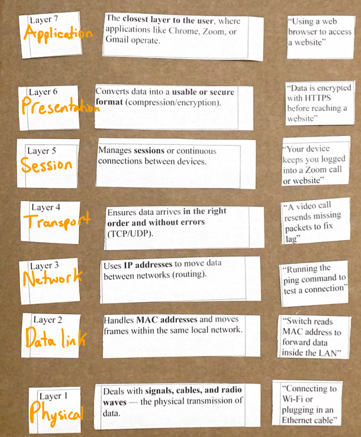
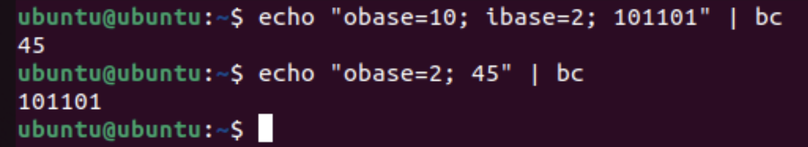
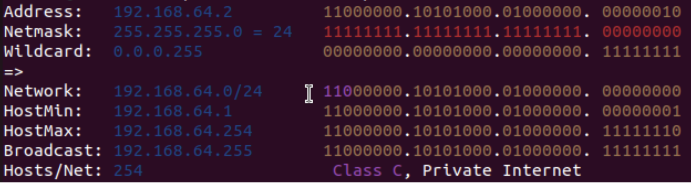
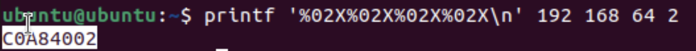
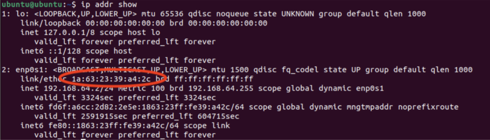
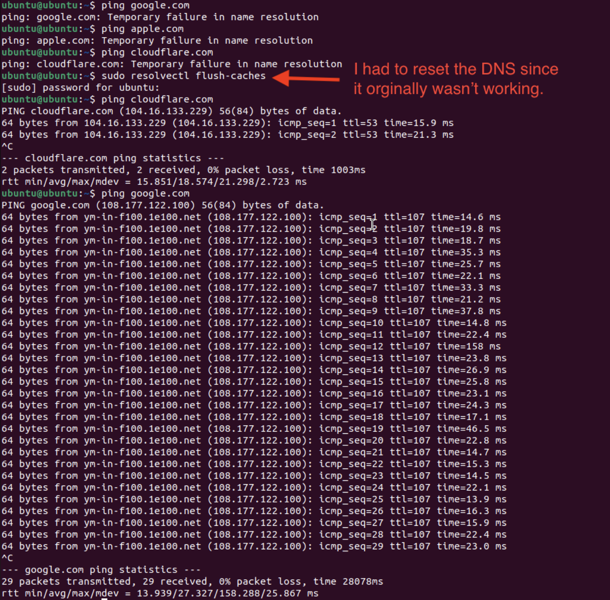
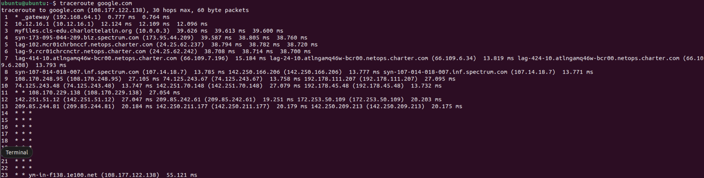
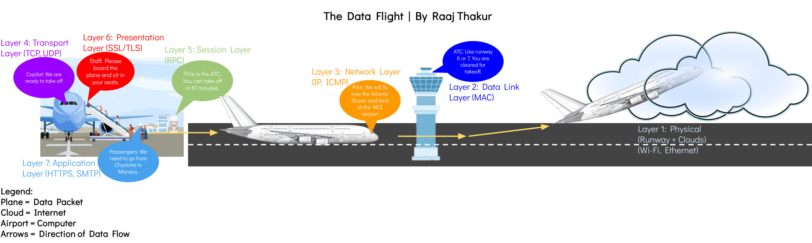

# Data Movement and Types of Networks

## Project Introduction

This project was focused on understanding how a LAN works, how data travels between devices on a LAN, and introducing binary, decimal, and hexadecimal numbers and their uses in networking applications.

- [**Planning and Design**](#planning-and-design)
- [**Technical Development**](#technical-development)
- [**Testing and Evaluation**](#testing-and-evaluation)
- [**Reflection**](#reflection)

## Planning and Design {.collapsible}

The main objectives for this project were to explore how Local Area Networks (LANs) enable communication between devices that are in the same environment (house, school, building, etc.), showcase how IP and MAC addresses are used to identify devices (as well as learning about their differences), and to learn to use ICMP tools to test connections and find details about devices on the LAN.

### Components of a LAN and Representing them as Parts of a City

|Component|Purpose|Analogy|
|---------|-------|-------|
|Endpoint Devices (Computers, Printers, Phones, etc.|Endpoint Devices are devices that send or receive data across a network. They are the ones that use the network.|Houses in the city who communicate with other houses|
|Ethernet Cables and Wi-Fi|The physical (Ethernet) or wireless (Wi-Fi) connections that allow data to move between devices on a network.|Roads that interconnect everything|
|Switch|A device that connects multiple endpoint devices within the same network and directs |Roundabout that guides traffic and ensures that everyone goes to the right location|
|Router||Post office that decides which mail should stay local (within LAN) and should be mailed to other cities (Internet)|
|Data||The letters and packages that people mail to each other within the city and outside the city|

### Important LAN Terms

|Term|Definition|
|----|---|
|LAN (Local Area Network)|A network that connects endpoint devices within 1 building/campus and lets them share printers, files, and internet connections efficiently over the LAN|
|Host|Any device (computer, printer, phone, etc.) that can send or receive data on the network. Each host has a unique IP address assigned by the router.|
|Switch|A device that connects multiple devices on the LAN. It works by learning the MAC address (hardware identifier unique to each NIC) of each device plugged in. When data comes in, the switch forwards it exclusively to the intended device.|
|Router|A device that connects the LAN to other networks and the Internet. It uses IP addresses to send incoming data to the intended device.|
|Packet|Segmented data that contains the sender's IP (return address), receiver's IP (destination), and the "payload" (the actual message/data). When packets arrive, the endpoint device reassembles it into complete data.|
|IP Address|Unique identifier for endpoint devices on a network. Different IP address ranges mean different things (192.168.x.x and 10.x.x.x vs 169.254.x.x)|

### Diagram of My House's LAN 

{ width=500 }

In my house, almost everything is connected via Wi-Fi, except for the switch and Home Assistant Server that handles all of the smart home tasks in my house. Everything is directly connected to the router, which communicates with the internet and cloud services.

### OSI Model - The Seven Layers of Networking

Networks are often represented by the OSI model, which consists of seven categories that encompass all networking-related tasks. They are:

|Layer|Name|Description|Analogy|
|-|-|-|-|
|7|Application|An email client, web browser, or any internet-connected application (Spotify, Adobe Creative Cloud, Safari, etc.|Human-computer interaction layer.|
|6|Presentation|Translates data (encryption, compression)|Ensures data is in a usable form.|
|5|Session|Manages the connection|Maintains connections and is responsible for controlling parts and sessions.|
|4|Transport|Breaks data into segments|Transmits data using transmission protocols such as TCP (Transmission Control Protocol) and UDP (User Datagram Protocol)|
|3|Network|Routes packages using IP addresses|Decides which physical path the data will take.|
|2|Data Link|Transfers frames via MAC (media access control) addresses|Defines the format of data on the network.|
|1|Physical|Wires, signals, routers, switches, Wi-Fi|Transmits raw bit streams over the physical medium.|

#### OSI Cards Diagram

The following images showcase an activity about understanding how real-world examples are categorized into the OSI layers:

##### First Attempt

{ width=400 } 

First attempt at matching OSI cards with example and ordering them correctly.

##### Correct Organization

{ width=500 }

Correct organization of OSI cards with their examples.

### OSI vs TCP/IP Model

|TCP/IP Layer|Corresponding OSI Layers|Functions|
|------------|----------------------------------------------|--------------------------|
|Application |7 (Application), 6 (Presentation), 5 (Session)|Apps, HTTP, FTP           |
|Transport   |4 (Transport)                                 |TCP/UDP, data segmentation|
|Internet    |3 (Network)                                   |IP addressing, routing    |
|Network Access|2 (Data Link), 1 (Physical)                 |Physical and Data Link    |

### Representing Numbers with Different Bases

To demonstrate how number bases work, cards representing base-10 (decimal), base-2 (binary), and base-5 were provided. The task was to represent different numerical values with the different bases.

#### Base 10

501 = 5 * 102 + 0 * 101 + 1 * 100  = 500 + 0 + 1 = 401

{ width=250 }

473 = 4 * 102 + 7 * 101 + 3 * 100 = 400 + 70 + 3 = 473

{ width=250 }

324 = 3 * 102 + 2 * 101 + 4 * 100 = 300 + 20 + 4 = 324

{ width=250 }

#### Base 5

84 (Decimal) = 3 * 52 + 1 * 51 + 4 * 50 = 300 + 50 + 4 = 314 (Base-5) = 84 (Base-10)

{ width=250 }

37 (Decimal) = 1 * 5² + 2 * 5¹ + 2 * 5⁰ = 25 + 10 + 2 = 122 (Base-5) = 37 (Base-10)

{ width=250 }

## Technical Development {.collapsible}
In this section of the project, an Ubuntu VM was used to apply and verify networking concepts in the CLI. 

### Using Ubuntu to Convert Between Binary and Decimal

Converting between binary and decimal by hand is very difficult and tedious. Thankfully, the `bc` CLI tool can be used to perform the conversion. 

To convert from binary to decimal, the command `echo "obase=10; ibase=2; [Insert Binary Number]" | bc` and `echo "obase=2; 45" | bc` can be used to convert from binary to decimal and from decimal to binary, respectively. Below is a breakdown of these commands:

|Part|Meaning|
|----|-------|
|echo|Prints text|
|"obase=10; ibase=2; 101101"|The conversion formula — it tells the calculator what number base to use.|
|obase|“Output base” — the numbering system you want the result in.|
|ibase|“Input base” — the numbering system your starting number is in.|
|bc|The basic calculator program built into Ubuntu — it performs the conversion.|

 

Below is what these commands look like in the Ubuntu CLI:
{ width= 300 }

### Representing Network Information as Hexadecimal and Binary

Although decimal is easily readable by humans, computers process information in binary. Any time a computer works with decimal numbers, it first has to convert it to binary in order to do any operations with it. To see Ubuntu's IP address in binary, `ipcalc` must be installed with `sudo apt install ipcalc -y`. After installing it, run `ipcalc [IP address]` to display network information in binary.

{ width= 300 }

Since hexadecimal can represent up to the number 15 in each character, it can store more information in less space when compared with decimal and especially compared to binary. To view network information in hexadecimal form in Ubuntu, the command `printf '%02X%02X%02X%02X\n' 192 168 64 2`, where 192, 168, 64, and 2 should be replaced with the digits from your IP address (found with `ifconfig`).

The output was C0A84002. Breaking this down:

- C0 = 192
- A8 = 168
- 40 = 64
- 02 = 2

{ width= 300 }

MAC addresses are also written in hexadecimal form; each pair of characters represents a byte of the device's hardware address. To find the MAC address in Ubuntu, run `ip addr show`. 

{ width=500 }

### Exploring LAN Components through Ubuntu
Information about the LAN can be identified in Ubuntu through CLI commands such as `ifconfig`, `ping`, and `traceroute`. These three commands are essential for finding information about the LAN as well as troubleshooting. 

#### What Each Command Does

<table>
  <thead>
    <tr>
      <th style="width: 18%;">Command</th>
      <th style="width: 42%;">Purpose</th>
      <th style="width: 40%;">Example Output</th>
    </tr>
  </thead>
  <tbody>
    <tr>
      <td><code>ifconfig</code></td>
      <td>Shows a computer's IP address on the network</td>
      <td>inet 192.168.1.202</td>
    </tr>
    <tr>
      <td><code>ping</code></td>
      <td>Tests if another computer or website is reachable within the LAN or over the internet</td>
      <td>64 bytes from google.com ...</td>
    </tr>
    <tr>
      <td><code>traceroute</code></td>
      <td>Shows every step data takes to reach a destination</td>
      <td>1 192.168.54.1 ⇒ 2 10.0.0.1 ⇒ 3 142.250.190.78, etc.</td>
    </tr>
  </tbody>
</table>

Before running any of these commands, they had to be installed on the computer with `sudo apt install net-tools -y` to install `ifconfig`, `sudo apt install iputils-ping -y` to install `ping`, and `sudo apt install traceroute -y` to install `traceroute`. 

`ifconfig` is mainly used to display information relating how a computer connects to the LAN. It outputs information such as **inet**, the IP address assigned to the computer, **netmask**, which defines the portion of the IP address identifies the network and device, and **broadcast**, which is used to send messages to all devices on the same LAN. 

{ width=300 }

In the image above, inet, netmask, and broadcast are all outlined in red. Inet is the IP address of the computer (192.168.64.2). Netmask (255.255.255.0) defines which part of the IP address identifies the network, and which part identifies the device. When translated to binary, the netmask is 11111111.11111111.11111111.00000000. Each 1 means "network", and each 0 means "host", meaning that 192.168.64 identifies the network, and 2 identifies the device on the network. The range of valid IP addresses in the network would be anywhere from 192.168.64.1 - 192.168.64.254 (since 192.168.64.255 is the broadcast).

`ping` is mainly used to test internet connection and DNS. Pinging a public DNS server, such as 8.8.8.8 (Google's public DNS server) and 1.1.1.1 (Cloudflare's public DNS server), is a simple way to ensure that a computer can reach the internet. Once internet connection is verified, pinging a domain such as google.com or cloudflare.com can test the DNS. If 8.8.8.8 is reachable but google.com isn't, that means that there is an issue with the DNS. To run these commands in Ubuntu and macOS, run `ping -c 4 8.8.8.8` then `ping google.com`. In the image below, a ping was sent to google.com and other domains, but they didn't respond. So, the DNS was reset with `sudo resolvectl flush-caches`, which made google.com and cloudlfare.com reachable. After each ping, the system prints how long the data took to travel to the domain, which is a good indicator of internet speed. 

{ width=300 }

`traceroute` is used to show the route data takes to reach a destination. To test it with google.com (any domain will work), run `traceroute google.com`. This command will return a list of "hops" that show the path the data takes across routers to reach Google's server. When it was tested, the data took 23 "hops" and 55.121 ms to reach google.com. 

{ width=300 }

The data from traceroute can be confusing. Below is a table explaining what each part of the output means:

|Part|What it Means|Example|
|Hop #|The number on the left that shows how many "steps" away that device is from the computer|1, 2, 3, ...|
|Hostname/IP Address|The name or IP of the router or device that handled the packet|10.12.16.1, 209.85.244.81, etc.|
|ms (milliseconds)|The round-trip time (how long it took to reach that hop and come back)|209.85.244.81: 20.175 ms|
|*|Stars represent a connection to a router or device that refuses to return information|* * *|

In the example above:
- Hop 1: *_gateway (192.168.64.1) is the local network gateway (what connects the LAN to the internet)
- Hop 2-10: Local or ISP routers
- Hop 11-20: Internet backbone routers (large, powerful routers moving data across regions or countries)
- Hop 23: Google's server (64.233.176.113)

### Roadmap Representing OSI Layers

Reflection:
This roadmap represents a data packet as a plane flying from an airport to another airport. It represents the different OSI layers as aspects of an airport, such as the runway being the physical layer. I think that the Transport layer is the most important since it ensures that everything arrives safely and in order. This project helped me understand how the TCP/IP model is a simplified version of the OSI model but both aim to describe how data is transferred.  

## Testing and Evaluation {.collapsible}

Throughout the activity, many labs were performed involving many different commands. Below, a table summarizes all of the commands used and their purpose.

| **Concept** | **Test Performed** | **Verification Result** |
|--------------|--------------------|--------------------------|
| **Network Path Mapping** | `traceroute google.com` | Successfully traced the route from the local router to Google’s servers, totaling 23 hops in roughly 3 seconds. |
| **Data Exchange** | `netcat` between virtual machines | Verified reliable message delivery over TCP between two VMs. |
| **Binary and Decimal Conversion** | `bc` command | Confirmed accurate conversions between binary and decimal formats. |
| **Hexadecimal Output** | `printf` command | Correctly formatted and displayed IP address as hexadecimal (e.g., `C0A84002`). |
| **LAN Interface Details** | `ifconfig` command | Displayed `inet`, `netmask`, and `broadcast` parameters for network interfaces. |
| **Address and Range Calculation** | `ipcalc` | Produced valid network, broadcast, and usable host address ranges. |
| **Open Port Detection** | `netstat` | Revealed listening ports and established TCP connections between devices. |
| **Internet Reachability Test** | `ping google.com` and `ping 8.8.8.8` | Reported full packet reception with ~22 ms average response time. |

## Reflection {.collapsible}

By working through the various labs exploring data movement, I learned how exactly data is transferred between devices, both over a LAN and through the internet. Learning about the OSI and TCP/IP models helped simplify and understand how data communication works. Designing a roadmap to visualize data transfer helped me understand OSI layers even better. Additionally, converting between binary, decimal, and hexadecimal helped me understand the different number systems and showed the different advantages of each system. By using `ipcalc`, I learned how IP addresses are represented in binary. Using `ping` and `traceroute` demonstrated the path that data takes to transfer from one system to another and demonstrated a real world application of the OSI layers.