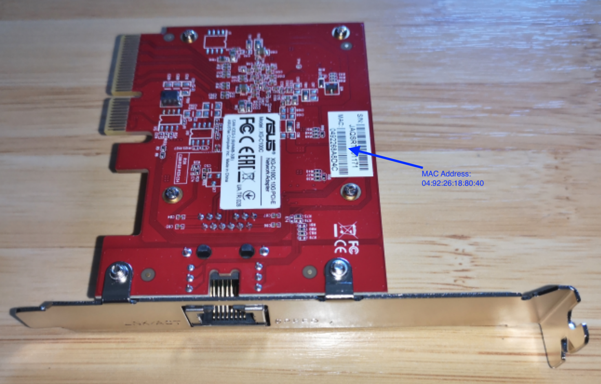
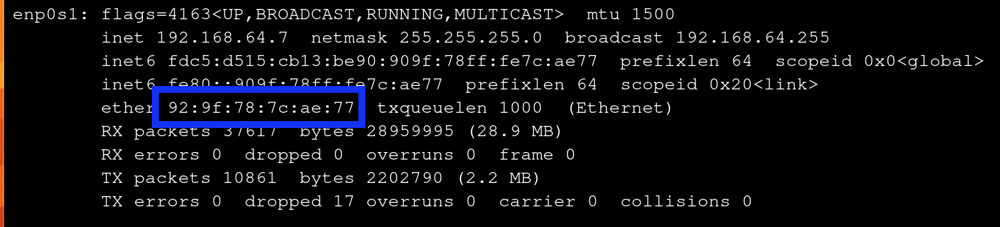
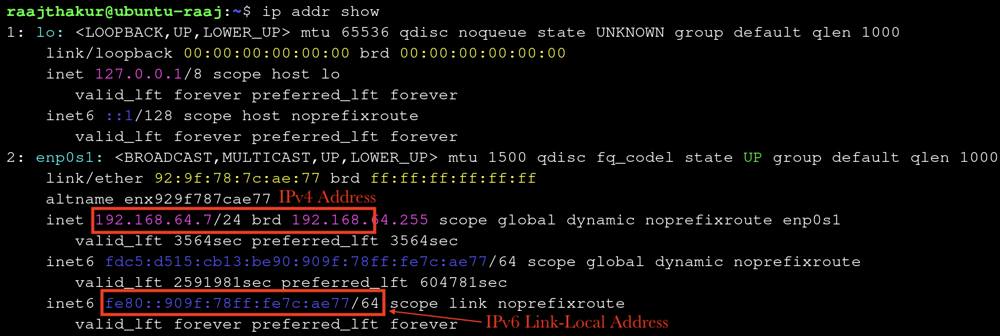
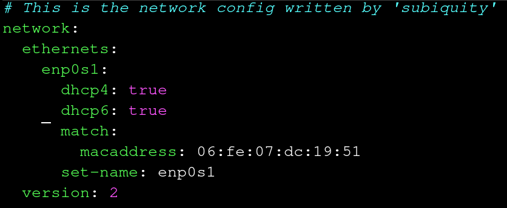
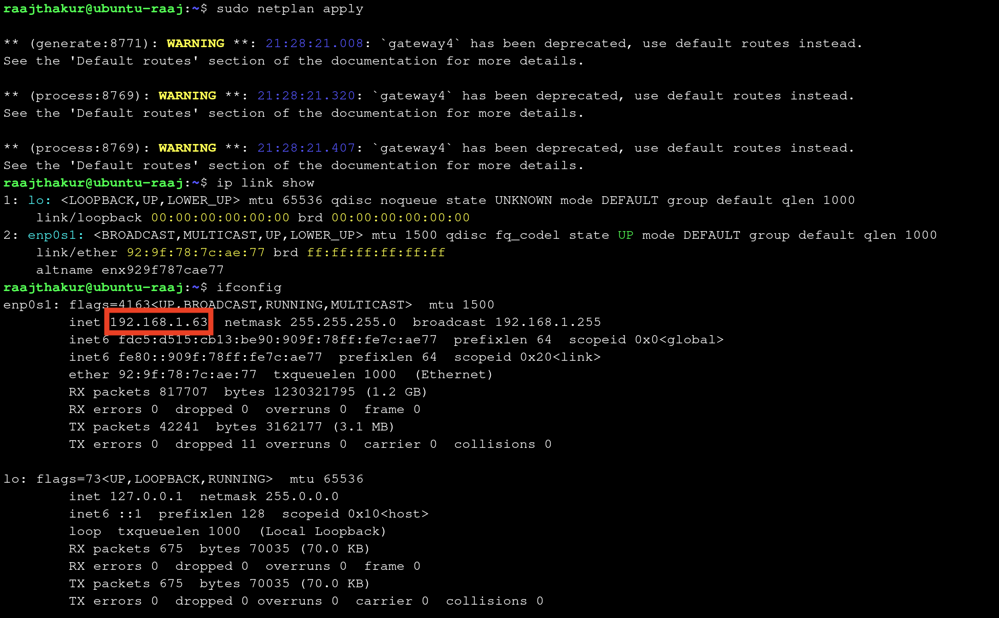

# Physical and Logical Addressing

## Project Introduction

This project was focused on exploring physical and logical addressing (MAC and IP addresses), such as their unique purposes, use cases, and differences. 

## Table of Contents

- [**Understanding Physical Addressing (MAC Addresses)**](#understanding-physical-addressing-mac-addresses)

- [**Understanding Logical Addressing (IPv4 and IPv6)**](#understanding-logical-addressing-ipv4-and-ipv6)

- [**Dynamic vs Static Addressing & When to Use Each**](#dynamic-vs-static-addressing--when-to-use-each)

- [**Configuring and Verifying IP Addresses on a Linux VM**](#configuring-and-verifying-ip-addresses-on-a-linux-vm)

- [**Reflection**](#reflection)

## Understanding Physical Addressing (MAC Addresses) {.collapsible}

### Part A: Exploring a Network Interface Card (NIC)

Every device that connects to a network—computers, phones, printers, game consoles—contains a small hardware component called a Network Interface Card (NIC). The NIC is what sends and receives data over the network. Each NIC is assigned a permanent hardware identifier when it is manufactured. This identifier is called a physical address because it is tied to the physical hardware itself.

On modern Ethernet and Wi-Fi networks, this physical address is known as a MAC Address (Media Access Control Address)

Key points:

- It is assigned at the factory.
- It does not normally change, even if you move the device to another network.
- It uniquely identifies your network interface among all others in the world.

NICs can take on many form factors. In portable devices (cell phones, laptops, tablets, etc.), the NIC is usually soldered directly to the board, or exists in the M.2 form factor. In desktop computers and servers, NICs usually utilize the PCIe interface and take up a PCIe x4 slot on a motherboard. 

{ width = 500 }

{ width = 500 }

In the NICs pictured above, the Ethernet port is used to transfer and receive packets from the network (OSI Layer 1) and the PCIe connector transmits data to the rest of the system so it can be processed by the RAM and CPU. It needs a main chip to handle all of the network protocol work, such as assembling frames, and tagging packets with its MAC address, amongst many other responsibilities.

Due to a MAC being permanently assigned to each NIC, a MAC address is considered the physical address for a device. It cannot be altered by the OS or any software. This is why switches use Ethernet to send packets to the right device, since they operate at OSI Level 2 along with MAC addresses.

### Part B: Interpreting MAC Addresses

The MAC address of the Ubuntu VM used in prior lessons was 0e:d6:c7:3a:ea:8f. A MAC is composed of 2 parts: the OUI (Organizationally Unique Identifier), represented by the first half of the MAC, and the device-specific identifier, represented by the second half of the MAC. In this case, the OUI was 0e:d6:c7 and the device-specific identifier was 3a:ea:8f. The OUI was researched on [maclookup.app](https://maclookup.app), which stated that the MAC as a "randomized MAC." This makes sense, since the VM's NIC is virtualized, and UTM generates a random MAC during the VM configuration. 

{ width=300 }

{ width=500 }

Overall, when compared to the physical NICs in Part A which get their MAC addresses permanently assigned to them upon being manufactured, the VM's virtual NIC gets a randomized NIC. Both the physical and virtual MAC addresses follow the same format (48 bit value, 6 pairs of hex numbers, etc.), and they both serve as Layer 2 identifiers. However, physical MACs contain OUIs that represent the manufacturer of the device, whereas virtual MACs have OUIs that don't represent anything - they're randomly generated. They tend to look "fake" in terms of vendor code, which is why the MAC lookup website reported the VM's MAC as randomized. 

Below is a comparison table that lists different MACs, their vendor, and whether they are physical or virtual MACs:

| Full Address         | OUI        | Vendor   | Type of Vendor |Notes|
|----------------------|------------|----------|----------------|-----|
| F0:18:98:AA:BB:CC    | F0:18:98   | Apple    | Physical       |Apple makes physical devices, which is why their MACs and OUIs are associated with physical MACs|
| 3C:5A:B4:11:22:33    | 3C:5A:B4   | Google   | Physical       |Similarly to Apple, Google only makes physical devices|
| 60:45:BD:12:34:56    | 60:45:BD   | Microsoft| Physical       |Similarly to Apple and Google, Microsoft only makes physical devices|
| A4:BA:DB:22:33:44    | A4:BA:DB   | Dell     | Physical       |Similarly to Microsoft, Apple, and Google, Microsoft only makes physical devices|
| 04:1A:04:55:66:77    | 04:1A:04   | WaveIP   | Physical       |Similarly to Dell, Microsoft, Apple, and Google, Microsoft only makes physical devices (WaveIP makes routers)|
| 00:50:56:AA:BB:CC    | 00:50:56   | VMWare   | Both           |VMWare makes both physical NICs and software which virtualize NICs (like VMWare Fusion), meaning that a VMWare NIC could be either physical or virtual|
| 52:54:00:12:34:56    | 52:54:00   | None     | Virtual        |The OUI 52:52:00 is not registered to any organization, meaning that this MAC is likely from a VM software such as UTM which generates a random MAC|

From this table, many patterns arose. Most of the registered vendors were well-known device makers such as Apple and Dell. Also, virtualization companies who deploy large-scale VM software to large corporations and enterprises need a registered OUI to ensure that the VMs and their virtual NICs appear as legitimate Layer 2 devices on a large network and avoid collisions with physical NICs. This activity helped me understand how MAC addressing operates. 

### Part C: Connecting the Physical and Digital: Interpreting MAC Address Structure

This section of the activity involved analyzing a MAC address's structure to understand what each part means and its function inside a local network.

The VM's MAC address was 0e:d6:c7:3a:ea:8f. MAC addresses contain two subsections: the OUI and the device identifier. For this MAC address, the OUI is 0e:d6:c7, and the identifier is 3a:ea:8f, represented by the first 3 and last 3 pairs, respectively. The OUI represents a specific manufacturer, like Apple, Dell, Microsoft, etc., and is important because it can help identify specific devices on a network. For example, if a network administrator is searching for a specific Mac computer, they can filter out any MAC addresses that don't have OUIs registered to Apple. The device identifier is equally important, since it is unique to each NIC and prevents any other NIC from having the exact same MAC address. If 2 devices have the same MAC address on a network, there will almost certainly be connectivity issues for both devices, and data will often end up at the wrong device since they appear as identical devices on the network.

Physical and virtual NICs store their MAC addresses differently. While physical NICs store their permanent MAC address in flash memory located on the NIC card, VMs get MAC addresses assigned by the hypervisor. These MAC addresses can either be completely random (like in UTM), or be within a certain range with a limited set of valid OUIs (in large-scale enterprise VM software like VMWare Fusion). Both physical and virtual MACs use the same 48 bit structure and must be unique. However, physical MACs are the only ones that are truly unique, as a virtual MAC can be any group of 48 bits as long as they follow the format of a MAC address. Regardless of physical or virtual hardware, OSI Layer 2 works identically with physical and virtual NICs since all Layer 2 works with is MAC addresses - the hardware / lack of hardware has no involvement with Layer 2. As long as the MAC is unique on the network, Layer 2 behaves identically across physical and virtual NICs. 

### Reflection

MAC addresses operate at OSI Layer 2, where switches and routers use them to deliver frames within the same local network to the correct device. They never leave the local network because routers replace the endpoint device's MAC address with the router's own MAC address, since the router is what forwards packets to and from the internet. 

## Understanding Logical Addressing (IPv4 and IPv6) {.collapsible}

While MAC addresses work extremely well for communication within a single network, they have one major limitation: a device cannot reach another device outside its local network with just MAC addresses. This is where **logical addressing** is used, as it uses **IP (Internet Protocol) Addresses** to communicate across the world. Logical addresses allow devices to be located anywhere on Earth, change networks and still remain reachable, and to transfer data across multiple interconnected networks.

There are two different standards in logical addressing: 

- IPv4: the fourth version of the Internet Protocol and the first widely deployed system for global addressing.
    - 32 bit address, supporting ≈ 4.3 billion unique addresses
    - Example: 192.168.1.10
- IPv6: the sixth version of the Internet Protocol designed to solve limitations of IPv4. While IPv4 can support ≈ 4.3 billion unique addresses, IPv6 allows for virtually infinite addresses since it uses 128 bits instead of 32. In fact, there are enough IPv6 addresses for **every grain of sand on Earth to each have billions of addresses**.
    - IPv6 is written in hexadecimal with colons to make it easier to read
    - Example: 2001:0db8:85a3::8a2e:0370:7334

**Comparison Table between IPv4 and IPv6:**

| Category          | IPv4             | IPv6                      |
|-------------------|------------------|---------------------------|
| Bits              |  32              | 128                       |
| Capacity          |  ~4.3 billion    | Virtually unlimited       |
| Notation          |  Dotted decimal  | Hexadecimal with colons   |
| Example           |  10.0.0.25       | fe80::1f4a:e3ff:fe21:bd10 |

### Logical Addressing Lab 

An activity was completed that focused on the following:

- Understanding the role of logical addresses
- Interpreting IPv4 and IPv6 addresses
- Understanding why IPv6 link-local addresses always exist
- Connecting logical addressing to global communication

#### Documenting IP Addresses

The Ubuntu VM's IP addresses were found using `ip addr show`, which printed the IPv4, IPv6, and MAC address, along with other information.

{ width=400 }

- **IPv4 Address:** 192.168.64.7
- **IPv6 Link-Local Address:** fe80::909f:78ff:fe7c:ae77**

**Purpose of IPv6 Link-Local Address:**

An IPv6 link-local address is a special type of IPv6 address that a device uses exclusively to communicate with other devices on the same subnet. Routers do not forward traffic associated with link-local addresses. They start with fe80:: since the IPv6 standard mandates that all link-local addresses begin with this prefix. These addresses are very important for local communication, such as router discovery, finding other IPv6 devices on the network, and basic connectivity without requiring advanced IP configuration. They also do not need a DHCP server (usually a router) to assign an address; IPv6 uses stateless auto configuration, meaning that a system automatically generates a link-local address for each network interface (such as en0, en1, enp0s1, etc.).

**WHy IPv6 is Important for the Future of Networking:**

Although IPv4 has been the backbone of networking and the internet for a very long time, it is no longer sufficient for modern use since its 32-bit address space only provides ~4.3 billion addresses, which has been exhausted due to the influx of connected devices since the turn of the century. In the 21st century, there has been exponential growth of the internet, mobile devices, cloud services, and IoT devices. IPv6 solves this problem by using a 128-bit address space, allowing for a virtually unlimited number of unique IP addresses. Along with a far higher capacity for addresses, IPv6 has many improvements in both efficiency and security when compared to IPv4. However, since IPv4 is deeply embedded in existing infrastructure, modern networks must support both IPv4 and IPv6 simultaneously, allowing for a gradual migration to IPv6 rather than a sudden change, which would almost certainly cause global infrastructure outages and a lack of support for billions of devices.

**Reflection: Why Both Logical and Physical Addresses are Needed on a Network, and how IP Addresses Allow Communication Beyond the Local Network:**

Logical addresses (IP addresses) are needed in addition to MAC addresses since MAC addresses only work for communication within a local network, whereas IP addresses can work both locally and globally. Also, MAC addresses identify individual devices but are unable to identify where a device is located on the internet, which is why MAC addresses are not reachable outside the local network. IP addresses compensate for these shortcomings since they can work across multiple routers. An example of this principle is when running `traceroute [public IP]`, which showcases how data travels across many different hops (different routers). This would be impossible without IP addresses. 

## Dynamic vs Static Addressing & When to Use Each {.collapsible}

Devices receive IP addresses in one of two ways:

- Dynamically: IP is automatically assigned by router, uses protocol called DHCP (Dynamic Host Configuration Protocol)
- Statically: IP is manually assigned to a device and does not change

Dynamic and Static Addressing each have benefits and disadvantages, such as:

- Dynamic:
    - Automatically assigned (no need for users or admins to configure IPs manually)
    - Lease-based (devices need to renew their IP once the "lease" is up)
    - Ideal for end-user devices
    - Highly scalable
- Static:
    - Manually configured (gives admins more control)
    - Never changes unless reconfigured
    - Commonly used in servers, printers, routers, cameras, etc. Not common for user endpoint devices.

DHCP works by following a four step sequence informally referred to as "DORA":

1. DHCP**D**ISCOVER: Device broadcasts a message across the network looking for a DHCP server to assign it an IP
2. DHCP**O**FFER: A DHCP server replies with an available IP address and network settings
3. DHCP**R**EQUEST: The device responds to the server agreeing to use the assigned IP
4. DHCP**A**CK: The server sends a final confirmation known as "ACK." Once the confirmation is acknowledged, the device officially receives its IP and can use the network normally.

### Activity: Dynamic vs Static Addressing Across Two VMs

This activity involved exploring how two differently configured Ubuntu VMs receive their IP addresses and whether each uses dynamic (DHCP) or static addressing.

To start, `ip addr show` was run in both VMs to find their IPv4 and IPv6 link-local addresses.

{ width=700 } 

{ width=700 }

VM1:

- IPv4 address: 192.168.64.2
- IPv6 link-local address: fe80::1863:23ff:fe39:a42c

VM2:

- IPv4 address: 10.12.26.1
- IPv6 link-local address: fe80::cd6:c7ff:fe3a:ea8f

The next step was to examine each VM's config files. This was first completed in VM1, where the command `cat /etc/netplan/*.yaml` was run in order to print out any files ending in .yaml in the directory /etc/netplan, the folder where the network config files are located. The output revealed, among other things, that the VM receives its IPv4 address dynamically since it says "dhcp4: true".

{ width=650 }

The same command was run in VM2, which printed "dhcp4: true" **and** "dhcp6: true". This means that the VM receives **both IPv4 and IPv6** addresses dynamically. 

{ width=650 }

When looking at both VMs together, both VMs use Netplan, the configuration layer that defines whether an interface uses DHCP in most modern Linux distributions. While VM2 uses DHCP for IPv4 and IPv6, VM1 only uses DHCP for IPv4, meaning that IPv6 has to be manually configured by the user. The output from running `cat /etc/netplan/*.yaml` was very similar between the two VMs, the only difference was that VM2 included a bit more information. The two Linux systems might configure networking differently since VM1 is running Ubuntu 22.04 while VM2 is running Ubuntu 25.10, so the newer version may have more advanced networking features, leading it to automatically configuring IPv6.

### Scenario Analysis

In this section of the activity, a list of devices was provided and it was decided whether they should use static or dynamic addressing.

1. School web server: **Static**
    - A web server needs a consistent IP so that students and staff can reliably access it. Changing its IP could make it unreachable or harder to find on the network.
2. A classroom printer: **Static**
    - Printers should have fixed IPs so that multiple devices can always locate and print to them without having to search the network. Static IP prevents connection issues caused by changing addresses.
3. Student laptops: **Dynamic**
    - Laptops are frequently connected and disconnected, and there are many of them; using DHCP allows efficient IP allocation without manual configuration. Dynamic addressing simplifies management and avoids IP conflicts.
4. Security cameras: **Static**
    - Cameras need a predictable IP for monitoring systems and remote access; dynamic IPs could disrupt video feeds or recording schedules. Static IP ensures continuous access and easier maintenance.
5. A teacher workstation: **Dynamic**
    - Since the teacher workstation is primarily used for daily tasks like web browsing, email, and printing, it doesn’t require a fixed IP. Dynamic addressing via DHCP simplifies network management and reduces the risk of IP conflicts, especially if the teacher occasionally moves the device to different classrooms or networks.

## Configuring and Verifying IP Addresses on a Linux VM {.collapsible}

In this activity, Ubuntu's network settings were manually edited to assign a static IP address. VM #2 from earlier activities was used in this activity since VM #1 uses NetworkManager, an older network manager that does not allow for direct .yaml file editing.

To configure the static IP, the following steps were taken:

1. Run `ip link show` to identify the active network interface. In this case, the active interface was enp0s1. 

{ width=500 }

2. Reveal contents of /etc/netplan with `ls /etc/netplan`. Open the file(s) located with `sudo nano /etc/netplan/<filename>.yaml`. In the case of this VM, files 00-installer-config.yaml and 01-network-manager-all.yaml were in the folder. Since the first file had "config" in the name, it was assumed that the first file was responsible for configuring the IP addresses (this ended up being correct).

3. In the file, change DHCP to Static IP by changing dhcp4 from "true" to "no", then specifying the desired IP address underneath it. 

{ width=400 } { width=400 }

4. Save the file with Ctrl + O & Ctrl + X

5. Apply the changes by running `sudo netplan apply`

{ width=600 }

6. Test that the IP is correct with `ip addr show`, that the traffic is routed through the correct IP with `ip route show`, and that the VM can connect to the internet with `ping -c 4 8.8.8.8`

{ width=500 }

### Reflection

The most challenging part of this activity was getting the YAML file correct. It is very sensitive to minute errors in syntax, and it is very difficult to tell what is actually wrong. I learned how important precision is in editing config files such as the netplan YAML files. 

## Reflection {.collapsible}

Working on this project helped me understand how physical and logical addressing work together. MAC addresses give each device a unique identity on a local network, while IP addresses let devices communicate across different networks. Learning about DHCP versus static addressing showed that dynamic IPs make managing devices like laptops easier, while static IPs are important for servers, printers, and cameras that need consistent addresses. Comparing VM #1 and VM #2 showed that different Linux versions and network managers handle IPs differently—VM #1 used DHCP for IPv4 only, while VM #2 got both IPv4 and IPv6 addresses automatically. Editing YAML files for static IPs taught me that even small mistakes in syntax or indentation can break the network. These lessons apply to real-world devices: web servers need static IPs to stay reachable, printers need fixed addresses so everyone can print, and routers use both static and dynamic addressing to keep networks running smoothly. Overall, this project showed that careful setup of addresses is essential for reliable network communication and that precision matters when configuring network settings.
