# Routing

## Table of Contents

- [**Design and Planning**](#design-and-planning)
- [**Techinal Development**](#technical-development)
- [**Testing and Evaluation**](#testing-and-evaluation)
- [**Reflection**](#reflection)

## Design and Planning {.collapsible}

### Investigation 1 – A Machine's Layer 3 Identity

To explore OSI Layer 3, two VMs running Ubuntu were opened. The following information was obtained:

VM1: Ubuntu 22.04.03
- IPv4: 10.12.26.143
- Network: 10.12.26.1
- Route: 10.0.1.38
- Default gateway: 10.12.16.0

VM2: Ubuntu 25.10
- IPv4: 10.12.17.124
- Network: 10.12.26.1
- Route: 10.0.1.38
- Default gateway: 10.12.16.0

The machine already has enough information to send traffic to itself, devices on its subnet, and devices outside its subnet. It knows to do this since the router gives endpoint devices the information needed to reach the correct destination.

### Investigation 2 – Sending Traffic

VM sending traffic to itself:

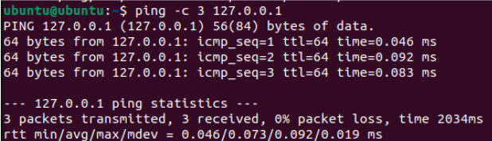{ width=500 }

VM sending traffic to other VM:

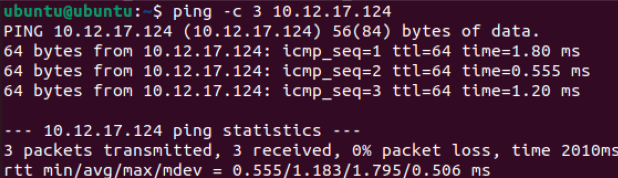{ width=500 }

VM sending traffic outside LAN:

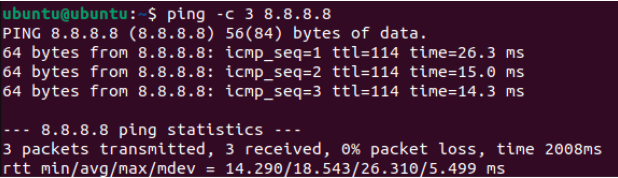{ width=500 }

I predict that if I send traffic to another VM, the next hop will be direct, since the packets never leave the computer, whereas if I send traffic to 8.8.8.8, the next hop will be to the gateway since the packets have to leave the LAN to reach an external server.

## Technical Development {.collapsible}

### Who Can See You? – Activity

#### Part 1 – Your Inside Identity

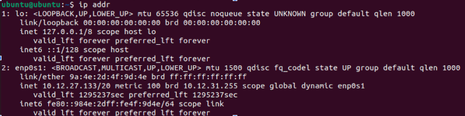{ width=500 }

- IPv4 Address: 10.12.27.133
- This address is not globally unique since IP addresses are not unique outside of a LAN and are arbitrary addresses that are randomly assigned by the DHCP server 
- Another network in the world could use the same address because IP addresses are arbitrary and not tied to specific hardware/software
- Common private IPv4 ranges include **10.0.0.0 - 10.255.255.255**, 172.31.0.0 - 172.31.255.255, and 192.168.0.0 - 192.168.255.255. This IPv4 falls in the first range (bolded).

#### Part 2 – Your Outside Identity

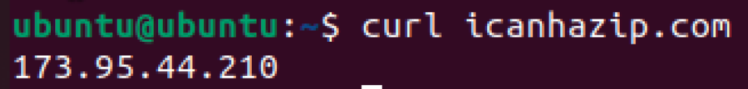{ width=500 }

This was run on both VMs. Both VMs returned the same public IP.

|Question|Private Address|Public Address|
|--------|---------------|--------------|
|Are they the same?|No|Yes|
|Why or why not?|Because they appear as separate devices on the LAN|Because they connect to the same router, which is what is assigned the public IP|

#### Part 3 – "Can I Reach You?" Partner Activity

Step 1: Private Address Test

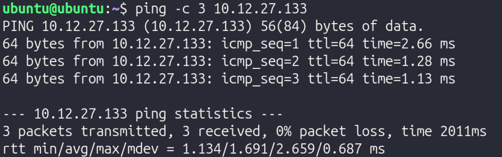{ width=500 }

Step 2: Public Address Test

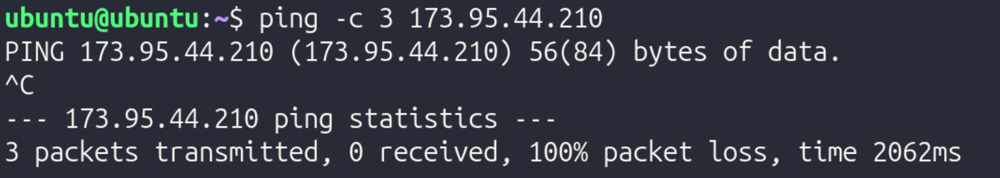{ width=500 }

Reflection:

In this experiment, a VM on another computer was reachable via ICMP (ping), as demonstrated by the first screenshot. However, the public IP could not be reached from the VM. This could be for a variety of reasons, but it is pretty common for ISPs to block users from pinging their public IP.

#### Part 4 - NAT Reasoning

1. Why are private IPv4 addresses reused in millions of different networks?
    - Since the IPv4 protocol has a limited amount of possible addresses, it is inevitable that IPv4 addresses are reused across different networks. Since they have no meaning outside the LAN/WAN, reusing the same IPv4 address across different networks does not cause conflicts
2. Why are private addresses not routed on the public internet?
    - If private addresses were routed on the public internet, there would be many different devices with the same IP due to IPv4 limitations. For example, if one computer with IP address 192.168.1.2 was supposed to receive packets from a server, the server and network infrastructure would have no method of distinguishing between all the other devices with an identical IP.
3. What would happen if every internal device required its on public IP?
    - If every device required a public IP, there would not be enough IP addresses to meet the amount of devices, again, due to the limitations of IPv4.
4. Why does a business typically have one public IP but many internal devices?
    - This occurs since the router is the only device that connects to other networks, meaning that it is the only device that requires a public IP. If any other device needs packets from outside the network, it simply routes its traffic through the router in order to connect to the internet.
5. How does this affect WAN design?
    - This affects WAN design since the engineers designing the WAN have to ensure that they don't run into IP address conflicts. They could mitigate this issue by using VLAN segmentation. 

Private IPv4 addresses must exist for scalability. As previously mentioned, if every device had a public IP, there would be significantly more devices than possible IPv4 addresses, which would cause conflicts. By using private IPv4 addresses, each network only needs 1 public IP, significantly cutting down on the amount of public IPs and mitigating the risk of having IP address conflicts. Due to the roles and incorporation of public and private IP addresses, a device can appear to have two different identities: its public and its private address. Within the network, its "identity" would be its private IP address, and outside the network, its "identity" would be its public IP address, since the device transmitting data to the device would contact the public IP since it does not have any knowledge of the network's internal details.

### Following a Packet Across a Router - Activity

#### Part 1 – Build the Network

In Cisco Packet Tracer, a 2topology was built with 2 PCs, 2 switches, and 1 router. They were arranged left to right in the following order:

PC 1 -–– Switch1 ––– Router ––– Switch 2 ––– PC 2

Then, using a copper straight-through cable, they were connected in the following order:

- PC 1 to Switch 1 on FastEthernet 0/1
- Switch 1 to Router on GigabitEthernet 0/0
- Router to Switch 1 on GigabitEthernet 0/1
- Switch 1 to PC1 on FastEthernet 0/1

Next, IP addresses for the two endpoints were configured using the IP Configuration tool. 

PC 1 received the following settings:

- IP Address: 192.168.1.10
- Subnet Mask: 255.255.255.0
- Default Gateway: 192.168.1.1  

PC 2 received the following settings:

- IP Address: 192.168.2.10
- Subnet Mask: 255.255.255.0
- Default Gateway: 192.168.2.1

After configuring the IP addresses and other relevant information, the router interfaces were assigned with the following commands in the CLI tab of the router:

1. Type `enable`, then `conf t`
2. Configure the first interface with:
    - `interface gig0/0`
    - `ip address 192.168.1.1 255.255.255.0`
    - `no shutdown`
    - `exit`
3. Configure the second interface with:
    - `interface gig0/1`
    - `ip address 192.168.2.1 255.255.255.0`
    - `no shutdown`
    - `exit`

After everything was configured, connectivity was tested by adding a Simple PDU, which simulated packets transmitting from 192.168.1.1 (PC 1) to 192.168.2.1 (PC 2). Once it was verified that it worked, to demonstrate the significance of the router, the router was deleted, and the Simple PDU was run again. Without the router, data could not move between the two switches.

Reflection:

1. Why does the switch never modify the IP address?
    - A switch operates at Layer 2, meaning it only works with MAC addresses. It looks at MAC addresses to get a packet to the right physical port. Since it doesn’t even look at the IP address (which is Layer 3), it has no reason to change it. 

2. Why must the router modify the MAC address?
    - MAC addresses are only relevant for a single hop of a packet. Once the packet reaches the router from the switch, it must modify the sender and destination MAC addresses so it can continue towards the other PC.

3. Why does the source IP remain the same from PC1 to PC2?
    - The source IP remains the same from PC1 to PC2 since the source IP tells the destination where the data originates from, since MAC addresses are used to specify the sender and receiver of the packets at each hop.

4. What exactly does "next hop" mean?
    - The "next hop" is the next transmission between devices that a packet must take. For example, if the packet is at Switch 1, the next hop would be to go to the router, and the hop after that would be to go to Switch 2.

5. Why is the default gateway necessary?
    - The default gateway is necessary because without it, endpoints only know how to communicate within the network. The gateway allows for data to be transmitted between networks, such as between a LAN and the Internet.

## Testing and Evaluation {.collapsible}

### Determining the Path of Data Using a Routing Tool

In this activity, a routing tool was used to determine the path of data.

#### Part 1 – Predict Before Testing

In Ubuntu, `ip route` was run and returned the following:

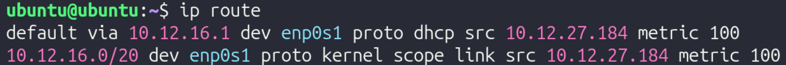{ width=400 }

- Directly connected network: 10.12.16.0/20
- Default route: 10.12.16.1
- Gateway IP: 10.12.16.1 – Note that this is the same as the default route!

The specific hops taken varies significantly based on where the end destination is. 

Predictions: if traffic was sent to:

- Another VM on the same computer
    - Traffic will go directly to the other VM since traffic never leaves the computer, and will never go to a gateway
    - There will only be one hop to the VM
- 8.8.8.8
    - Traffic will go through the gateway since the data leaves the LAN
    - The first hop will be to the gateway since that's the first step of packets leaving the LAN
    - It is expected that communicating with 8.8.8.8 will require fewer hops than communicating with google.com, since a DNS server does not have to be consulted
- google.com
    - Traffic will go through the gateway since the data leaves the LAN
    - The first hop will be to the gateway since that's the first step of packets leaving the LAN
    - It is expected that communicating with google.com will require more hops than communicating with 8.8.8.8, since a DNS server has to be consulted 

#### Part 2 - Run Traceroute

To verify these predictions, `traceroute` was run for 8.8.8.8 and google.com (traceroute was not working with the other VM):

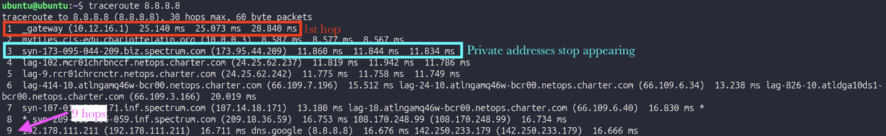{ width=500 }
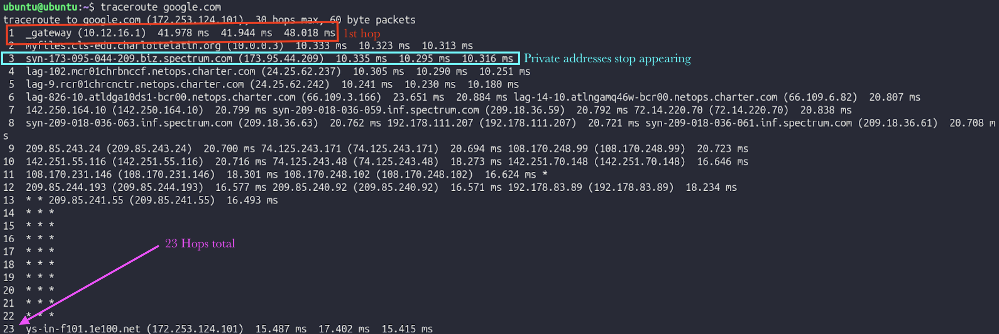{ width=500 }

#### Part 3 - Interpretation

In depth interpretation of `traceroute 8.8.8.8`:

Hop 1: Connecting to the VLAN's gateway

- Private IP
- Inside LAN

Hop 2: Moving from VLAN's gateway to main gateway
    
- Private IP
- Inside LAN

Hop 3: Moving from main gateway to router

- Public IP
- Inside LAN

Hop 4: Moving from router to ISP-specific infrastructure

- Public IP
- Outside LAN

Hop 5: Moving from ISP-specific infrastructure to backbone infrastructure

- Public IP
- Outside LAN

#### Part 4 - Validate with Routing Table

To specifically check the first hop when communicating with 8.8.8.8, `ip route get 8.8.8.8` was run in Ubuntu, returning the following:

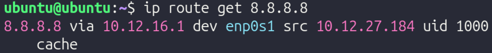{ width=500 }

The next hop was to 10.12.27.184 using interface enp0s1. This does not match the first hop of traceroute.

Next, `ip route get 10.12.24.59` (other VM's IP) was run, returning the following:

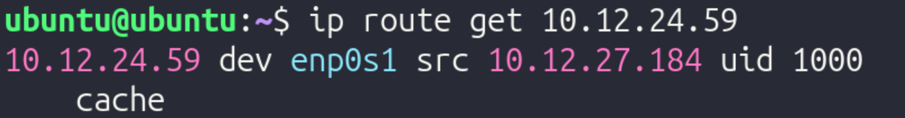{ width=500 }

The next hop was to 10.12.27.184 as well. 

#### Part 5 – TTL Experiment

To limit hops, `traceroute -m 3 8.8.8.8` was run. This limits the quantity of hops to the first 3. 

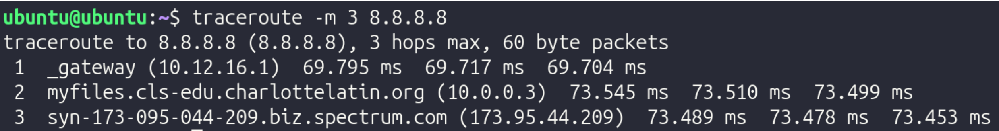{ width=500 }

It stops at 173.95.44.209, the router's public IP.

TTL (Time to Live) is a numerical value (usually 64, 128, or 255) embedded in the header of every IP packet. It measures the maximum number of hops (routers) a packet is allowed to take before it is destroyed. Every time a packet arrives at a router, that router is required by protocol to subtract 1 from the TTL value before passing it along. This serves as a vital safety mechanism for the internet. If there is a "routing loop" (where two routers accidentally keep sending a packet back and forth to each other), the TTL will eventually hit 0. When it hits zero, the router discards the packet and sends an error message back to the sender. Without TTL, these "zombie packets" would circle the globe forever, eventually clogging the entire internet. This makes Traceroute work, since to find the IP of every hop, TTL increases by 1 until it reaches the final destination, therefore allowing it to find the quantity of hops and info for each hop.

## Reflection {.collapsible}

### Technical Development Reflection

1. Why does the switch never modify the IP address?
    - A switch operates at Layer 2, meaning it only works with MAC addresses. It looks at MAC addresses to get a packet to the right physical port. Since it doesn’t even look at the IP address (which is Layer 3), it has no reason to change it. 

2. Why must the router modify the MAC address?
    - MAC addresses are only relevant for a single hop of a packet. Once the packet reaches the router from the switch, it must modify the sender and destination MAC addresses so it can continue towards the other PC.

3. Why does the source IP remain the same from PC1 to PC2?
    - The source IP remains the same from PC1 to PC2 since the source IP tells the destination where the data originates from, since MAC addresses are used to specify the sender and receiver of the packets at each hop.

4. What exactly does "next hop" mean?
    - The "next hop" is the next transmission between devices that a packet must take. For example, if the packet is at Switch 1, the next hop would be to go to the router, and the hop after that would be to go to Switch 2.

5. Why is the default gateway necessary?
    - The default gateway is necessary because without it, endpoints only know how to communicate within the network. The gateway allows for data to be transmitted between networks, such as between a LAN and the Internet.

Private IPv4 addresses must exist for scalability. As previously mentioned, if every device had a public IP, there would be significantly more devices than possible IPv4 addresses, which would cause conflicts. By using private IPv4 addresses, each network only needs 1 public IP, significantly cutting down on the amount of public IPs and mitigating the risk of having IP address conflicts. Due to the roles and incorporation of public and private IP addresses, a device can appear to have two different identities: its public and its private address. Within the network, its "identity" would be its private IP address, and outside the network, its "identity" would be its public IP address, since the device transmitting data to the device would contact the public IP since it does not have any knowledge of the network's internal details.

### Testing and Evaluation Reflection

TTL (Time to Live) is a numerical value (usually 64, 128, or 255) embedded in the header of every IP packet. It measures the maximum number of hops (routers) a packet is allowed to take before it is destroyed. Every time a packet arrives at a router, that router is required by protocol to subtract 1 from the TTL value before passing it along. This serves as a vital safety mechanism for the internet. If there is a "routing loop" (where two routers accidentally keep sending a packet back and forth to each other), the TTL will eventually hit 0. When it hits zero, the router discards the packet and sends an error message back to the sender. Without TTL, these "zombie packets" would circle the globe forever, eventually clogging the entire internet. This makes Traceroute work, since to find the IP of every hop, TTL increases by 1 until it reaches the final destination, therefore allowing it to find the quantity of hops and info for each hop.
