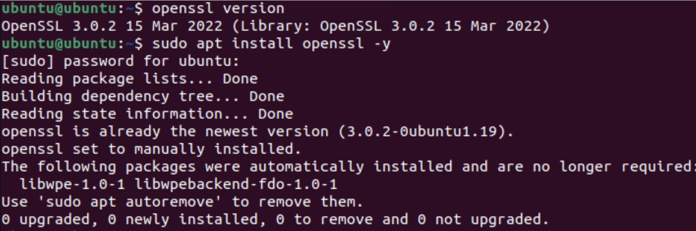

# Determining Security Controls for Devices

## Project Introduction

This project was focused on securing physical devices, specifically, patching vulnerabilities, recognizing examples of phishing, and other similar skills. Hackers and other malicious actors are constantly trying to break into devices, therefore knowing how to secure a device is vital for both personal devices and in commercial settings.

- [**Planning and Design**](#planning-and-design)
- [**Technical Development**](#technical-development)
- [**Testing and Evaluation**](#testing-and-evaluation)
- [**Reflection**](#reflection)

## Planning and Design {.collapsible}
The main objectives for this project were to identify types of attacks and recommend security controls for devices.

### Cybersecurity Basics

The main purpose of cybersecurity can be represented by the CIA triad:

- **C**onfidentiality: keeping information secret from malicious actors
- **I**ntegrity: keeping information trustworthy, uncorrupted, accurate, and ensuring it hasn't been tampered with
- **A**vailability: making sure that information and systems are available when needed

### Checking Ubuntu in UTM 

To ensure that Ubuntu is secure, it is vital to be on the latest release. To check the version, the command `uname -a` can be used, and should output an example similar to `Linux ubuntu 5.15.0-87-generic #97-Ubuntu SMP Tue Oct 3 09:52:42 UTC 2023 aarch64 aarch64 aarch64 GNU/Linux`. This output means that the system is running Ubuntu on a 64-bit ARM processor (makes sense since M1 is an ARM chip) with Linux Kernel Version 5.15 which was built on October 3, 2023.

### Checking MacOS

A similar process can be applied to macOS, albeit, with a slightly different command. `system_profiler SPSoftwareDataType` can be used to output data such as the macOS version, kernel version, and the build number. On my M1 Pro MacBook Pro, it outputted  

System Version: macOS 26.1 (25B5042k)
      Kernel Version: Darwin 25.1.0
      Boot Volume: Macintosh HD
      Boot Mode: Normal
      Computer Name: Raaj's MacBook Pro
      User Name: Raaj Thakur (raajthakur)
      Secure Virtual Memory: Enabled
      System Integrity Protection: Enabled
      Time since boot: 2 days, 12 hours, 44 minutes

The main takeaways from these data is that the computer is running macOS 26.1 with Darwin 25.1.0 (Darwin is the kernel of Apple software (such as macOS, VisionOS, iOS, etc.)).

### Common Device Vulnerabilities

Devices are very complex, and therefore have many different aspects that could be vulnerable if ignored. Common vulnerabilities include:

- **Outdated OS:** Outdated operating systems almost always have vulnerabilities which can be exploited by malicious actors. 

- **Weak Passwords:** Weak passwords can easily be guessed, allowing malicious actors to access sensitive data such as financial information, medical records, and more.

- **Open Ports:** Ports are "doors" that let data in and out of a computer. More open ports are more access points that malicious actors can exploit to access data on a computer. Therefore, only ports required for functionality should be open, and unused ports should be closed. Common ports include:
    - Port 80 = HTTP (hyper text transfer protocol)
    - Port 443 = HTTPS (secure hyper text transfer protocol)
    - Port 22 = SSH (secure shell)
    - Port 25 = SMTP (simple mail transfer protocol)
    - Port 110 = POP3 (retrieve mail)
    - Port 143 = IMAP (mail on server)
    - Port 3389 = RDP (remote desktop protocol)
    - Port 53 = DNS (domain name system)
    - Port 67 = DHCP (dynamic host configuration protocol)
    
- **Unpatched Software:** Unpatched software is similar to outdated operating systems, as older versions of software often have vulnerabilities which malicious actors can use to do bad things.

### Vulnerability Tracking (CVE)
Vulnerabilities are in virtually every software, and it is essential that these vulnerabilities are discovered and patched before hackers can exploit them. They are tracked using CVE, a standardized system for identifying and naming known vulnerabilities. Each vulnerability is assigned a unique CVE ID.

### Social Engineering Attacks
Humans are usually the weakest link of the security of a device. Millions of people are targeted every day by social engineering attacks, attacks by hackers that exploit human behavior to trick them into installing malware, giving away information, or allowing hackers to directly control a system.

Types of attacks include:

- **Phishing:** Broad attacks where malicious actors send mass emails, texts, or other similar things to trick users into clicking a fraudulent link.
- **Spear Phishing:** More targeted version of phishing that targets a specific group or organization.
- **Pretexting:** When an attacker invents a story or identity to trick a victim to sending them money, sharing sensitive information, or granting access to a device.
- **Baiting:** Offering a prize to trick a victim into doing something that installs malware or sharing sensitive information.
- **Tailgating:** A physical tactic where a malicious actor follows an authorized person into a secure location, giving them access to sensitive data.

## Technical Development {.collapsible}

### Recognizing and Updating Outdated Software
In order to secure the VM, I checked the version of important softwares in Ubuntu, then either installed them if they weren't previously installed or updated them if they were outdated.

|Software|Status|What the Software Does|
|--------|------|----------------------|
|OpenSSL|Up to Date|Encrypts network traffic|
|Firefox|Up to Date|Web browser|
|LibreOffice|Outdated|Office software (text, spreadsheets, slideshows, etc.)|
|Python|Up to Date|Popular programming language that underpins many modern apps and programs|
|Apache HTTP Server|Not Installed|HTTP server; important for hosting websites|
|GIMP|Not Installed|Photo editing software|
|Java|Not Installed|Programming language that underpins many programs|
|OpenSSH|Up to Date|Package for the SSH protocol, important for direct communication between 2 devices|

{ width=400 }

### Checking Open Ports

Open ports can be a vulnerability in a system and can easily be secured by closing them if the port is not necessary. The open ports can be checked on Linudx with `netstat -tuln`. `netstat` is a CLI tool that shows network connections, routing tables, and open ports, and the `-tuln` argument tells `netstat` to show **T**CP connections (**t**), **U**DP connections (**u**), only ports that are **l**istening (**l**), and show port **n**umbers instead of service names (**n**).

{ width=400 }

On my VM, ports 445, 139, 53, 22, 54, 9843, 631, 5353, 43433, 68, 137, 139, and 53918 were open.

### Setting up the Firewall (UFW)

On Linux, a commonly used firewall is UFW (Uncomplicated Firewall). A firewall is akin to a security guard for a computer: it decides which ports should stay open and which should be locked. To use UFW, follow the following steps:

- Install it with `sudo apt update && sudo apt upgrade`, then `sudo apt install ufw -y`
- Check UFW's status with `sudo ufw status`
- If it returns `inactive`, then enable it with `sudo ufw enable`. At this point, UFW should be enabled

{ width=400 } { width=400 }

## Testing and Evaluation {.collapsible}

tests
explain risks of outdated software and open ports

## Reflection {.collapsible}
