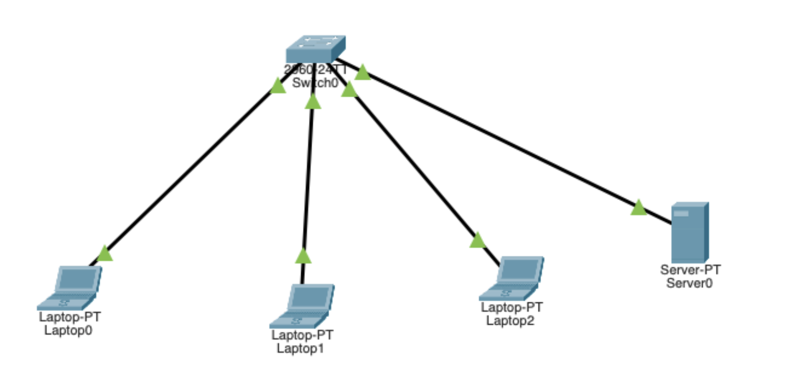
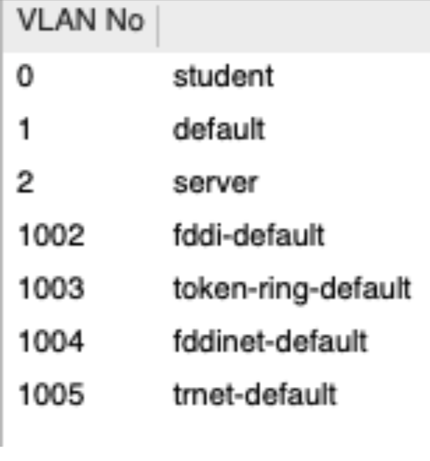
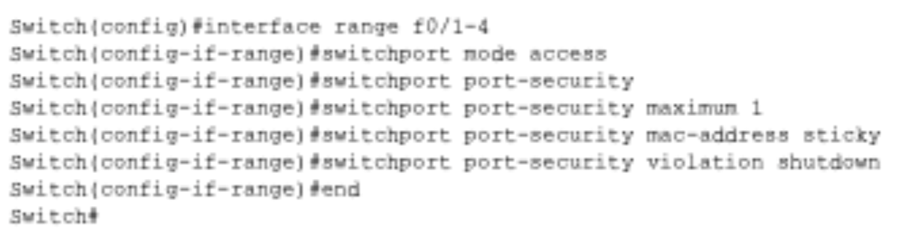
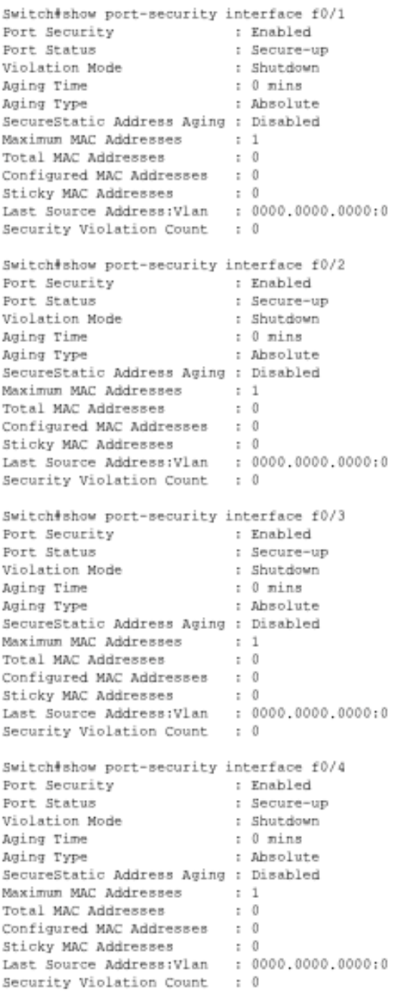
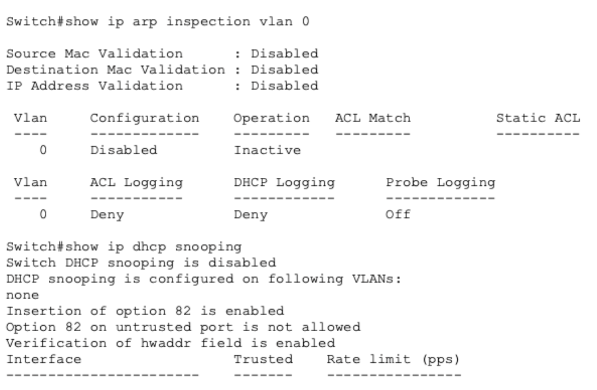
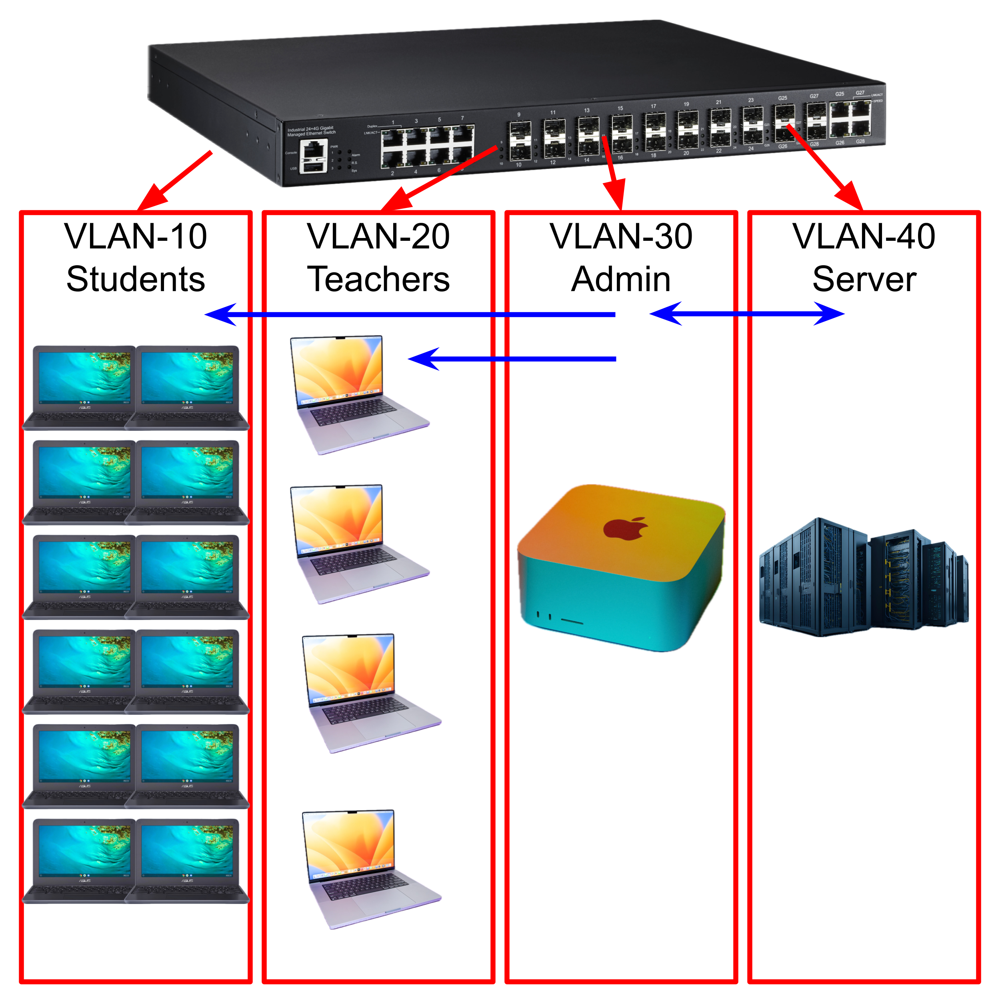

# Switch Security

## Table of Contents

- [**Planning and Conceptual Understanding**](#planning-and-conceptual-understanding)

## Planning and Conceptual Understanding {.collapsible}

### Initial Security Thinking

Within a LAN, the device that is most vulnerable to compromise is the switch. Switches almost always have unused ports which can be accessed by malicious actors, and are usually not updated to later models as often as endpoint devices (laptops, PCs, etc.). Since older switches are used more often than older endpoint devices, it is likely that the switch has the most outdated security features and is more vulnerable to attacks. In general, being "inside" a network increases risk when compared to being "outside" a network, since being inside a network means that if attackers breach one device (switch, router, endpoints, etc.), the attack has the opportunity to spread to more devices. On the other hand, if a device is "outside" a LAN, the only vulnerabilities present are solely on the device and can therefore be controlled more easily. This is because by default, a typical device can see and learn a lot about the LAN, such as IPs of other endpoints.  

## Threat Scenario Analysis and Reasoning {.collapsible}

{ width=500 }
{ width=500 }

|Scenario Letter|                           Symptoms                              |                                                           Hypothesis                                                               |                                                        Justification                                                    |
|---------------|-----------------------------------------------------------------|------------------------------------------------------------------------------------------------------------------------------------|-------------------------------------------------------------------------------------------------------------------------|
|A              |A device suddenly receives the wrong gateway                     |A malicious device on the network is impersonating the default gateway server, allowing it to intercept all traffic from the device.|ARP has no authentication, so any device can claim ownership of the gateway IP and respond to ARP requests               |
|B              |The switch CPU spikes and many MACs appear on one port           |An attacker uses a MAC flooding attack to allow many MACs to be on a single port                                                    |Flooding the CAM table with spoofed MACs forces the switch to broadcast traffic, allowing the attacker to capture packets|
|C              |Clients receive IPs from an unexpected source                    |A malicious device is on the network and impersonating the DHCP server and sending incorrect credentials to endpoint devices.       |Without DHCP snooping, any device can respond to DHCP requests faster than the legitimate server                         |
|D              |A new unknown device appears inside the broadcast domain         |An unauthorized device is plugged into an open port on the switch                                                                   |Network access controls are not configured, allowing any device to plug into an open port and join the LAN immediately   |
|E              |A host begins reaching other internal hosts it should never reach|The network does not have established VLANs, making all hosts reachable on the LAN                                                  |Without VLANs, all devices exist in a single broadcast domain with no network segmentation or access restrictions        |

## VM Evidence Collection and Interpretation {.collapsible}

## Reflection and Synthesis {.collapsible}

### Switch Security Controls

In this activity, a LAN was designed in Cisco Packet Tracer then secured in order to observe how different security decisions affect network structure and communication.

#### Flat Network (No Controls)

{ width=500 }

At the start, a network with a switch, 3 laptops, and 1 server was created with no security controls. By default, the network allows all devices to see and communicate with each other due to a lack of VLAN segmentation.

#### VLAN Segmentation

To make the server not visible to the laptops, the next step was to implement Virtual LAN (VLAN) segmentation. After adding VLANs, each port on the switch was selected and assigned a specific VLAN. Ports 1-3 were assigned to VLAN 0 (Student), and Port 4 was assigned to VLAN 2 (Server). This is because Ports 1-3 had student laptops, and Port 4 had the server. 

{ width=500 }

Since the laptops and server are now on separate VLANs, they can no longer communicate with each other over the LAN unless communication is explicitly allowed. This is because VLANs group devices into smaller logical segments, which changes visibility by ensuring a device only sees traffic within its own group. This reduces broadcast visibility because messages like ARP or DHCP requests stay inside the specific VLAN instead of flooding the entire network. While this limits what an attacker can discover, VLANs alone do not provide full security because they don't inspect traffic for threats or stop lateral movement within the same segment. They are a tool to mitigate initial exposure, not a complete defense.

#### Port Security

After adding VLAN segmentation, port security was added to limit physical access. In the CLI, the following commands were typed in order to set a max of 1 device per port (mitigates MAC flooding attacks).

{ width=500 }

Port security manages the physical layer by limiting which MAC addresses are allowed to connect to a specific switch port. This mitigates the risk of unauthorized physical access, such as a student plugging a rogue laptop into a classroom wall jack. However, it cannot protect against a "trusted" device that is already authorized but has been compromised by malware. It secures the physical connection point but does not monitor the actual data being sent by a legitimate device.

**Overview of Security Controls:**

{ width=600 }
{ width=600 } 

Overall, when deciding what devices to trust, access levels should be based on a device's role; for example, servers are "trusted" for data storage but still require DHCP Snooping to prevent identity theft. High-risk devices, like those used by students, should be restricted and isolated from sensitive administrative traffic. The switch must enforce these security rules at the access layer—the individual port where the user connects—using Port Security, DAI, and ACLs to mitigate threats at the entry point and between network segments.

### Secure VLAN-Based Design

{ width=800 }

VLAN 10: Student laptops
VLAN 20: Teacher laptops and PCs
VLAN 30: Admin laptops and PCs
VLAN 40: Server

In the VLAN, only Admin is allowed to communicate with the server, and Admin can send packets to the Student and Teacher VLANs. However, the Teacher and Student VLANs cannot send data outside their respective VLANs.

VLAN 10 and 20 (Students and Teachers) are the least trusted, whereas VLAN 30 (Admin) is the most trusted. VLAN 40 is purposefully isolated from everything except VLAN 30 to mitigate the amount of possible attackers that can attempt to breach the server.

