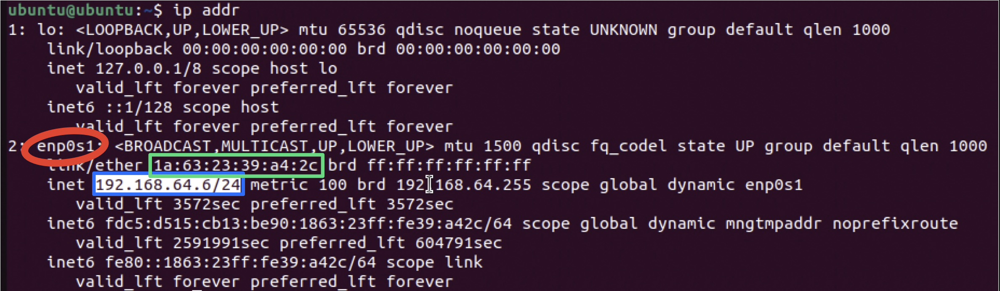

# Troubleshooting

## Project Introduction

This project was focused on troubleshooting various aspects of networks through CLI commands. Both MacOS and Ubuntu in a VM were used. 

## Important Terminology {.collapsible}

|Term|Definition|
|----|----------|
|Wi-Fi|Protocol that uses radio waves to wirelessly connect devices to a local network|
|Ethernet|Protocol that uses cables to connect devices to a local network|
|Network Adapter|Hardware that lets a computer communicate with the network (NIC in a PC)|
|IP Address|Identifiable address given to any device on a network|
|Default Gateway (Router)|Device that connects the local network to the internet. Metaphor: exit ramp connecting a neighborhood to a highway.|
|DNS|Domain Name System; translates website names to IP addresses|
|Ping|CLI command that tests communication between devices|
|NAT/Shared Networking|Network Address Translation; VM shares host's IP address|
|Bridged Networking|VM appears as its own device with a separate IP from the host|

## Four Step Troubleshooting Workflow {.collapsible}
1. **Test the Physical Connection**
    - Check if Wi-Fi is turned on or if Ethernet is plugged in
    - Check Wi-Fi/Ethernet settings in MacOS/Windows/Linux
2. **Check the IP Address**
    - MacOS: Run `ifconfig`, then look for en0/en1 and make sure that at least one of them lists `inet: 192.168.x.x or 10.x.x.x`
    - Linux: Run `ip addr`, then look for interfaces named like `enpXsY` (for example, `enp0s3` or `enp0s1`), which are common on modern Linux systems, and make sure that at least one of them lists `inet: 192.168.x.x or 10.x.x.x`
    - If it lists 169.254.x.x, that means that the device has a **self-assigned IP address**, meaning it likely can't connect to the internet
3. **Test Basic Reachability**
    - Ping a public server from Google or Cloudflare with `ping -c 4 8.8.8.8` or `ping -c 4 1.1.1.1`, respectively, to make sure that the computer can communicate with them
    - If this works, then the computer can connect to the internet
4. **Test the DNS**
    - After confirming that `ping -c 4 8.8.8.8` works, check the DNS with `ping -c 4 google.com`. 8.8.8.8 is Google's public DNS, meaning that when you connect to 8.8.8.8, you connect to google.com, and vice versa. 
    - If the computer can connect to the IP address (8.8.8.8) but not the domain name (google.com), then there is a DNS issue
 

## IP Range Meaning {.collapsible}

The type of IP address that is assigned to a device has a specific meaning. Below are common private IP address ranges and what they mean.

|**IP Range**|**What it Means**|**Example**|
|------|--------------------|---------|
|192.168.x.x|Private IP common in home/school network; assigned by router/DHCP|Common on Wi-Fi networks|
|10.x.x.x|Private IP common in large organizations and VMs|Ubuntu VM in Bridged mode|
|172.16.x.x – 172.31.x.x|Less common private IP|Pretty rare, usually is assigned when there are a very large amount of devices on a network|
|169.254.x.x|Self-assigned IP (device could not get IP from router)|Happens if Wi-Fi is on but router is unresponsive or if computer cannot communicate with router for any reason|
 

## Network Troubleshooting from MacOS CLI {.collapsible}

When troubleshooting networks on a Mac, vital commands to know are:
- `ifconfig`: reveals IP address and other network information
- `ping`: tests connection
- `route -n get default`: outputs default gateway (router) information

## Network Troubleshooting from Linux CLI {.collapsible}

When troubleshooting networks on Linux, vital commands to know are:
- `ip addr`: reveals IP address and other network information
- `ping`: tests connection
- `ip route`: outputs default gateway (router) information (preferred modern command)
- `netstat -rn`: also outputs routing information, but may not be installed by default on modern Linux distributions

## Shared vs Bridged Network in UTM (Ubuntu) {.collapsible}

In UTM, the two major network modes are **Shared** and **Bridged**. While Shared mode *shares* the host device's IP address and appears as the host on the network, Bridged mode acts as its own separate computer with a unique IP address.

### Shared Mode Exploration
I started the exploration with Shared mode. Running `ip addr` returned an IP address of **192.168.64.6** under enp0s1, which is standard behavior for a VM. 

{ width=400 }

The network adapter is circled in red, the IP address in blue, and the MAC address in green.

### Bridged Mode Exploration

After exploring Shared mode, I powered down the VM, edited the VM's network settings from UTM, and set network mode to Bridged and selected Emulated Network to be en1 (since the Mac mini was on Wi-Fi, not Ethernet).

Running `ip addr` in the Bridged VM returned an IP address of **192.168.1.132** under enp0s1, which is standard behavior for a VM. Notably, the IP address was different than it was under Shared mode, exhibiting how Bridged mode makes the router think that the VM is an individual computer.

After testing the IP address, basic reachability needed to be tested. This was done with `ping -c 4 8.8.8.8` (pings the Google public server 4 times). This did not work at first, but this was due to a firewall issue in Ubuntu. Running `sudo ufw disable` stopped the firewall and allowed Ubuntu to ping Google's server.

> **Caution:** Disabling the firewall with `sudo ufw disable` is not recommended in production environments, as it can expose your system to security risks. Only disable the firewall temporarily for troubleshooting, and re-enable it (`sudo ufw enable`) when finished.

Additionally, the VM in Bridged mode could ping the Mac mini's IP address, since they act as 2 separate computers. The latency between the Mac mini and the VM was considerably lower than between the VM and Google (0.838 ms vs 12.694 ms), which makes sense since the Mac mini is on the same local network as the VM.

Next, the DNS needed to be tested. Running `ping -c 4 google.com` returned virtually the exact same output as `ping -c 4 8.8.8.8` (there was a very slight difference in average latency within margin of error), meaning that the DNS worked. 

## Reflection {.collapsible}

This assignment provided a strong overview of how to troubleshoot networks from MacOS and Linux. Learning CLI tools to diagnose networks is extremely important in many settings, since virtually all networking equipment is accessible solely through a CLI. The 4 step workflow is used by virtually all professionals in their industry to troubleshoot networks, so learning those skills now is very valuable.