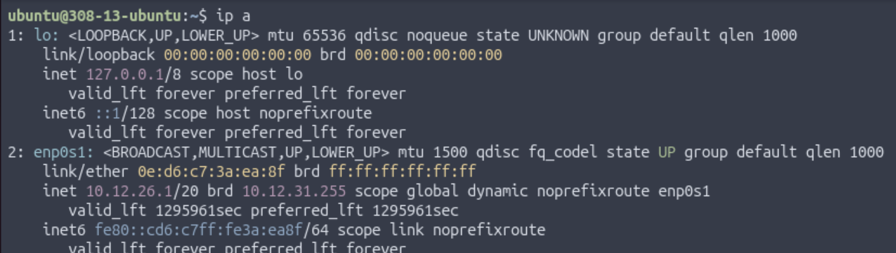
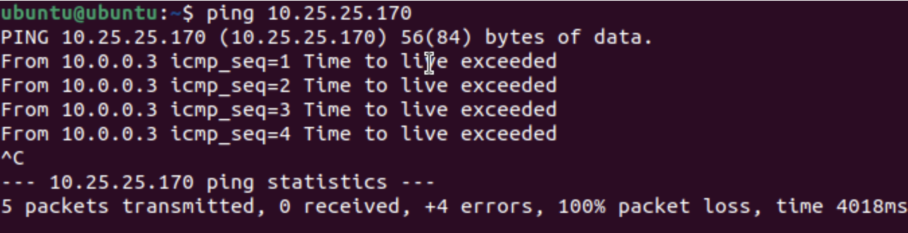

# Why Can't These Two Computers Talk to Each Other?

## Project Introduction

This project was a 1 day activity where a partner and I investigated why two computers connected with a working Ethernet cable are still unable to communicate. Both computers were running 2 different Ubuntu virtual machines, however they were unable to ping each other. 

## Part 1 {.collapsible}

Before doing anything, the connection was verified by inspecting the Ethernet port and cable on both of the Mac mini computers. Once the Ethernet connection was confirmed to be good, 2 VMs were opened on each Mac mini: an Ubuntu 25.10 ARM64 VM using Apple Virtualization, and an Ubuntu 22.04 ARM64 VM using QEMU. Then, `ip a` was run on each VM to obtain the IP address and status for each VM. All of them returned an IP address and reported "state UP", meaning that there is an active connection.

**Ubuntu 25.10 w/ Apple Virtualization:**

{ width=400 }

 

**Ubuntu 22.04 w/ QEMU:**

{ width=400 }

## Part 2 {.collapsible}

After it was verified that all of the VMs had IP addresses, we made sure that they were on the same Layer 2 network. This was tested by pinging each other's IP address. A pattern was observed: the Ubuntu 22.04 VM could only ping my partner's Ubuntu 25.10 VM and not his 22.04 VM, whereas the Ubuntu 25.10 VM could only ping his 22.04 VM, not his 25.10 VM. He observed the same phenomenon.

**Pinging 22.04 from 25.10**

 

Here, pinging my partner's 22.04 VM from my 25.10 VM was successful.

 

**Pinging 25.10 from 25.10**

 

Here, pinging my partner's 25.10 VM from my 25.10 VM was unsuccessful.

 

**Pinging 25.10 from 22.04**

 

Here, pinging my partner's 25.10 VM from my 22.04 VM was successful.

 

**Pinging 22.04 from 22.04**

 

Here, pinging my partner's 22.04 VM from my 22.04 VM was unsuccessful.

 

In this test, OSI Layer 2 and 3 was tested since they use MAC and IP addresses, respectively, to reach the correct device.

## Part 3 {.collapsible}

After observing the interactions between the VMs, we had to determine whether the issue comes from IP configuration. Direct connections only work if both computers are on the **same subnet**, but in VMs in UTM, the machines are in **two separate private host-only networks** created automatically by UTM. This means that they appear like the share a subnet but are actually behind **different invisible switches**, meaning that they can't see each other.

In the VMs, the IPs are not identical since they're separate devices and the router assigns them different IP addresses. If the IPs were to match, they VMs may not necessarily be on the same network. For example, two different devices could have the IP 192.168.4.2 but be on different networks. Since this IP is **private**, they have no meaning outside the LAN. 

{ width=400 }

 

{ width=400 }

Under this configuration, despite being on the same subnet and being on the same network (since the first 20 bits are identical), UTM places each VM into is own isolated virtual network. This means that the two machines are on completely different networks and cannot see each other's ping requests. Layer 3 is impossible since ARP cannot succeed across two separate virtual switches.

## Part 4 {.collapsible}

To verify this claim, the VMs were pinged again. The Ubuntu 25.10 machines still could not ping each other, and the Ubuntu 22.04 machines still could not ping each other. This happens because each virtualization system (Apple Virtualization for the 25.10 VM and QEMU for the 22.04 VM) places its VM into a private, host-only network that exists only within each Mac mini. These private networks are completely independent from one another, so the VMs are not sharing the same Layer 2 network—the layer where devices learn each other’s MAC addresses. Since their OSI Layer 2s are independent, they can’t discover each other, and communication fails before it even reaches the IP level (Layer 3). Surprisingly, the 25.10 VM can ping the 22.04 VM on the other computer (Apple Virtualization to QEMU or vice versa) because each Mac mini is able to route traffic between its own internal virtual networks before sending it over the Ethernet cable. This makes cross-platform pings work, while same-platform pings fail due to Layer-2 isolation.

**Pinging 22.04 from 25.10**

 

Here, pinging my partner's 22.04 VM from my 25.10 VM was successful.

 

**Pinging 25.10 from 25.10**

 

Here, pinging my partner's 25.10 VM from my 25.10 VM was unsuccessful.

 

**Pinging 25.10 from 22.04**

 

Here, pinging my partner's 25.10 VM from my 22.04 VM was successful.

 

**Pinging 22.04 from 22.04**

 

Here, pinging my partner's 22.04 VM from my 22.04 VM was unsuccessful.

 

## Part 5 {.collapsible}

Even though the two computers were connected with a working Ethernet cable, they could not communicate because each VM was in its own isolated VLAN, meaning that the VMs on different Mac minis were on different Layer 2 domains. The failure happened at OSI Layer 2 since the ARP could not find the correct MAC address associated with the IP address which prevented data from transferring. UTM prevents the VMs from connecting since it creates a virtual LAN for each Bridged VM to simulate an entire LAN and device. To allow for the VMs to easily connect, they should be placed in Shared (NAT) mode so they can piggyback off of the Mac mini's IP address and communicate with other devices on the LAN. In a real SOHO network, routers and switches prevent similar issues since they create multiple VLANs with different subnets and facilitate data transfer between the subnets to allow for many devices to be on the same LAN.