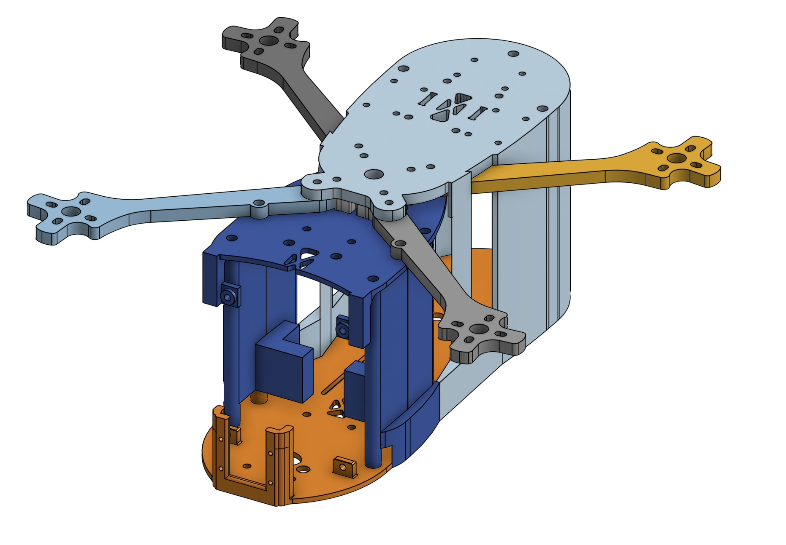

# Capstone
For the majority of the year, I worked towards completing my capstone project: a fully custom-designed 3D printed drone with custom electronics and AI-powered object classification, pose tracking, facial recognition, and more. 

## Navigation

## Build Goals
From the start, I wanted my drone to do the following:

- Have a long battery life
- Be able to record video in at least 1080p
- Have high processing power for AI-powered tasks
- Custom design as much as possible

## Part Selection {.collapsible}

The first step of making the drone was to figure out what parts I wanted to use. I had to consider many questions, such as:
- What purpose will the drone be made for (racing, cinematography, autonomous missions, etc.)?
- How big will the drone be?
- What firmware will it use (ArduPilot, Betaflight, etc.)?

After considering many factors, I decided that I wanted to prioritize having a long flight time and powerful computers for autonomous missions. Those two choices meant that I would have to use a very large battery (meaning I would need a large drone to match), and that I need to use ArduPilot due to its support for GPS as well as a companion computer (more on this under the [firmware](#firmware) section). 

I did some more research on drones, and I knew I wanted to build a drone with 7" propellers (I ended up changing to 9"), since it would allow me to support a chassis large enough to house advanced electronics and a very large battery. For that size, I saw that 6S (6 cell) LiPo batteries were most popular in the community due to their high voltage (up to 25.2V) which allows for the drone to be more efficient. I settled on the [Ovonic 4500 mAh 6S LiPo 100C XT90 Battery](https://us.ovonicshop.com/products/ovonic-100c-6s-4500mah-22-2v-lipo-battery-with-xt90-anti-spark-connector-for-rc-car-airplane-heli?_pos=8&_fid=b3da36f5b&_ss=c), since it had a very large capacity (99.9 wh!), a very high discharge rate, a bulky XT90 connector to allow for high power draw, and it was 6S.

After choosing the battery, I had to choose the motors, ESC, and electronic components. Since I chose a high-voltage battery, I went with relatively low 1050KV motors made by BrotherHobby. I saw good reviews about these online and they are made of high quality materials, which is why I chose them. The ESC is also made by BrotherHobby. It's a 4 in 1 ESC with support up to a 6S battery and can provide 65A per motor. I chose it since it had good reviews and was by far the cheapest ESC from a legitimate brand that could provide 65A per motor. 

For the electronic components, I needed to ensure that they could support ArduPilot, and that I chose a comprehensive suite of sensors to allow for autonomous flight. For the MCU, I chose the STM32F767ZIT6 since it is powerful and has ample I/O for all of the sensors. For the sensors, I chose the ICM 29048 (IMU), LIS2MDL (magnetometer), LPS22HB (barometer), and NEO-M9N (GPS). I found boards from Adafruit at competitive prices that featured the sensors, power management systems (capacitors, step downs, resistors, etc.), along with a STEMMA QT connector for easy I2C connectivity. Insted of soldering the extremely tiny sensors directly to the board, I decided to go with these Adafruit boards to reduce complexity and increase reliability. The NEO M9N is large enough where I can solder it myself, so I bought the bare chip and added the power management system for the NEO M9N directly to the board (more on this under the [Electronics Architecture](#electronics-architecture) section).

Additionally, I wanted a separate computer to drive the video recording and AI aspect. From the start, I knew that I wanted to use a Raspberry Pi 5 with the Raspberry Pi AI Hat+, capable of 26 TOPS. This combination allows for very powerful edge AI capabilities with high power efficiency, meaning that the drone can do real-time AI calculations in the air without drawing too much power. 

After all this consideration, I ended up with a very high end parts list that would create a drone with very powerful capabilities. The next step was to design the [chassis](#chassis-design).

## Chassis Design {.collapsible}
The first component I designed was the chassis. Originally, I wanted to use the [Source One](https://www.printables.com/model/261673-complete-tbs-source-one-v5-cad-model-step), an open source drone chassis supporting up to 7" props. However, in its standard form, it had nowhere near enough space to fit my large battery, a Raspberry Pi 5, a camera, and all of the components for the flight controller (the board was not designed at this point). So, I downloaded the STEP files into Onshape and made significant changes to allow for the battery to fit. 

{ width=400 } { width=400 }

However, after printing it out, I realized that the drone is far too heavy and that the chassis is too complicated with too many parts. Additionally, I realized that for the weight of the components, I would need bigger propellers. I looked at the website for the motors, and it said that they support up to 9" propellers, so I decided to switch. 

Instead of modifying the chassis more to be stiffer and to support bigger props, I decided to start fresh with a clean sheet design. I wanted to keep the design as simple as possible and to make sure that it would support the larger propellers.

## PCB Design {.collapsible}
## Electronics Architecture {.collapsible}
## Firmware {.collapsible}
## Assembly {.collapsible}
TBD
## Testing and Calibration {.collapsible}
TBD
## Next Steps {.collapsible}
TBD