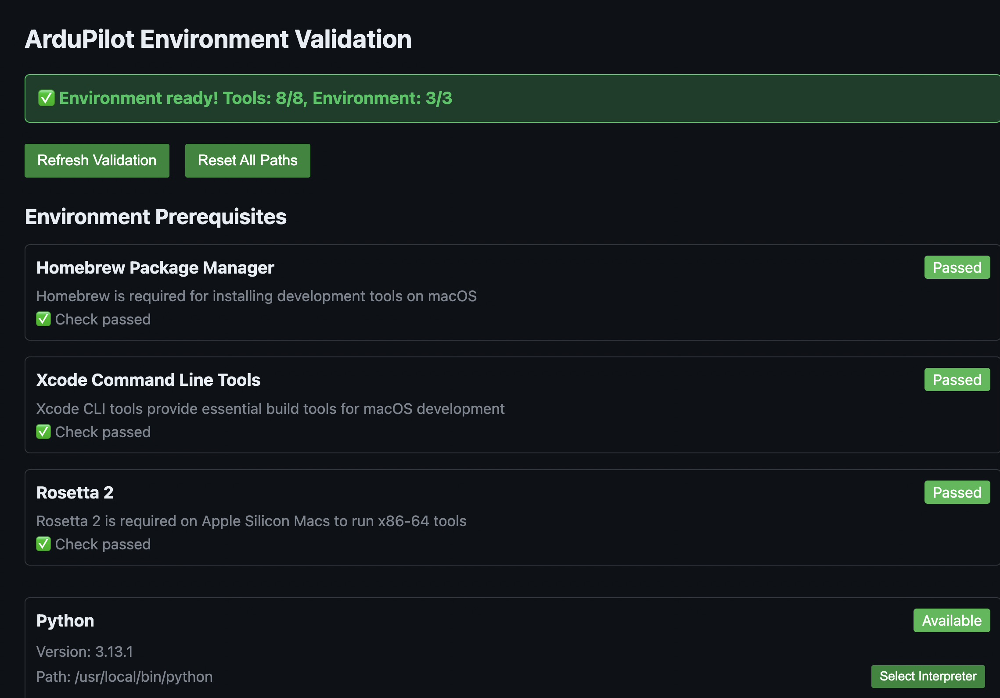
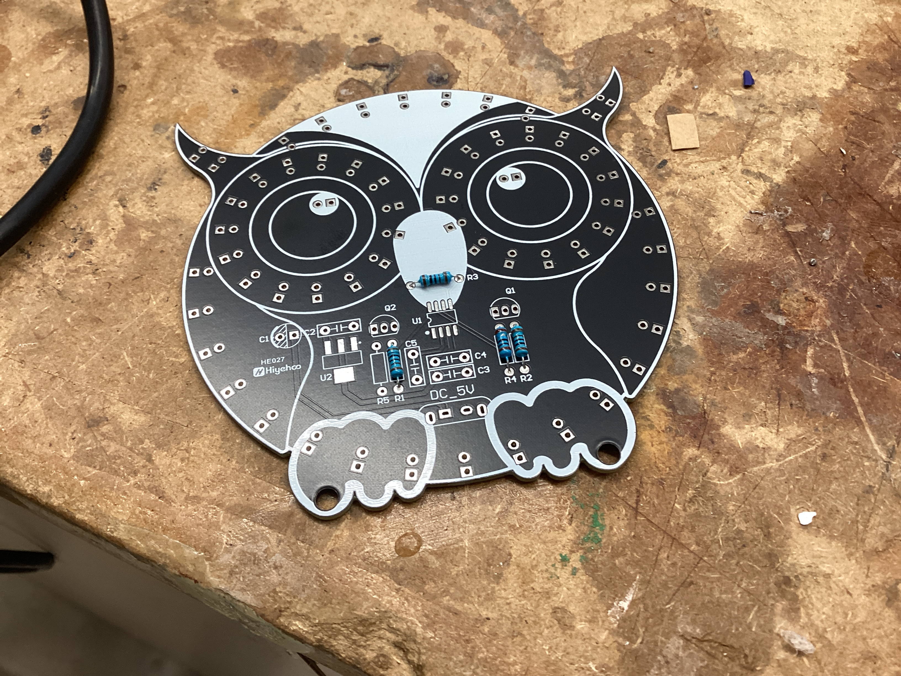

# Honors Advanced Topics in Engineering Daily Log

Welcome to my daily log for engineering! Here, I will outline what I do every day in class.

## Navigation

| [September](#september) | [October](#october) | [November](#november) | [December](#december) | [January](#january) |
|-------------------------|---------------------|-----------------------|-----------------------|---------------------|
|**[February](#february)**|**[March](#march)**  |**[April](#april)**    |**[May](#may)**        |**[June](#june)**    |

## September {.collapsible}

### 09.03.2025 

Today, I continued work on my wooden pen. I took my two blocks of wood and turned them on a lathe. I took a chisel and removed material until the blocks were cylindrical, and when they got to the desired thickness, I used fine grit sandpaper to smooth the two blocks. Now, I have the two wooden components for my pen ready, and now, I can assemble the pen and do all of the finishing touches next class.

### 09.04.2025 

Today, I finished my pen. I started off by using the pen press to:

- Press the pen tip into the bottom end of the lower barrel 
- Press the ink chamber into the top end of the lower barrel
- Press the clip assembly into the top end of the upper barrel

{ width=400 } { width=400 }

Once I pressed these components, I could assemble the main sections together. I screwed the ink refill into the ink chamber, slid the ring onto the chamber above the lower barrel, and slid the upper barrel above the ring. Once I did that, my pen was done, and it wrote super well, along with looking very cool.

{ width=400 } { width=400 }

### 09.05.2025 

Today, I did some research and work on my capstone project. My goal is to assemble the board as soon as possible, so today, I practiced soldering random components to practice boards to prepare for soldering intricate components on the board.

{width=400} {width=400} 

### 09.08.2025 

Today, I researched more about how to configure ArduPilot for a custom board. I decided that I would have to compile ArduPilot from the source code with a custom hwdef.dat file for my specific hardware configuration. From the start, I knew that I wanted to do as much as possible in VSCode, as I am very familiar with it. After doing some researching, I discovered that ArduPilot provides a VSCode integration which allows you to configure and flash ArduPilot directly from VSCode. All I have to do is make a custom board definition (hwdef.dat) for my specific hardware detailing what components I have and how they are connected, then I can use that board definition in the ArduPilot configurator to flash it. 

Conveniently, the extension has a built-in tool to make sure that your machine's ArduPilot environment has all of the necessary tools to build and flash the software. I had to install a lot of stuff, such as:

- Python MAVLink (`pip install pymavlink`)
- MAV Proxy (`pip install mavproxy`)
- J-Link ([**through SEGGER application**](https://www.segger.com/downloads/jlink/))

In addition, I had to create symlinks between ccache and g++, gcc, arm-none-eabi-gcc, and arm-none-eabi-g++. I did so by adding this line to my ZSH profile (~/.zshrc: `export PATH="/opt/homebrew/opt/ccache/libexec:$PATH"`, then verifying that the installations of ccache, gcc, g++, arm-none-eabi-gcc, and arm-none-eabi-g++ were correct by typing `which` + the name of the toolchain.

I made sure that they were all installed, but I was unclear as to what exactly their purpose was. I did some digging and these were the results I found:

- GCC: GNU Compiler Collection's C compiler
- G++: GNU Compiler Collection's C++ compiler
- arm-none-eabi-gcc: Compiles .c code into machine code for the ARM Cortex-M family of CPUs
- arm-none-eabi-gcc: Compiles .cpp code into machine code for the ARM Cortex-M family of CPUs

Together, these toolchains work together to compile the .c and .cpp files that make up the ArduPilot source code in order to create machine code for the ARM Cortex-M CPU that powers my flight controller (STM32F767ZIT6).

 { width=400 }

### 09.09.2025

Today, I did some more research on how to set up the software. I read the ArduPilot documentation, STMicroelectronics documentation on their various apps such as STM32CubeMX, STM32CubeIDE, etc. They have many apps, so it was confusing trying to figure out exactly what purpose each app had and whether or not I needed them. The only STMicroelectronics app that I will need is the STM32CubeProgrammer which will allow me to flash the ArduPilot software to the STM32 with an ST-Link via Serial Wire Debug. 

### 09.15.2025 

I dedicated today to working on my GitHub documentation. Mr. Dubick taught the class on how to use GitHub, and I worked on refining format and writing out some pages on Github.

### 09.16.2025 

Today, I printed out the chassis for my drone. Although I intend to make my final parts out of either PETG or ABS with 50-80% infill, I printed this part out of PLA since all of the printers in the lab are loaded with PLA, and since it is easier to work with. To save time, I used 15% infill, and to support overhangs, I used tree supports. 

After printing the parts out, I confirmed that my battery would fit in the space. The battery was a perfect fit for the space, although I was a little worried about not having enough clearance for screw heads. Although there is space in the CAD mockup, I may inset the screw heads to allow for more room. 

The main issues with the parts had to do with durability. The parts have long cylinders for screws to slot into and clamp down on the chassis. Although the screws will add a lot of support, the cylinders are brittle and break easily. To fix this issue, I will add fillets to the base of the cylinders. Also, the plates are pretty thin, so I will have to thicken them by 1-2 in order to reduce flexing. 

{ width=400 }

### 09.17 - 09.24.2025
In this period of time, I continued work on the 3D CAD design of the drone chassis. I made many small changes in order to increase interior volume, reduce weight, increase strength, and cut down on parts. However, I never printed it out since I was not happy with the final result (and eventually I made a new design from the ground up, more on this later).

### 09.25 - 09.29.2025
I worked on a mini project to practice soldering. The project is an owl with LEDs which activate by touching a capacitive sensor on the front of the board. While the through hole components were very easy to solder, the 2 ICs on the board with small pin pitches were relatively difficult to solder.

{ width=300 } { width=300 } { width=300 }

### 09.30.2025
Today, I finished soldering all of the LEDs, then tested the board. Unfortunately, only the outside ring of lights turned on and the "eyes" did not work. This is due to an issue with an IC. I'm not sure exactly how I will fix it, but I will likely have to de-solder the chip, clean the IC, clean the pads with a solder wick and flux, then re-solder it. 

## October {.collapsible}

### 10.01.2025
Today, I started setting up my Raspberry Pi 5 with the AI Hat+. I installed the latest release of Pi OS Bookworm onto a microSD card, then plugged the Pi into a monitor to configure it. I then followed [this guide](https://www.raspberrypi.com/documentation/computers/ai.html) to set up the Pi. 

- I started off by setting up PCIe Gen 3.0 by typing `sudo raspi-config` to bring up the Raspi-Config CLI tool, then enabling PCIe Gen 3.0 speeds under Advanced Options.

- After that, I ran `sudo apt install hailo-all` in order to install the following:
    - Hailo kernel device driver and firmware (allows Pi OS to communicate directly with the Hailo-8 NPU)
    - HailoRT middleware software (runtime that handles tasks such as loading the AI model onto the chip and managing inference execution)
    - Hailo Tappas core post-processing libraries (computer vision libraries that handle post-processing tasks such as decoding bounding boxes, converting raw data into masks, and mapping points onto human body parts)
    - `rpicam-apps` Hailo post-processing software demo stages (Pi OS's camera stack allowing for video recording, image capturing, live feeds, etc.)

### 10.07.2025

Today, I printed out the bottom plate for my drone, which is where most of the electronics are mounted. 

printed base plate v1 and front top plate, installed raspberry pi:
- holes too big for camera not gripping screws
- stands too weak to support camera properly
- npu chip slightly pressing on camera --> heating up connector as well as forcing the plate to bend very slightly
- redesigned in cad to strengthen camera plate and recess pi mounts by 0.25 mm to get rid of flexing issue

### 10.08.2025

Today, I focused on getting the AI working on the Raspberry Pi. Up to this point, I was using the pre-existing hailo_inf_fl.json file in Raspberry Pi OS that uses 3 models: [yolov8](https://docs.ultralytics.com/models/yolov8/#key-features-of-yolov8) (object detection/classification), [yolov8 pose](https://docs.ultralytics.com/models/yolov8/#key-features-of-yolov8) (pose detection), and [scrfd](https://www.insightface.ai/research/scrfd) (facial tracking). While the yolov8 models were correctly compiled for the Hailo 8 (the NPU I am using), the scrfd model was compiled for the Hailo 8L NPU, the lower performance version of the Hailo 8. This returned a warning message that I will likely experience lower performance than expected, since the model was compiled for the incorrect architecture. I wanted to get rid of this error, so I looked at the [Hailo Model Zoo Github](https://github.com/hailo-ai/hailo_model_zoo/tree/update-to-version-2.17) and looked through the models until I found the link for scrfd compiled for the Hailo 8 NPU. 

Once I found the correct .hef file, I looked at the hailo_inf_fl.json file to see where the current scrfd file is located. It was located at /usr/bin/rpi-camera-assets/scrfd_2.5g.hef, so I deleted it and copied the new scrfd_2.5g.hef file to the same location to ensure that the json file would work as expected and know where to locate the model. When I re-ran `rpicam-hello -t 0 --rotation 180 --post-process-file /usr/share/rpi-camera-assets/hailo_inf_fl.json`, I no longer got the warning that the model is compiled for the wrong NPU. Although it would have previously worked fine, I wanted to ensure that everything was as optimized as possible to ensure maximum performance and the lowest power consumption possible. 

printed new base plate, camera is more secure and no longer any flexing issues

may add ribs to reduce overall flexing/lack of structural rigidity, but will wait to use petg since it will flex less in petg w/ 67% gyroid infill

### 10.09.2025

did some refining in Onshape to finish up the back top part (added standoffs to sit flush with base plate) as well as searched for models to use.

also fixed owl project by taking a fine tip solder and melting the solder of the ics and melting the excess solder paste that was likely bridging some pads on the small ic. doing this made the owl work perfectly

### 10.10.2025

printed back top part

stress tested new models to test overheating/throttling/melting the chassis (it got hot, but not hot enough to cause damage) by running model the whole class (45 minutes) and periodically checking to see if it was still at 30fps or if it was dropping frames. it didn't drop frames and was able to run continuously mostly thanks to the active cooler turning on its fan and blowing out the hot air. And, when the drone is flying, the pi is at the very front and will get a lot of cool fresh air to cool it down, so even in the worst case scenario, it doesn't throttle.

insert video here

### 10.13.2025

Today, I started off with refining my original chassis design even more. However, I was not very happy with the level of complexity of the parts They were too weak, complicated, and I decided to start fresh by designing a brand new chassis from the ground up. While the original chassis was a heavily modified version of the Source One open-source drone chassis, the new design was my own from the start and was designed around my specific hardware.

My overall goals for the new chassis were to increase structural rigidity, reduce the amount of parts, increase 

### 10.16.2025

## November

## December

## January

## February

## March

## April

## May

## June