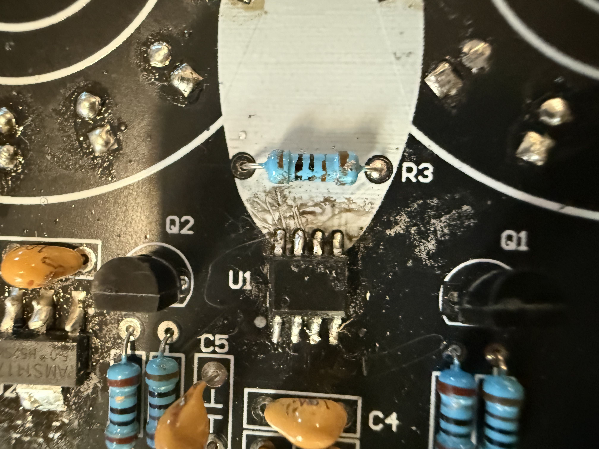
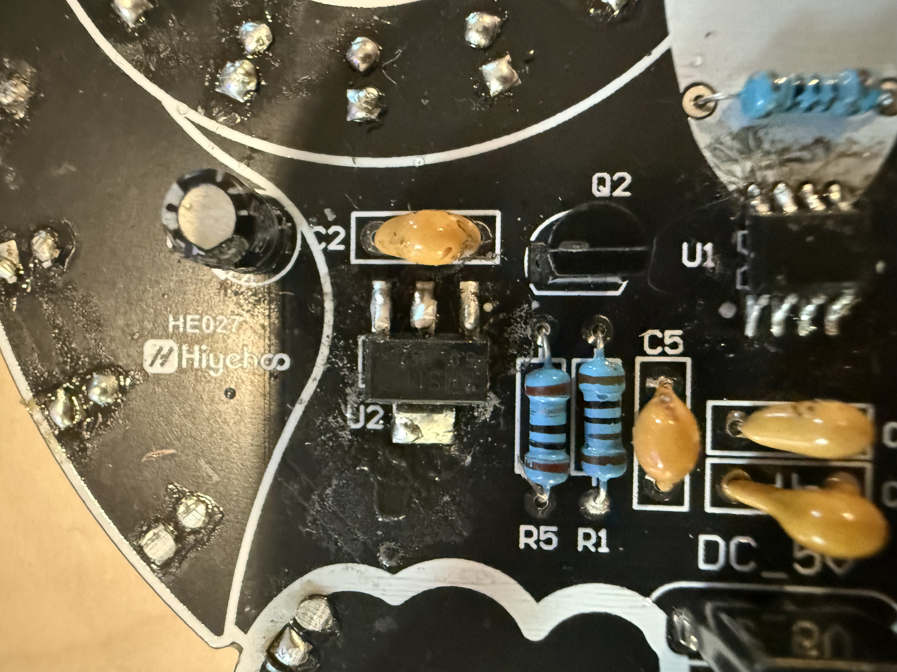
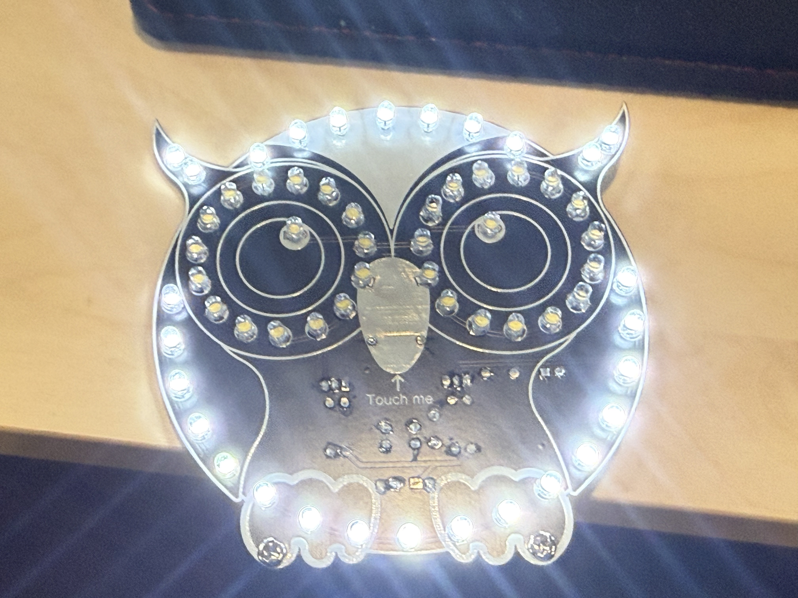

# Owl Project

In order to practice soldering, I completed a mini-project where I soldered LEDs and other components to a board in the shape of an owl. This project featured both through-hole and surface-mount soldering, which was useful for refreshing my soldering skills. 

## Manufacturing

Since I am more experienced with through hole soldering and find it easier, I started the project off with soldering all of the through hole components, such as resistors, transistors, capacitors, LEDs, and the USB-C port. 

{ width=300 } { width=300 } { width=300 }

After I successfully soldered all of the through hole components, I had to solder the 2 surface mount components. It was quite challenging to do so, and I used solder paste and a fine tip soldering iron to solder the components.

{ width=300 } { width=300 } { width=300 } 

Unfortunately, after soldering the ICs on, only the outer ring of LEDs lit up; the inner LEDs did not work. I suspected that there was a bridge between two pads of the IC due to unmelted solder paste, so I took a fine tip soldering iron, ran it between all of the legs of the ICs, and melted all excess solder paste. After doing so, all of the LEDs lit up and the board functioned perfectly. 

{ width=500 }

## What I Learned
From doing this project, I learned a lot about surface mount soldering. I learned use solder paste to solder SMD components, and I learned how to troubleshoot surface mount components that aren't working as expected. Practicing will help me eventually surface the intricate SMD components to the flight controller board of my drone.