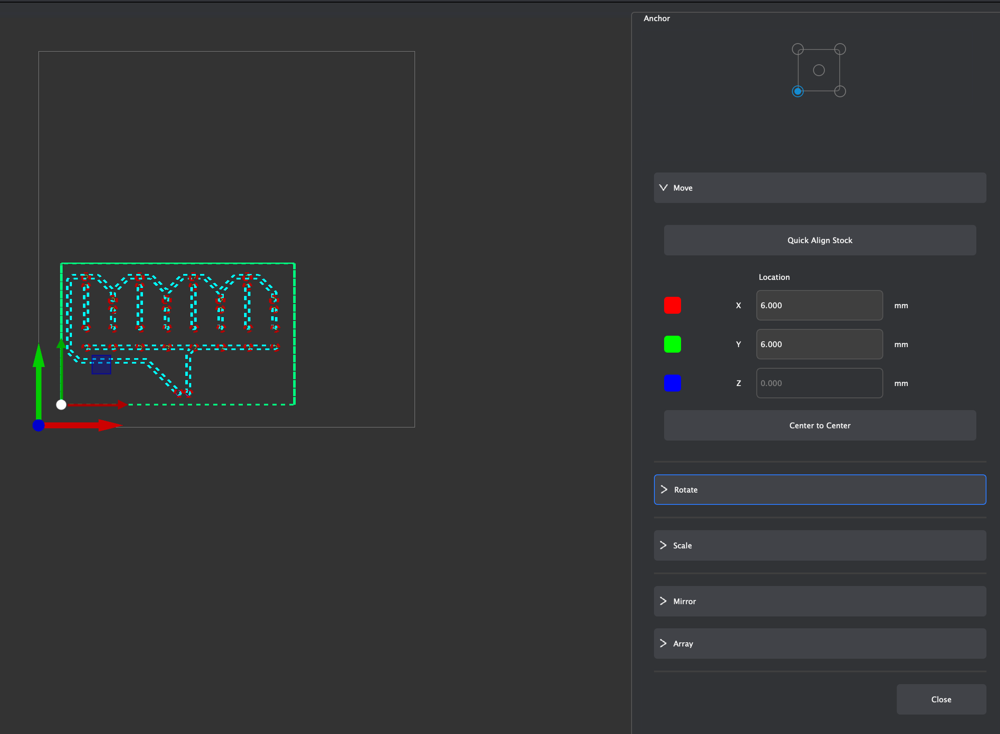
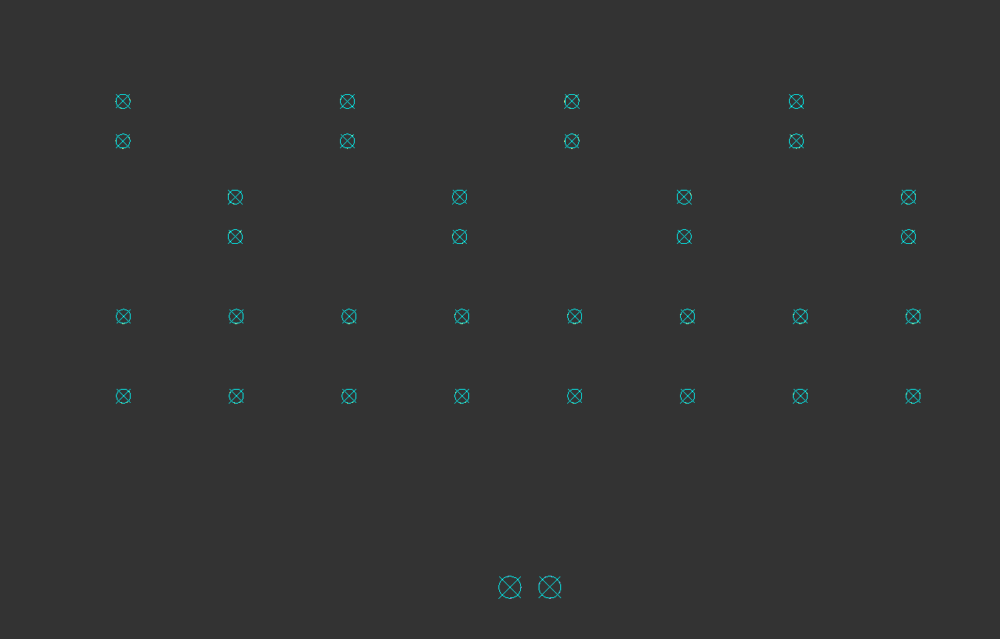

# PCB Milling
In this project, I used MakerCAM and the CNC machines in the Fab Lab in order to create GCode for a board and manufacture it when given gerber files. 

## Software and Hardware Used:

- [**Carvera Desktop CNC Machine**](https://www.makera.com/products/carvera): Machine that milled out the board
- [**Makera CAM**](https://www.makera.com/pages/makera-cam): Software to generate GCode from gerber and drill files
- [**Carvera Controller**](https://www.makera.com/pages/software#MakeraController): Software to control the CNC Machine

## Quick Downloads

- [**GCode for Board**](media/pcb_milling/Board.nc)
- [**KiCAD Files**](media/pcb_milling/pcb_milling_files.zip)

## Workflow for Milling a Board with the Carvera Desktop CNC Machine {.collapsible}

1. Open Makera CAM and open a 3-Axis project
2. Edit the material settings to be a 127mm x 101mm x 1.7mm PCB
3. Import the files with File &Rightarrow; Import PCB
4. Select all of the imported vectors and click the letter M to move them. Set the origin to the bottom left corner and type in the coordinates (6,6) to move the bottom left corner of the vectors to (6,6) in the workspace.
5. Create a 2D Pocket cut toolpath by selecting only the edge.cuts and f.cu vectors, then clicking 2D Path &Rightarrow; 2D Pocket.
6. Edit the 2D Pocket settings with the following settings:
    - End depth: 0.05mm
    - Tools: 0.8mm Corn and 0.2mm*30° Engraving (metal)
        - Ensure that for these tools, the material selected is "PCB"
7. Once these settings are applied, select "calculate," which should make a toolpath appear on the screen. If it looks right, then hide it. If not, re-do the process.
8. Hide everything except for the .drl files. Then, select all of the holes and click 2D Path &Rightarrow; 2D Drilling. 
9. Edit the 2D Drilling settings with the following settings:
    - End depth: 1.70mm
    - Tools: 0.8mm Corn (ensure material is set to "PCB")
10. Once these settings are applied, select "calculate," which should make a toolpath appear on the screen. If it looks right, then hide it. If not, re-do the process.
11. Deselect everything, and hide all vectors except for the edge.cuts layer. Select only the inner line, then click 2D Path &Rightarrow; 2D Contour.
12. Edit the 2D Contour settings with the following settings:
    - End depth: 1.70mm
    - Tools: 0.8mm Corn (ensure material is set to "PCB")
13. Once these settings are applied, select "calculate," which should make a toolpath appear on the screen. If it looks right, then hide it. If not, re-do the process.
14. Hide everything except for the 3 toolpaths. If everything looks correct, export them by clicking Export Toolpaths in the top right of the screen and selecting the 3 toolpaths. It should save a .nc file.

## Creating GCode in Makera CAM {.collapsible}
At the start, Mr. Dubick provided the class with [gerber files (**Download**)](media/pcb_milling/pcb_milling_files.zip) to create the board from.

Once I downloaded these files, I imported them into Makera CAM with File &Rightarrow; Import PCB. Before doing anything else, I changed the material settings to 127mm x 101mm x 1.7mm (L x W x H) since the blank PCB that I milled was that size.

{ width=400 }

After setting the workspace up, I used the Translate tool to move the board to the coordinates (6,6). Moving the board here allows for the board to be milled with very little wasted space while still allowing ample room for securing the board to the CNC machine. Next, I hid the .drl and f.cu_pad files, leaving only the edge.cuts and f.cu files visible. I selected them and selected 2D Path &Rightarrow; 2D Pocket, which brought up many options. I made sure to change the end depth to 0.05mm and to change the tools to 0.8mm Corn and 0.2mm*30° Engraving (Metal) for the 2D Pocket cut. The purpose of the 2D Pocket is to take off the very top layer of copper on the PCB board, leaving behind only the desired traces. Once I had all of my desired settings, I pressed "calculate", and it displayed the toolpath for the 2D Pocket cut.

{ width=300 } { width=300 } { width=300 } { width=300 } { width=300 } { width=300 } { width=300 }

Once I created the toolpath for the 2D Pocket cut, the next step was to create a toolpath for drilling the holes in the board. To do so, I hid the edge.cuts, f.cu, and 2D Pocket and showed only the 2 drill files. I selected them, then selected 2D Path &Rightarrow; 2D Drilling in order to drill holes in the board. I set the tool to 0.8mm Corn and end depth to 1.7mm to ensure that the holes are drilled completely though the board.

{ width=300 } { width=300 } 

Lastly, I needed to cut out the board. To do so, I hid everything except the edge.cuts vector, then selected 2D Path &Rightarrow; 2D Contour. Again, I chose 0.8mm Corn and set the end depth to 1.7mm so the board gets cut out completely. I also added 3 tabs to make sure that the board would stay in place when it gets cut. 

{ width=300 } { width=300 } { width=300 } { width=300 }

Once I created the 3 different toolpaths, I exported them to a [.nc (GCode) file (**Download**)](media/pcb_milling/Board.nc) so I could import it into the Carvera Controller application.

{ width=600 }

## Milling the Board with the CNC Machine using Carvera Controller (Workflow) {.collapsible}

After I successfully created a GCode file for the CNC machine, I had to mill the board out. To do so, I obtained a blank PCB that matched the dimensions I specified in Makera CAM (127mm x 101mm x 1.7mm), then I put it in the machine and clamped it down.

After doing so, I used the Carvera Controller Software to load my GCode and start the job. To do so, I followed this workflow:

1. Open Carvera Controller and connect to the CNC via USB
2. Before doing anything, ensure that the probe is charged to at least 3.6V under "Tool Status and Control"
3. In the top right corner, click "Switch to Display Manual Control Interface," then click the "Home" button
4. In the bottom left corner, open the GCode file from the computer. 
5. To check that everything is correct, click "Switch to Display File Preview Interface" in order to preview the toolpath
6. If everything looks as expected, click "Config and Run" and ensure that the options for "auto vacuum" and "auto leveling" are enabled.
7. Once everything looks good, click "run."

After following these steps, the machine took ~30 minutes to mill out my board. After it was done, all I had to do was break the 3 tabs that I set, and I was done!

## Reflection

In this project, I learned how to use MakeraCAM to take KiCAD files and turn them into GCode for the Carvera Desktop CNC Machines. I learned about the different types of cuts and their purposes (2D Pocket for removing material off the top, 2D Contour for cutting the board out of the larger material, and 2D Drilling for drilling holes for THT components).

Learning these skills will allow me to manufacture boards I custom design for my projects in house rather than having them manufactured overseas, which is super useful for rapid prototyping and cost reduction.