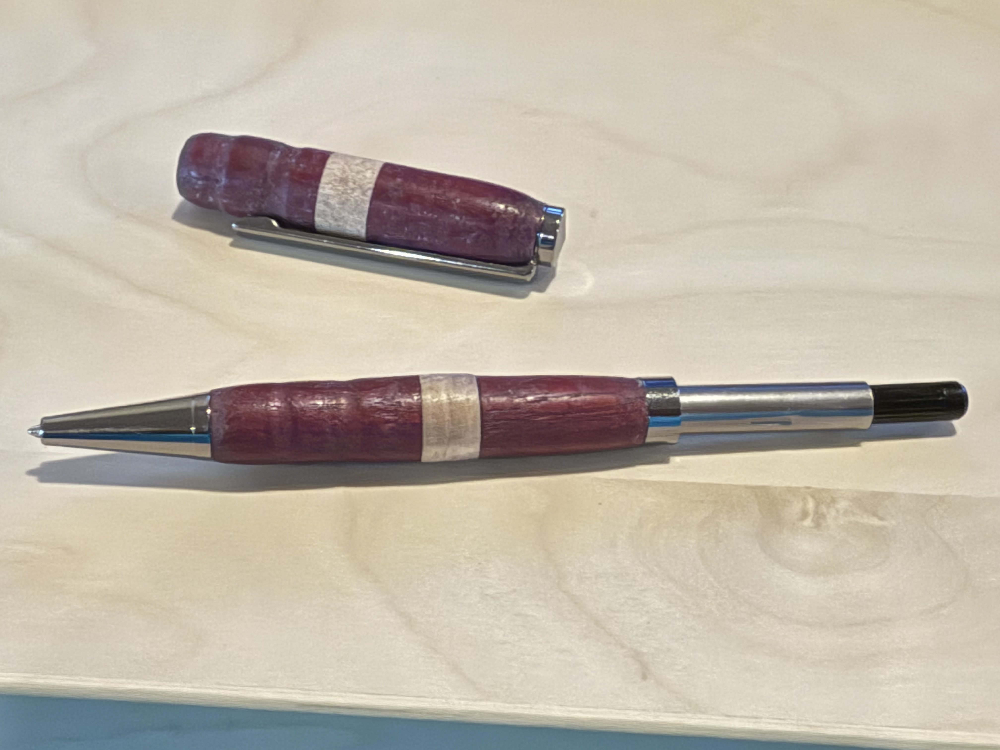

# Custom Wooden Pen
In this project, I created a custom pen with a pen kit and wood. I used tools such as a drill, lathe, and band saw to custom make the wood accents on the pen.

## Making the Wooden Barrels

I started the process by assembling the two pieces of wood that go around the barrels. I decided to make the pen out of purpleheart and birch, since I really liked the look of the dark purple and the light wood contrasting each other. 

The first step was to cut two pieces of 1" long purpleheart wood on the band saw, then cutting those in half to form 4 pieces of 0.5" thick wood. Then, I cut 2 thin pieces of birch to put in between the purpleheart pieces. Once I had all the pieces, I clamped and glued together the wood to form two blocks of wood that was mostly purpleheart with a thin piece of birch in the middle. I let the glue set overnight. While the glue was drying, I took the 2 brass barrels from the pen kit and made them rough by sanding them. This allows for the barrel to bond better with the superglue when they get glued inside the wood.

{ width=400 }

After the glue dried, I drilled a hole down the middle. Then, I lined the hole in each wood block with superglue, then inserted a sanded barrel into each block. I let it dry overnight.

After the barrel fully dried, I sanded the corners in order to make turning it on the lathe easier. After doing so, I took my pieces of wood and put them on the lathe. I then used various chisels to trim off most of the material to make the wood blocks round and easy to grip. 

{ width=400 } { width=400 }

## Assembling the Pen

Now that I had the two wooden barrels, I could assemble the pen. I used the pen press to do the following: 

- Press the pen tip into the bottom end of the lower barrel 
- Press the ink chamber into the top end of the lower barrel
- Press the clip assembly into the top end of the upper barrel

{ width=400 } { width=400 }

Once I pressed these components, I could assemble the main sections together. I screwed the ink refill into the ink chamber, slid the ring onto the chamber above the lower barrel, and slid the upper barrel above the ring. Once I did that, my pen was done, and it wrote super well, along with looking very cool.

{ width=400 } { width=400 }
